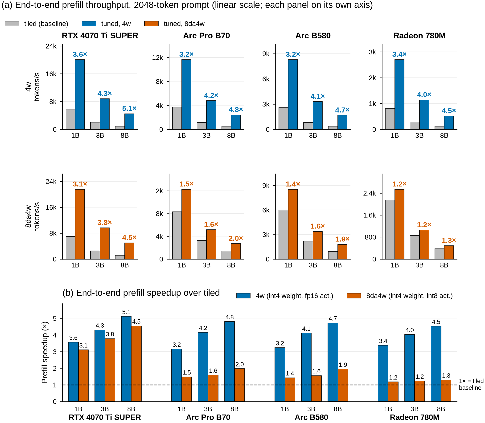
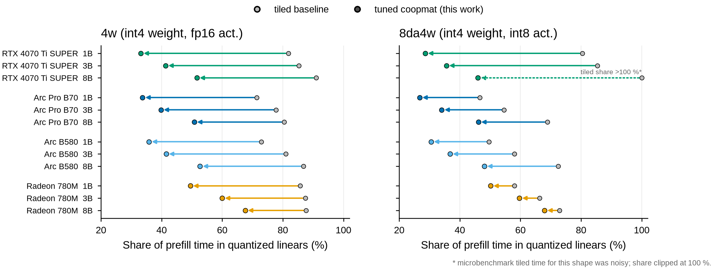
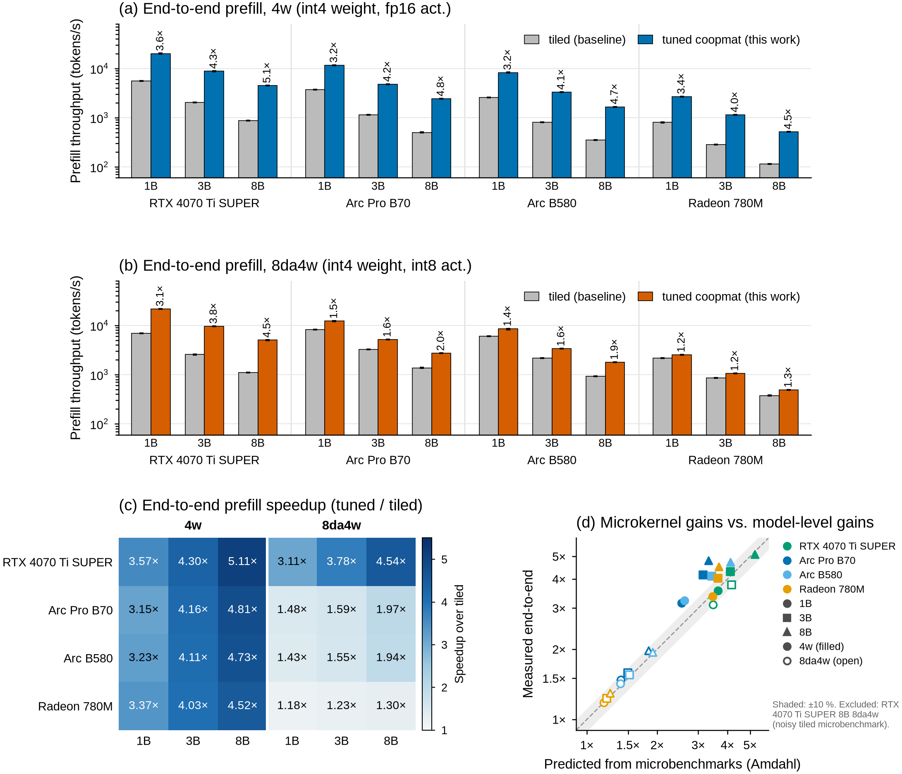

# Roofline-guided WMMA tuning across four GPUs: results and takeaways (2026-09-26)

The later Jetson study brings coverage to five GPUs; see the
[results index](GPU-STUDY-RESULTS.md). The figures and comparisons below retain
their original four-GPU campaign scope.

This is a cross-GPU summary of the roofline study and the ExecuTorch Vulkan 4w / 8da4w prefill kernel
work on the RTX 4070 Ti SUPER, Arc Pro B70, Arc B580 and Radeon 780M. Per-GPU detail:
- [XE2-WMMA-LESSONS.md](XE2-WMMA-LESSONS.md) (B580, B70)
- [780M-WMMA-LESSONS.md](780M-WMMA-LESSONS.md)
- [4070TI-WMMA-LESSONS.md](4070TI-WMMA-LESSONS.md)

Data and scripts:
- Roofs: `results/fleet-fast-20260926/` (git-ignored, local).
- End-to-end runs and the plotting script: `results/e2e-20260926/` (git-ignored, local). Regenerate the
  figures with `uv run python results/e2e-20260926/plot_e2e.py`.
- The figures are committed in `docs/figures/` as PNG + PDF.
- Raw microbench, profiler and build artifacts: `sarc-acl/.artifacts/roofline-et-study/`, indexed in its
  `README.md`.

## Result

The figure shows `llama_main` end-to-end prefill of a 2048-token prompt.
- Tiled baseline: the same binary with `ET_VK_FORCE_TILED_LINEAR=1`.
- Tuned: each GPU branch's defaults.

Values are the median of 3 repeats; every spread is ≤ 5 %. Tiled and tuned produce the same next token on
all 24 GPU × model × scheme combinations (1973-token real-text prompt). PDF versions sit next to the
PNGs in `docs/figures/`.

Prefill tokens/s, tiled → tuned:

| GPU | 1B 4w | 3B 4w | 8B 4w | 1B 8da4w | 3B 8da4w | 8B 8da4w |
|---|---:|---:|---:|---:|---:|---:|
| RTX 4070 Ti SUPER | 5626 → 20078 (3.57×) | 2042 → 8790 (4.30×) | 880 → 4501 (5.11×) | 6942 → 21558 (3.11×) | 2557 → 9660 (3.78×) | 1108 → 5032 (4.54×) |
| Arc Pro B70 | 3690 → 11636 (3.15×) | 1147 → 4774 (4.16×) | 502 → 2412 (4.81×) | 8292 → 12264 (1.48×) | 3251 → 5159 (1.59×) | 1375 → 2713 (1.97×) |
| Arc B580 | 2563 → 8292 (3.23×) | 801 → 3293 (4.11×) | 352 → 1665 (4.73×) | 5988 → 8533 (1.43×) | 2174 → 3374 (1.55×) | 921 → 1789 (1.94×) |
| Radeon 780M | 801 → 2702 (3.37×) | 283 → 1142 (4.03×) | 114 → 516 (4.52×) | 2151 → 2538 (1.18×) | 858 → 1055 (1.23×) | 375 → 486 (1.30×) |

### Microkernel gains mostly carry through to the model

- With tiled kernels, the quantized linears take 47–91 % of prefill time. After tuning they take 27–68 %.
- An Amdahl prediction from the microbench kernel times matches the measured end-to-end speedup within
  ±10 % for about two thirds of the combinations (panel d of the supplementary figure below).
- The rest measure *better* than predicted: 4w on both Xe2 GPUs (for example B70 8B 4.81× vs 3.31×) and
  780M 8B 4w. Their tiled microbenchmark times appear to understate the tiled kernel's cost inside the
  model; this was not investigated further.
- The prediction for 4070 Ti 8B 8da4w is excluded, because its tiled microbenchmark was noisy.
- Larger models gain more, because the linears are a larger share of prefill.
- After tuning, the non-linear operators matter: SDPA, norms, RoPE and activation quantization. They are
  now ~30–70 % of prefill.

### Why the 8da4w gains differ by vendor

- **4070 Ti:** the int8 matrix roof (369 TOP/s) is 4.7× the int8 dot roof, so coopmat has a lot of room.
- **Xe2:** the int8 matrix roof is 7× the dot roof. However, the zpg kernel keeps an int32 and an fp32
  accumulator per MMA, and that caps the subgroup tile.
- **780M:** the int8 matrix roof is only 1.23× the int8 dot roof, and the kernel was already at 65–70 %
  of it.

## Takeaways

### Method

1. **Measure the roofs first, and compare each kernel with the roof that matches its instruction mix.**
   The matching roofs are fp16 vs fp16→fp32 accumulate, int8 matrix, LDS-fed, and DRAM. The accumulator
   choice alone flips on the roofline:
   - 780M: fp32 accumulate is 1.35× *faster*;
   - Xe2: fp16 and fp32 accumulate run at equal rate;
   - GeForce: fp32 accumulate runs at *half* rate.
2. **Use a real profiler on every vendor, and when there is none, use differential timing.** The route
   differs by vendor:

   | GPU | What worked | What did not |
   |---|---|---|
   | Xe2 (B580/B70) | Xe OA counters (`xe-perf-recorder`, root, `observation_paranoid` restored); `INTEL_DEBUG=cs` ISA | — |
   | 780M | in-kernel `shader_clock` phase timing; `RADV_DEBUG=shaders` ISA; occupancy arithmetic | SQTT/RGP (banned, hung a machine); `amdgpu_top` too coarse |
   | 4070 Ti | `sudo nsys --gpu-metrics-set=ad10x` (Tensor Active, SM Issue); `VK_KHR_pipeline_executable_properties` (registers, local/shared memory); stage ablations | in-kernel clocks (2× perturbation); no SASS route |

3. **Read derived metrics, not single counters.**
   - SM Issue ÷ Tensor Active exposed NVIDIA code-generation flips (1.65× more instructions per MMA).
   - Resident waves × per-wave cycles reproduced RDNA3 speedups within 3 %.
4. **An ablation that removes a store also removes the wait on its load.** Confirm with a variant that
   keeps the work and changes only its form.
5. **When the MMA-only ablation is as slow as the full kernel, look outside the loop,** for example at
   partial workgroup waves on small-N shapes.

### Per-vendor kernel lessons

- **Xe2:**
  - subgroup-16 tiles remove SIMD32 register spills;
  - drop padding that was designed for AMD;
  - read A with `imageLoad`;
  - roof access granularity matters.
- **RDNA3:**
  - fp32 accumulation removes ~350 repack moves per 32 WMMAs;
  - staging the drain band in dead LDS (`CSH_IN_ASH`) lifts occupancy;
  - WMMA and VALU share a SIMD, so producer/consumer overlap has little room.
- **GeForce Ada:**
  - int8 MMA is twice fp16, so an 8da4w tile needs twice the K per barrier to hide the same staging
    (k32 → k64);
  - int8 `coopMatStore` into LDS was the largest single cost; raw 16-byte staging fixed it;
  - fp16-accumulate MMA loses accuracy at long K, and per-group fp32 flushes fix it for 8 %.

### Correctness: what the microbench missed

Two real bugs passed every microbench check and were found only end to end or on production shapes:

1. **fp16 accumulation accuracy (4070 Ti 4w).**
   - The 8B w2 shape (K = 14336) had max |err| 1.49 against a 0.5 tolerance. K = 4096 had already used
     90 % of the tolerance.
   - The same data passes on B580/B70 (Xe2 DPAS; `:hf` accumulators confirmed in the ISA) and on the
     780M (fp32 accumulation).
   - Fixed with per-group fp32 accumulation.
   - Lesson: print the error margin, not pass/fail.
2. **8da4w coopmat garbage for unaligned prompt lengths.**
   - Affected: the 4070 Ti branch, and the dev branch default on AMD.
   - The activation layout (row-major) is fixed at graph build, but the kernel picker re-runs on every
     resize. For M % 128 ≠ 0 it fell back to tiled, which reads another layout. Every unaligned prompt
     produced the same wrong token.
   - The microbench and the 2048-token timing prompt are aligned, so they never exercised this. The test
     data's activation zero points were also all 0.
   - Fixed on `-4070ti` (6fa64bf74) and the dev branch (d529bfc7b).
   - New checks:
     - `--production-diff-nonzero-zp`;
     - `e2e_prefill.py --check` (real 1973-token prompt);
     - prompt-length probes.

Also found, not fixed:
- The `-4070ti` branch lacks the `sdpa_*_coop` shaders, so short prompts and decode crash.
- On the dev branch, the default 4w coopmat on the 780M is 4× slower than tiled; the `-780m` branch
  retune fixes that.

### Measurement hygiene

- One process per GPU under the gpu-lab lock.
- Stop co-tenant services (ComfyUI, llm-api) for the **whole** campaign on that GPU. Restoring them
  between milestones invalidated a set of 4070 Ti timings: the unchanged tiled baseline ran up to 2×
  slower. Those runs are in `superseded/comfyui-contended`.
- Judge contention by engine-time deltas (drm fdinfo counters, `nvidia-smi` compute apps) before and after
  each run, not by which processes hold the device open.
- Keep one binary for tiled and tuned; switch with an environment variable.
- Never delete results; move invalid ones to `superseded/`.
- Beware `pkill -f` / `pgrep -f` patterns that also match the calling shell.

## Open items

- **Phones (S24+, Pixel 7a):** no coopmat, so the tiled kernels are still untuned. The S24+ roofline has
  unconfirmed roofs (sentinel warm-up).
- **4070 Ti 8da4w** reaches 37–42 % of the int8 roof. Producer/consumer warp specialization is the next
  structural step (252 µs full vs 142 µs MMA-only on 3B wq_wo).
- Missing `sdpa_*_coop` shaders on `-4070ti`: decode is unusable on that branch.
- **Housekeeping (done 2026-09-26):**
  - Superseded build trees (≈ 15 GB) were deleted with the owner's approval.
  - Only the latest microbench binary is kept per GPU host.
  - Remote result directories are mirrored in `.artifacts/roofline-et-study/remote/`; the index is in its
    `README.md`.
