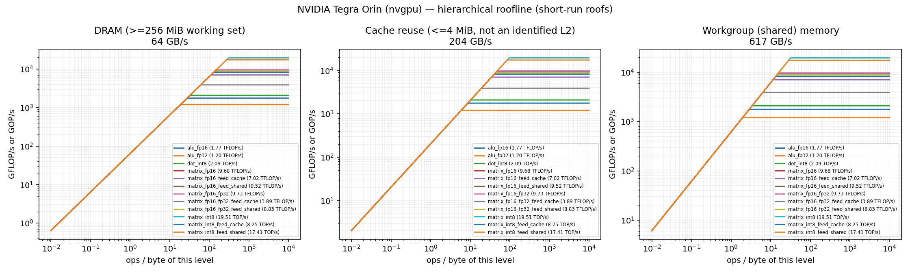
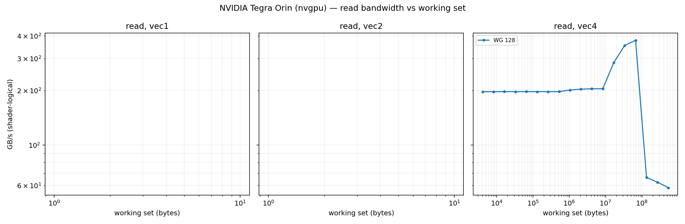
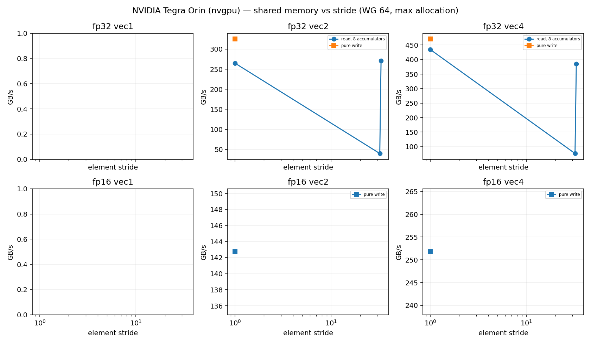
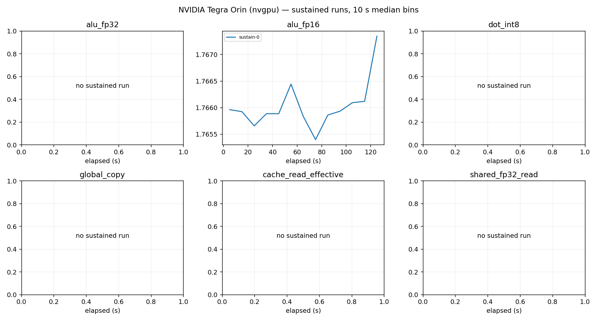

# NVIDIA Tegra Orin (nvgpu) roofline report

Device: host  (SoC ), Ubuntu 24.04.5 LTS, driver 2496888832, subgroup 32.
Plan(s): fast. GPU clock state **unavailable** (frequency and pinning not verified).
Code: None, runner bdc8d65c4c5e8c75. Rows from other runner or shader builds excluded: 0.

Validation policy: **pre_and_post**; checks bracket continuous sampling and do not guarantee detection of transient errors between checks. Historical pre-only rows are diagnostic only.
Excluded rows: 67; reasons are in all-configurations.csv.
matrix_fp16_fp32_feed_cache: repeat_unstable
Sustained roofs require three distinct stable batches per current confirmed configuration and duration

Short-run columns are the best validated configuration: median and best (minimum time, the STREAM/BabelStream convention) of the samples, and the differential rate (paired L vs L/2 runs, removing fixed per-dispatch cost). Sustained is the median of the last 60 s of each sustained run (durations are recorded in sustained-runs.csv). Controls never define a roof. `spill` marks variants whose driver statistics report register spilling: spills only slow a kernel, so the value is still an achievable lower bound.

| roof | short median | short best | differential | sustained | unit |
|---|---:|---:|---:|---:|---|
| alu_fp16 | 1.766 | 1.767 | 1.773 (fixed 0%) | 1.766 (1×) | TFLOP/s |
| alu_fp32 | 1.201 | 1.204 | 1.227 (fixed 2%) | — | TFLOP/s |
| cache_read_effective | 204.059 | 204.807 | 205.467 (fixed 1%) | — | GB/s |
| dot_int8 | 2.090 | 2.099 | 2.107 (fixed 1%) | — | TOP/s |
| global_copy | 64.046 | 64.138 | 64.146 (fixed 0%) | — | GB/s |
| global_read | 62.260 | 62.447 | 65.074 (fixed 4%) | 62.231 (1×) | GB/s |
| global_triad | 64.259 | 64.414 | 65.399 (fixed 2%) | — | GB/s |
| global_write | 58.086 | 58.309 | 58.027 (fixed -0%) | — | GB/s |
| matrix_fp16 | 9.684 | 9.728 | 9.910 (fixed 2%) | — | TFLOP/s |
| matrix_fp16_feed_cache | 7.024 | 7.069 | 7.692 (fixed 9%) | — | TFLOP/s |
| matrix_fp16_feed_dram | 60.325 | 60.402 | 65.825 (fixed 8%) | — | GB/s |
| matrix_fp16_feed_shared | 9.517 | 9.555 | 9.887 (fixed 4%) | — | TFLOP/s |
| matrix_fp16_fp32 | 9.731 | 9.773 | 9.832 (fixed 1%) | 9.729 (1×) | TFLOP/s |
| matrix_fp16_fp32_feed_cache | 3.893 | 3.920 | 4.285 (fixed 9%) | — | TFLOP/s |
| matrix_fp16_fp32_feed_dram | 61.331 | 61.499 | 63.615 (fixed 4%) | — | GB/s |
| matrix_fp16_fp32_feed_shared | 8.829 | 8.913 | 9.748 (fixed 9%) | — | TFLOP/s |
| matrix_int8 | 19.512 | 19.553 | 19.670 (fixed 1%) | — | TOP/s |
| matrix_int8_feed_cache | 8.246 | 8.338 | 9.149 (fixed 10%) | — | TOP/s |
| matrix_int8_feed_dram | 59.719 | 59.974 | 65.397 (fixed 9%) | — | GB/s |
| matrix_int8_feed_shared | 17.411 | 17.472 | 19.259 (fixed 10%) | — | TOP/s |
| shared_fp16_read | 566.369 | 568.931 | 622.741 (fixed 9%) | — | GB/s |
| shared_fp16_write | 335.146 | 336.511 | 340.444 (fixed 2%) | — | GB/s |
| shared_fp32_read | 617.099 | 619.387 | 618.518 (fixed 0%) | — | GB/s |
| shared_fp32_write | 532.982 | 534.654 | 534.068 (fixed 0%) | — | GB/s |
| texture_rgba16f_buffer_cache | 58.727 | 58.858 | 58.693 (fixed -0%) | — | GB/s |
| texture_rgba16f_buffer_dram | 56.589 | 56.754 | 56.507 (fixed -0%) | — | GB/s |
| texture_rgba16f_tex2d_cache | 55.725 | 56.009 | 55.638 (fixed -0%) | — | GB/s |
| texture_rgba16f_tex2d_dram | 20.724 | 20.762 | 20.735 (fixed 0%) | — | GB/s |
| texture_rgba16f_tex3d_cache | 56.777 | 56.844 | 56.725 (fixed -0%) | — | GB/s |
| texture_rgba16f_tex3d_dram | 40.804 | 41.068 | 40.793 (fixed -0%) | — | GB/s |
| texture_rgba32f_buffer_cache | 58.620 | 58.721 | 58.562 (fixed -0%) | — | GB/s |
| texture_rgba32f_buffer_dram | 60.830 | 61.274 | 60.892 (fixed 0%) | — | GB/s |
| texture_rgba32f_tex2d_cache | 53.206 | 53.582 | 53.093 (fixed -0%) | — | GB/s |
| texture_rgba32f_tex2d_dram | 20.758 | 20.777 | 20.765 (fixed 0%) | — | GB/s |
| texture_rgba32f_tex3d_cache | 56.736 | 56.905 | 56.660 (fixed -0%) | — | GB/s |
| texture_rgba32f_tex3d_dram | 41.301 | 41.357 | 41.330 (fixed 0%) | — | GB/s |

## Roof confirmation

Each roof's top candidates were re-measured in fresh processes, round-robin with alternating order. The roof is the median of the best candidate's repeats; the sweep maximum (a single run) is shown for comparison. Roofs without a quality-passing candidate (standard error of the median <= 3 %, not short, fixed cost <= 10 %) are marked unconfirmed.

| roof | confirmed median | repeat range | repeats | sweep max (unconfirmed) |
|---|---:|---:|---:|---:|
| alu_fp16 | 1.766 | 1.765–1.766 (0.0%) | 3 | 1.764 |
| alu_fp32 | 1.201 | 1.200–1.202 (0.2%) | 3 | 1.201 |
| cache_read_effective | 204.059 | 204.025–204.107 (0.0%) | 3 | 204.103 |
| dot_int8 | 2.090 | 2.090–2.091 (0.0%) | 3 | 2.090 |
| global_copy | 64.046 | 63.972–64.095 (0.2%) | 3 | 64.066 |
| global_read | 62.260 | 62.236–62.270 (0.1%) | 3 | 62.224 |
| global_triad | 64.259 | 64.222–64.304 (0.1%) | 3 | 64.276 |
| global_write | 58.086 | 58.043–58.152 (0.2%) | 3 | 58.145 |
| matrix_fp16 | 9.684 | 9.683–9.689 (0.1%) | 3 | 9.714 |
| matrix_fp16_feed_cache | 7.024 | 7.018–7.060 (0.6%) | 3 | 7.004 |
| matrix_fp16_feed_dram | 60.325 | 60.223–60.340 (0.2%) | 3 | 60.234 |
| matrix_fp16_feed_shared | 9.517 | 9.516–9.517 (0.0%) | 3 | 9.511 |
| matrix_fp16_fp32 | 9.731 | 9.729–9.733 (0.0%) | 3 | 9.724 |
| matrix_fp16_fp32_feed_cache | 3.893 | 3.888–3.899 (0.3%) | 2 | 5.592 |
| matrix_fp16_fp32_feed_dram | 61.331 | 61.329–61.359 (0.0%) | 3 | 61.352 |
| matrix_fp16_fp32_feed_shared | 8.829 | 8.827–8.905 (0.9%) | 3 | 8.823 |
| matrix_int8 | 19.512 | 19.510–19.514 (0.0%) | 3 | 19.516 |
| matrix_int8_feed_cache | 8.246 | 8.194–8.313 (1.4%) | 3 | 8.161 |
| matrix_int8_feed_dram | 59.719 | 59.237–59.917 (1.1%) | 3 | 59.568 |
| matrix_int8_feed_shared | 17.411 | 17.402–17.411 (0.1%) | 3 | 17.421 |
| shared_fp16_read | 566.369 | 566.284–566.433 (0.0%) | 3 | 566.521 |
| shared_fp16_write | 335.146 | 334.881–335.162 (0.1%) | 3 | 335.255 |
| shared_fp32_read | 617.099 | 616.936–617.387 (0.1%) | 3 | 616.822 |
| shared_fp32_write | 532.982 | 532.957–533.361 (0.1%) | 3 | 533.163 |
| texture_rgba16f_buffer_cache | 58.727 | 58.719–58.747 (0.0%) | 3 | 58.776 |
| texture_rgba16f_buffer_dram | 56.589 | 56.549–56.609 (0.1%) | 3 | 56.675 |
| texture_rgba16f_tex2d_cache | 55.725 | 55.660–55.958 (0.5%) | 3 | 56.070 |
| texture_rgba16f_tex2d_dram | 20.724 | 20.723–20.726 (0.0%) | 3 | 20.724 |
| texture_rgba16f_tex3d_cache | 56.777 | 56.745–56.809 (0.1%) | 3 | 56.727 |
| texture_rgba16f_tex3d_dram | 40.804 | 40.766–40.922 (0.4%) | 3 | 40.821 |
| texture_rgba32f_buffer_cache | 58.620 | 58.613–58.640 (0.0%) | 3 | 58.529 |
| texture_rgba32f_buffer_dram | 60.830 | 60.644–60.835 (0.3%) | 3 | 60.805 |
| texture_rgba32f_tex2d_cache | 53.206 | 53.056–53.552 (0.9%) | 3 | 53.317 |
| texture_rgba32f_tex2d_dram | 20.758 | 20.757–20.761 (0.0%) | 3 | 20.751 |
| texture_rgba32f_tex3d_cache | 56.736 | 56.668–56.742 (0.1%) | 3 | 56.668 |
| texture_rgba32f_tex3d_dram | 41.301 | 41.297–41.303 (0.0%) | 3 | 41.290 |

## Cooperative matrix fed from memory, by reuse

Best validated median per source and CHAINS (multiply-adds per loaded A/B tile pair). `load GB/s` counts the A/B tile bytes loaded. DRAM-fed rates grow with reuse until the matrix unit limits them, so the `matrix_*_feed_dram` roof above is a bandwidth; look a kernel's ops per loaded byte up here instead. `gates` lists quality gates the row failed (such rows never define a roof).

| dtype | source | CHAINS | ops / loaded byte | rate | load GB/s | gates |
|---|---|---:|---:|---:|---:|---|
| fp16 | shared | 8 | 64.0 | 9.517 TFLOP/s | 148.7 | — |
| fp16 | cache | 1 | 8.0 | 1.216 TFLOP/s | 152.1 | — |
| fp16 | cache | 2 | 16.0 | 2.312 TFLOP/s | 144.5 | — |
| fp16 | cache | 4 | 32.0 | 4.250 TFLOP/s | 132.8 | — |
| fp16 | cache | 8 | 64.0 | 7.060 TFLOP/s | 110.3 | — |
| fp16 | dram | 1 | 8.0 | 0.445 TFLOP/s | 55.7 | — |
| fp16 | dram | 2 | 16.0 | 0.863 TFLOP/s | 53.9 | — |
| fp16 | dram | 4 | 32.0 | 1.679 TFLOP/s | 52.5 | — |
| fp16 | dram | 8 | 64.0 | 3.265 TFLOP/s | 51.0 | — |
| fp16_fp32 | shared | 1 | 8.0 | 4.516 TFLOP/s | 564.5 | — |
| fp16_fp32 | shared | 2 | 16.0 | 8.231 TFLOP/s | 514.5 | — |
| fp16_fp32 | shared | 4 | 32.0 | 8.778 TFLOP/s | 274.3 | — |
| fp16_fp32 | shared | 8 | 64.0 | 8.905 TFLOP/s | 139.1 | — |
| fp16_fp32 | cache | 1 | 8.0 | 1.205 TFLOP/s | 150.6 | — |
| fp16_fp32 | cache | 2 | 16.0 | 2.214 TFLOP/s | 138.4 | — |
| fp16_fp32 | cache | 4 | 32.0 | 3.899 TFLOP/s | 121.8 | — |
| fp16_fp32 | cache | 8 | 64.0 | 5.660 TFLOP/s | 88.4 | — |
| fp16_fp32 | dram | 1 | 8.0 | 0.448 TFLOP/s | 56.0 | — |
| fp16_fp32 | dram | 4 | 32.0 | 1.629 TFLOP/s | 50.9 | — |
| fp16_fp32 | dram | 8 | 64.0 | 2.876 TFLOP/s | 44.9 | — |
| int8 | shared | 1 | 16.0 | 4.620 TOP/s | 288.7 | — |
| int8 | shared | 2 | 32.0 | 9.168 TOP/s | 286.5 | — |
| int8 | shared | 4 | 64.0 | 15.791 TOP/s | 246.7 | — |
| int8 | shared | 8 | 128.0 | 17.421 TOP/s | 136.1 | — |
| int8 | cache | 1 | 16.0 | 1.501 TOP/s | 93.8 | — |
| int8 | cache | 2 | 32.0 | 2.902 TOP/s | 90.7 | — |
| int8 | cache | 4 | 64.0 | 5.216 TOP/s | 81.5 | — |
| int8 | cache | 8 | 128.0 | 8.313 TOP/s | 64.9 | — |
| int8 | dram | 1 | 16.0 | 0.755 TOP/s | 47.2 | — |
| int8 | dram | 4 | 64.0 | 3.370 TOP/s | 52.7 | — |
| int8 | dram | 8 | 128.0 | 5.169 TOP/s | 40.4 | — |

## Device-state sentinel

`alu_fp32_v4_c16 wg256 groups512` measured before and after every stage and every 20 configurations. Values below 85 % of the median reading (0.732 TFLOP/s) mark a stage that ran on a throttled or otherwise degraded device; re-measure those stages.

| UTC | label | TFLOP/s | state |
|---|---|---:|---|
| 2026-10-09T18:15:02 | validate_start | 0.732 | ok |
| 2026-10-09T18:15:17 | validate_end | 0.732 | ok |
| 2026-10-09T18:15:58 | cache_end | 0.732 | ok |
| 2026-10-09T18:16:11 | sweep-memory_20 | 0.732 | ok |
| 2026-10-09T18:16:34 | memory_end | 0.732 | ok |
| 2026-10-09T18:17:02 | sweep-compute_40 | 0.732 | ok |
| 2026-10-09T18:17:47 | sweep-compute_60 | 0.732 | ok |
| 2026-10-09T18:18:41 | sweep-compute_80 | 0.732 | ok |
| 2026-10-09T18:20:33 | sweep-compute_100 | 0.732 | ok |
| 2026-10-09T18:22:27 | sweep-compute_120 | 0.731 | ok |
| 2026-10-09T18:27:08 | sweep-compute_140 | 0.732 | ok |
| 2026-10-09T18:29:55 | sweep-compute_160 | 0.732 | ok |
| 2026-10-09T18:30:23 | compute_end | 0.731 | ok |
| 2026-10-09T18:30:38 | sweep-matrix-feed_180 | 0.731 | ok |
| 2026-10-09T18:31:25 | sweep-matrix-feed_200 | 0.731 | ok |
| 2026-10-09T18:31:51 | matrix_feed_end | 0.732 | ok |
| 2026-10-09T18:32:20 | sweep-texture_220 | 0.732 | ok |
| 2026-10-09T18:32:28 | texture_end | 0.732 | ok |
| 2026-10-09T18:33:03 | sweep-shared_240 | 0.732 | ok |
| 2026-10-09T18:33:42 | sweep-shared_260 | 0.732 | ok |
| 2026-10-09T18:34:17 | shared_end | 0.732 | ok |
| 2026-10-09T18:34:23 | latency-capacity_280 | 0.732 | ok |
| 2026-10-09T18:35:38 | latency_end | 0.732 | ok |
| 2026-10-09T18:36:28 | confirm_300 | 0.732 | ok |
| 2026-10-09T18:37:16 | confirm_320 | 0.732 | ok |
| 2026-10-09T18:38:14 | confirm_340 | 0.732 | ok |
| 2026-10-09T18:39:04 | confirm_360 | 0.732 | ok |
| 2026-10-09T18:40:02 | confirm_380 | 0.732 | ok |
| 2026-10-09T18:40:44 | confirm_400 | 0.732 | ok |
| 2026-10-09T18:42:15 | confirm_420 | 0.732 | ok |
| 2026-10-09T18:43:13 | confirm_440 | 0.732 | ok |
| 2026-10-09T18:44:02 | confirm_460 | 0.732 | ok |
| 2026-10-09T18:44:10 | confirm_end | 0.732 | ok |
| 2026-10-09T18:44:14 | sustain_0 | 0.732 | ok |

## Ridge points (short-run roofs)

Arithmetic intensity (ops per byte of that level) at which each compute roof meets each memory roof.

| compute roof | global | cache | shared_fp32 | shared_fp16 |
|---|---:|---:|---:|---:|
| alu_fp16 | 27.48 | 8.65 | 2.86 | 3.12 |
| alu_fp32 | 18.68 | 5.88 | 1.95 | 2.12 |
| dot_int8 | 32.53 | 10.24 | 3.39 | 3.69 |
| matrix_fp16 | 150.70 | 47.46 | 15.69 | 17.10 |
| matrix_fp16_feed_cache | 109.31 | 34.42 | 11.38 | 12.40 |
| matrix_fp16_feed_shared | 148.10 | 46.64 | 15.42 | 16.80 |
| matrix_fp16_fp32 | 151.44 | 47.69 | 15.77 | 17.18 |
| matrix_fp16_fp32_feed_cache | 60.58 | 19.08 | 6.31 | 6.87 |
| matrix_fp16_fp32_feed_shared | 137.39 | 43.26 | 14.31 | 15.59 |
| matrix_int8 | 303.64 | 95.62 | 31.62 | 34.45 |
| matrix_int8_feed_cache | 128.32 | 40.41 | 13.36 | 14.56 |
| matrix_int8_feed_shared | 270.94 | 85.32 | 28.21 | 30.74 |

## Figures

See also [TUNING.md](TUNING.md), [SUPPLEMENT.md](SUPPLEMENT.md) (latency, TLB, line size, ERT, memory type) and [ISA-CHECK.md](ISA-CHECK.md).

## Limits

- Bandwidths are shader-logical bytes; physical DRAM/L2 traffic is not measurable without `VK_KHR_performance_query` (exposed: False).
- No vendor theoretical peaks are used; values are achievable rates on this device and driver.
- Cache knees move with workgroup size and are not cache capacities; see the pointer-chase results.
- Sustained values need 3 batches (plan `gold`) before they replace short-run roofs.
