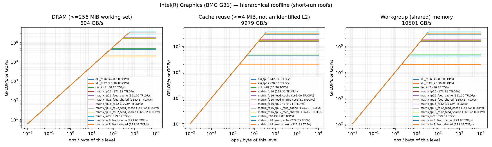
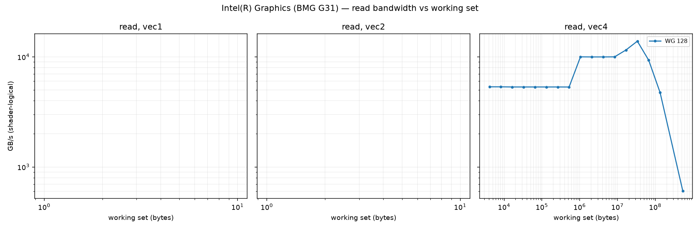
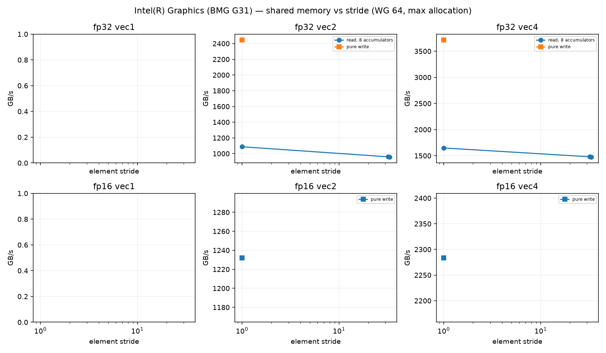
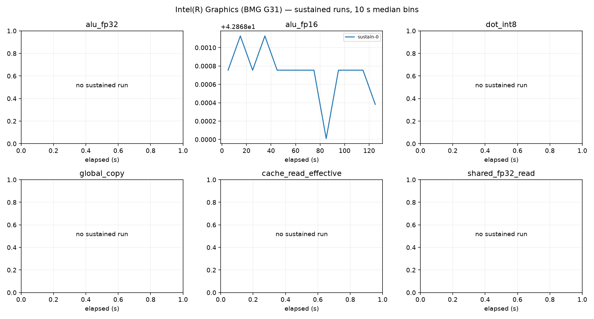

# Intel(R) Graphics (BMG G31) roofline report

Device: host Intel(R) Core(TM) i9-14900K (SoC Intel(R) Core(TM) i9-14900K), Fedora Linux 44 (Cloud Edition), driver 109060099, subgroup 32.
Plan(s): fast. GPU clock state **unavailable** (frequency and pinning not verified).
Code: None, runner 810e098c8abb2dfb. Rows from other runner or shader builds excluded: 0.

Validation policy: **pre_and_post**; checks bracket continuous sampling and do not guarantee detection of transient errors between checks. Historical pre-only rows are diagnostic only.
Excluded rows: 61; reasons are in all-configurations.csv.
matrix_fp16_fp32_feed_dram: repeat_unstable
Sustained roofs require three distinct stable batches per current confirmed configuration and duration

Short-run columns are the best validated configuration: median and best (minimum time, the STREAM/BabelStream convention) of the samples, and the differential rate (paired L vs L/2 runs, removing fixed per-dispatch cost). Sustained is the median of the last 60 s of each sustained run (durations are recorded in sustained-runs.csv). Controls never define a roof. `spill` marks variants whose driver statistics report register spilling: spills only slow a kernel, so the value is still an achievable lower bound.

| roof | short median | short best | differential | sustained | unit |
|---|---:|---:|---:|---:|---|
| alu_fp16 | 42.869 | 42.872 | 42.947 (fixed 0%) | 42.869 (1×) | TFLOP/s |
| alu_fp32 | 20.300 | 20.301 | 20.362 (fixed 0%) | — | TFLOP/s |
| cache_read_effective | 9978.783 | 9981.501 | 9994.656 (fixed 0%) | — | GB/s |
| dot_int8 | 50.364 | 50.366 | 50.416 (fixed 0%) | — | TOP/s |
| global_copy | 533.983 | 555.464 | 538.920 (fixed 1%) | — | GB/s |
| global_read | 603.902 | 606.468 | 608.591 (fixed 1%) | 603.701 (1×) | GB/s |
| global_triad | 482.567 | 504.481 | 469.986 (fixed -3%) | — | GB/s |
| global_write | 511.936 | 526.098 | 514.650 (fixed 1%) | — | GB/s |
| matrix_fp16 | 173.324 | 173.335 | 180.317 (fixed 4%) | — | TFLOP/s |
| matrix_fp16_feed_cache | 161.000 | 162.219 | 164.705 (fixed 2%) | — | TFLOP/s |
| matrix_fp16_feed_dram | 598.359 | 598.936 | 607.722 (fixed 2%) | — | GB/s |
| matrix_fp16_feed_shared | 168.407 | 168.683 | 177.449 (fixed 5%) | — | TFLOP/s |
| matrix_fp16_fp32 | 179.939 | 179.950 | 180.428 (fixed 0%) | 179.939 (1×) | TFLOP/s |
| matrix_fp16_fp32_feed_cache | 154.622 | 156.085 | 156.349 (fixed 1%) | — | TFLOP/s |
| matrix_fp16_fp32_feed_dram | 591.932 | 597.177 | 607.241 (fixed 3%) | — | GB/s |
| matrix_fp16_fp32_feed_shared | 166.618 | 166.935 | 167.370 (fixed 0%) | — | TFLOP/s |
| matrix_int8 | 359.872 | 359.891 | 360.872 (fixed 0%) | — | TOP/s |
| matrix_int8_feed_cache | 279.652 | 282.147 | 281.332 (fixed 1%) | — | TOP/s |
| matrix_int8_feed_dram | 614.789 | 618.515 | 657.515 (fixed 6%) | — | GB/s |
| matrix_int8_feed_shared | 323.330 | 324.089 | 327.895 (fixed 1%) | — | TOP/s |
| shared_fp16_read | 3331.018 | 3331.245 | 3493.091 (fixed 5%) | — | GB/s |
| shared_fp16_write | 6455.425 | 6457.129 | 6607.080 (fixed 2%) | — | GB/s |
| shared_fp32_read | 10017.217 | 10020.387 | 10033.670 (fixed 0%) | — | GB/s |
| shared_fp32_write | 10500.828 | 10501.830 | 10505.935 (fixed 0%) | — | GB/s |
| texture_rgba16f_buffer_cache | 2272.572 | 2272.993 | 2273.352 (fixed 0%) | — | GB/s |
| texture_rgba16f_buffer_dram | 564.205 | 565.001 | 564.341 (fixed 0%) | — | GB/s |
| texture_rgba16f_tex2d_cache | 2014.672 | 2015.256 | 2015.224 (fixed 0%) | — | GB/s |
| texture_rgba16f_tex2d_dram | 536.867 | 541.146 | 537.029 (fixed 0%) | — | GB/s |
| texture_rgba16f_tex3d_cache | 1970.514 | 1971.230 | 1971.010 (fixed 0%) | — | GB/s |
| texture_rgba16f_tex3d_dram | 559.488 | 564.085 | 559.831 (fixed 0%) | — | GB/s |
| texture_rgba32f_buffer_cache | 2284.018 | 2284.395 | 2285.025 (fixed 0%) | — | GB/s |
| texture_rgba32f_buffer_dram | 567.210 | 567.715 | 567.431 (fixed 0%) | — | GB/s |
| texture_rgba32f_tex2d_cache | 2060.138 | 2060.741 | 2060.795 (fixed 0%) | — | GB/s |
| texture_rgba32f_tex2d_dram | 721.316 | 734.687 | 725.946 (fixed 1%) | — | GB/s |
| texture_rgba32f_tex3d_cache | 1993.258 | 1994.054 | 1993.789 (fixed 0%) | — | GB/s |
| texture_rgba32f_tex3d_dram | 765.432 | 769.993 | 766.469 (fixed 0%) | — | GB/s |

## Roof confirmation

Each roof's top candidates were re-measured in fresh processes, round-robin with alternating order. The roof is the median of the best candidate's repeats; the sweep maximum (a single run) is shown for comparison. Roofs without a quality-passing candidate (standard error of the median <= 3 %, not short, fixed cost <= 10 %) are marked unconfirmed.

| roof | confirmed median | repeat range | repeats | sweep max (unconfirmed) |
|---|---:|---:|---:|---:|
| alu_fp16 | 42.869 | 42.868–42.869 (0.0%) | 3 | 42.868 |
| alu_fp32 | 20.300 | 20.292–20.300 (0.0%) | 3 | 20.300 |
| cache_read_effective | 9978.783 | 9978.104–9978.859 (0.0%) | 3 | 9978.632 |
| dot_int8 | 50.364 | 50.357–50.365 (0.0%) | 3 | 50.366 |
| global_copy | 533.983 | 533.486–535.273 (0.3%) | 3 | 533.960 |
| global_read | 603.902 | 603.505–604.032 (0.1%) | 3 | 603.701 |
| global_triad | 482.567 | 478.698–482.748 (0.8%) | 3 | 479.084 |
| global_write | 511.936 | 510.403–512.713 (0.5%) | 3 | 511.527 |
| matrix_fp16 | 173.324 | 173.322–173.326 (0.0%) | 3 | 173.326 |
| matrix_fp16_feed_cache | 161.000 | 160.959–161.081 (0.1%) | 3 | 161.157 |
| matrix_fp16_feed_dram | 598.359 | 598.269–598.405 (0.0%) | 3 | 598.405 |
| matrix_fp16_feed_shared | 168.407 | 168.399–168.430 (0.0%) | 3 | 168.454 |
| matrix_fp16_fp32 | 179.939 | 179.928–179.941 (0.0%) | 3 | 179.886 |
| matrix_fp16_fp32_feed_cache | 154.622 | 153.924–154.679 (0.5%) | 3 | 153.739 |
| matrix_fp16_fp32_feed_dram | 591.932 | 586.615–594.561 (1.3%) | 3 | 610.859 |
| matrix_fp16_fp32_feed_shared | 166.618 | 166.504–166.624 (0.1%) | 3 | 166.764 |
| matrix_int8 | 359.872 | 359.815–359.874 (0.0%) | 3 | 359.865 |
| matrix_int8_feed_cache | 279.652 | 279.414–280.259 (0.3%) | 3 | 279.212 |
| matrix_int8_feed_dram | 614.789 | 600.593–616.830 (2.6%) | 3 | 610.471 |
| matrix_int8_feed_shared | 323.330 | 322.173–323.330 (0.4%) | 3 | 323.186 |
| shared_fp16_read | 3331.018 | 3331.018–3331.075 (0.0%) | 3 | 3331.046 |
| shared_fp16_write | 6455.425 | 6455.299–6455.677 (0.0%) | 3 | 6455.740 |
| shared_fp32_read | 10017.217 | 10017.217–10018.713 (0.0%) | 3 | 10018.561 |
| shared_fp32_write | 10500.828 | 10500.766–10500.857 (0.0%) | 3 | 10500.759 |
| texture_rgba16f_buffer_cache | 2272.572 | 2272.493–2272.671 (0.0%) | 3 | 2272.540 |
| texture_rgba16f_buffer_dram | 564.205 | 564.094–564.390 (0.1%) | 3 | 564.113 |
| texture_rgba16f_tex2d_cache | 2014.672 | 2014.610–2014.761 (0.0%) | 3 | 2014.629 |
| texture_rgba16f_tex2d_dram | 536.867 | 536.810–537.481 (0.1%) | 3 | 535.895 |
| texture_rgba16f_tex3d_cache | 1970.514 | 1970.481–1970.655 (0.0%) | 3 | 1970.568 |
| texture_rgba16f_tex3d_dram | 559.488 | 559.022–560.672 (0.3%) | 3 | 558.442 |
| texture_rgba32f_buffer_cache | 2284.018 | 2283.923–2284.097 (0.0%) | 3 | 2283.899 |
| texture_rgba32f_buffer_dram | 567.210 | 567.210–567.244 (0.0%) | 3 | 567.244 |
| texture_rgba32f_tex2d_cache | 2060.138 | 2059.990–2060.205 (0.0%) | 3 | 2060.080 |
| texture_rgba32f_tex2d_dram | 721.316 | 719.100–723.665 (0.6%) | 3 | 723.494 |
| texture_rgba32f_tex3d_cache | 1993.258 | 1993.258–1993.303 (0.0%) | 3 | 1993.315 |
| texture_rgba32f_tex3d_dram | 765.432 | 764.664–765.703 (0.1%) | 3 | 766.050 |

## Cooperative matrix fed from memory, by reuse

Best validated median per source and CHAINS (multiply-adds per loaded A/B tile pair). `load GB/s` counts the A/B tile bytes loaded. DRAM-fed rates grow with reuse until the matrix unit limits them, so the `matrix_*_feed_dram` roof above is a bandwidth; look a kernel's ops per loaded byte up here instead. `gates` lists quality gates the row failed (such rows never define a roof).

| dtype | source | CHAINS | ops / loaded byte | rate | load GB/s | gates |
|---|---|---:|---:|---:|---:|---|
| fp16 | shared | 8 | 42.7 | 168.454 TFLOP/s | 3948.2 | — |
| fp16 | cache | 1 | 5.3 | 29.794 TFLOP/s | 5586.4 | — |
| fp16 | cache | 2 | 10.7 | 57.485 TFLOP/s | 5389.2 | — |
| fp16 | cache | 4 | 21.3 | 108.204 TFLOP/s | 5072.1 | — |
| fp16 | cache | 8 | 42.7 | 161.157 TFLOP/s | 3777.1 | — |
| fp16 | dram | 1 | 5.3 | 3.126 TFLOP/s | 586.2 | — |
| fp16 | dram | 2 | 10.7 | 6.145 TFLOP/s | 576.1 | — |
| fp16 | dram | 4 | 21.3 | 11.966 TFLOP/s | 560.9 | — |
| fp16 | dram | 8 | 42.7 | 23.029 TFLOP/s | 539.7 | — |
| fp16_fp32 | shared | 1 | 5.3 | 42.382 TFLOP/s | 7946.5 | — |
| fp16_fp32 | shared | 2 | 10.7 | 82.662 TFLOP/s | 7749.5 | — |
| fp16_fp32 | shared | 4 | 21.3 | 155.822 TFLOP/s | 7304.2 | — |
| fp16_fp32 | shared | 8 | 42.7 | 166.764 TFLOP/s | 3908.5 | — |
| fp16_fp32 | cache | 1 | 5.3 | 27.765 TFLOP/s | 5205.8 | — |
| fp16_fp32 | cache | 2 | 10.7 | 54.032 TFLOP/s | 5065.5 | — |
| fp16_fp32 | cache | 4 | 21.3 | 102.296 TFLOP/s | 4795.1 | — |
| fp16_fp32 | cache | 8 | 42.7 | 154.679 TFLOP/s | 3625.3 | — |
| fp16_fp32 | dram | 1 | 5.3 | 3.121 TFLOP/s | 585.2 | — |
| fp16_fp32 | dram | 2 | 10.7 | 6.292 TFLOP/s | 589.8 | — |
| fp16_fp32 | dram | 4 | 21.3 | 13.291 TFLOP/s | 623.0 | — |
| fp16_fp32 | dram | 8 | 42.7 | 24.350 TFLOP/s | 570.7 | — |
| int8 | shared | 1 | 10.7 | 53.944 TOP/s | 5057.3 | — |
| int8 | shared | 2 | 21.3 | 113.857 TOP/s | 5337.0 | — |
| int8 | shared | 4 | 42.7 | 210.960 TOP/s | 4944.4 | — |
| int8 | shared | 8 | 85.3 | 323.330 TOP/s | 3789.0 | — |
| int8 | cache | 1 | 10.7 | 36.769 TOP/s | 3447.1 | — |
| int8 | cache | 2 | 21.3 | 72.709 TOP/s | 3408.2 | — |
| int8 | cache | 4 | 42.7 | 144.078 TOP/s | 3376.8 | — |
| int8 | cache | 8 | 85.3 | 280.259 TOP/s | 3284.3 | — |
| int8 | dram | 1 | 10.7 | 6.428 TOP/s | 602.6 | — |
| int8 | dram | 2 | 21.3 | 13.044 TOP/s | 611.4 | — |
| int8 | dram | 4 | 42.7 | 25.644 TOP/s | 601.0 | — |
| int8 | dram | 8 | 85.3 | 48.023 TOP/s | 562.8 | — |

## Device-state sentinel

`alu_fp32_v4_c16 wg256 groups512` measured before and after every stage and every 20 configurations. Values below 85 % of the median reading (18.350 TFLOP/s) mark a stage that ran on a throttled or otherwise degraded device; re-measure those stages.

| UTC | label | TFLOP/s | state |
|---|---|---:|---|
| 2026-10-09T17:50:51 | validate_start | 18.350 | ok |
| 2026-10-09T17:50:58 | validate_end | 18.350 | ok |
| 2026-10-09T17:51:32 | cache_end | 18.349 | ok |
| 2026-10-09T17:51:39 | sweep-memory_20 | 18.350 | ok |
| 2026-10-09T17:51:52 | memory_end | 18.350 | ok |
| 2026-10-09T17:52:13 | sweep-compute_40 | 18.350 | ok |
| 2026-10-09T17:52:46 | sweep-compute_60 | 18.350 | ok |
| 2026-10-09T17:53:18 | sweep-compute_80 | 18.350 | ok |
| 2026-10-09T17:53:51 | sweep-compute_100 | 18.349 | ok |
| 2026-10-09T17:54:24 | sweep-compute_120 | 18.350 | ok |
| 2026-10-09T17:54:57 | sweep-compute_140 | 18.350 | ok |
| 2026-10-09T17:55:32 | sweep-compute_160 | 18.350 | ok |
| 2026-10-09T17:55:54 | compute_end | 18.350 | ok |
| 2026-10-09T17:56:04 | sweep-matrix-feed_180 | 18.350 | ok |
| 2026-10-09T17:56:37 | sweep-matrix-feed_200 | 18.350 | ok |
| 2026-10-09T17:56:55 | matrix_feed_end | 18.351 | ok |
| 2026-10-09T17:57:12 | sweep-texture_220 | 18.350 | ok |
| 2026-10-09T17:57:17 | texture_end | 18.350 | ok |
| 2026-10-09T17:57:51 | sweep-shared_240 | 18.350 | ok |
| 2026-10-09T17:58:25 | sweep-shared_260 | 18.349 | ok |
| 2026-10-09T17:58:55 | shared_end | 18.350 | ok |
| 2026-10-09T17:58:59 | latency-capacity_280 | 18.350 | ok |
| 2026-10-09T17:59:31 | latency_end | 18.350 | ok |
| 2026-10-09T17:59:51 | confirm_300 | 18.350 | ok |
| 2026-10-09T18:00:26 | confirm_320 | 18.349 | ok |
| 2026-10-09T18:01:05 | confirm_340 | 18.350 | ok |
| 2026-10-09T18:01:39 | confirm_360 | 18.350 | ok |
| 2026-10-09T18:02:19 | confirm_380 | 18.350 | ok |
| 2026-10-09T18:02:51 | confirm_400 | 18.350 | ok |
| 2026-10-09T18:03:24 | confirm_420 | 18.350 | ok |
| 2026-10-09T18:04:02 | confirm_440 | 18.351 | ok |
| 2026-10-09T18:04:38 | confirm_460 | 18.350 | ok |
| 2026-10-09T18:04:43 | confirm_end | 18.350 | ok |
| 2026-10-09T18:04:44 | sustain_0 | 18.350 | ok |

## Ridge points (short-run roofs)

Arithmetic intensity (ops per byte of that level) at which each compute roof meets each memory roof.

| compute roof | global | cache | shared_fp32 | shared_fp16 |
|---|---:|---:|---:|---:|
| alu_fp16 | 70.99 | 4.30 | 4.08 | 6.64 |
| alu_fp32 | 33.61 | 2.03 | 1.93 | 3.14 |
| dot_int8 | 83.40 | 5.05 | 4.80 | 7.80 |
| matrix_fp16 | 287.01 | 17.37 | 16.51 | 26.85 |
| matrix_fp16_feed_cache | 266.60 | 16.13 | 15.33 | 24.94 |
| matrix_fp16_feed_shared | 278.86 | 16.88 | 16.04 | 26.09 |
| matrix_fp16_fp32 | 297.96 | 18.03 | 17.14 | 27.87 |
| matrix_fp16_fp32_feed_cache | 256.04 | 15.50 | 14.72 | 23.95 |
| matrix_fp16_fp32_feed_shared | 275.90 | 16.70 | 15.87 | 25.81 |
| matrix_int8 | 595.91 | 36.06 | 34.27 | 55.75 |
| matrix_int8_feed_cache | 463.07 | 28.02 | 26.63 | 43.32 |
| matrix_int8_feed_shared | 535.40 | 32.40 | 30.79 | 50.09 |

## Figures

See also [TUNING.md](TUNING.md), [SUPPLEMENT.md](SUPPLEMENT.md) (latency, TLB, line size, ERT, memory type) and [ISA-CHECK.md](ISA-CHECK.md).

## Limits

- Bandwidths are shader-logical bytes; physical DRAM/L2 traffic is not measurable without `VK_KHR_performance_query` (exposed: False).
- No vendor theoretical peaks are used; values are achievable rates on this device and driver.
- Cache knees move with workgroup size and are not cache capacities; see the pointer-chase results.
- Sustained values need 3 batches (plan `gold`) before they replace short-run roofs.
