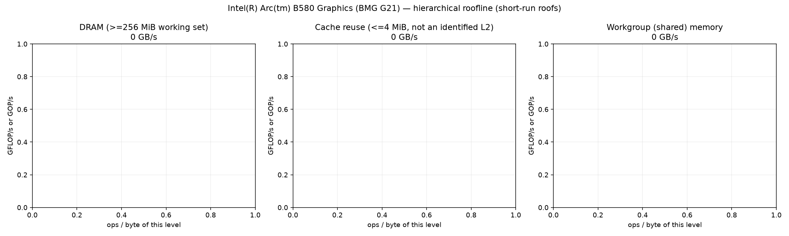
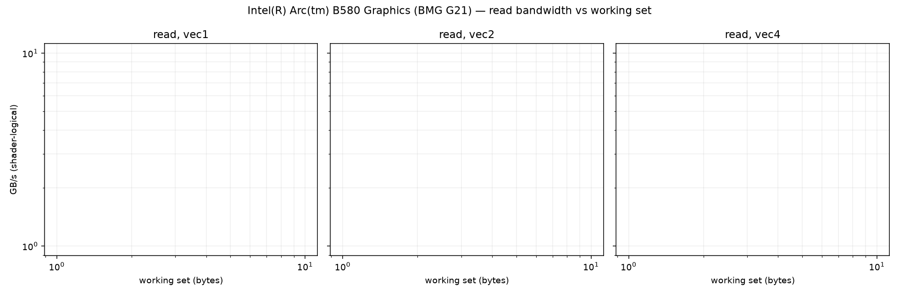
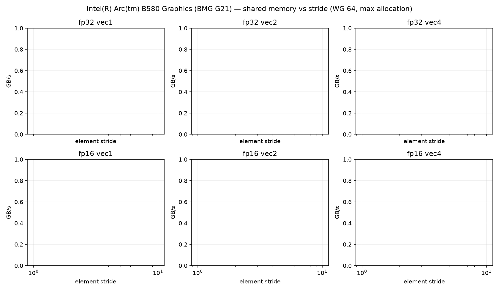
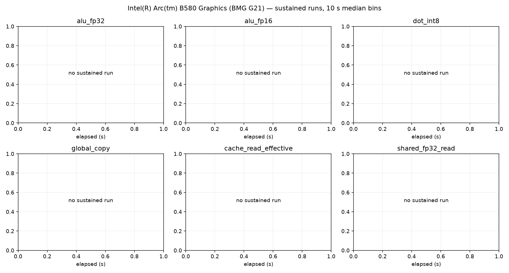

# Intel(R) Arc(tm) B580 Graphics (BMG G21) roofline report

Device: host AMD Ryzen 5 9600X 6-Core Processor (SoC AMD Ryzen 5 9600X 6-Core Processor), Fedora Linux 44 (Workstation Edition), driver 109060099, subgroup 32.
Plan(s): fast. GPU clock **DVFS-governed** (not pinned); results depend on the governor and thermal state.
Code: d0efe1c1a4467ac80c99538fd195045bad70d000, runner 784e6acafa0a54e5. Rows from other runner or shader builds excluded: 0.

Validation policy: **pre_and_post**; checks bracket continuous sampling and do not guarantee detection of transient errors between checks. Historical pre-only rows are diagnostic only.
Excluded rows: 1; reasons are in all-configurations.csv.
No current confirmed roofs
Sustained roofs require three distinct stable batches per current confirmed configuration and duration

Short-run columns are the best validated configuration: median and best (minimum time, the STREAM/BabelStream convention) of the samples, and the differential rate (paired L vs L/2 runs, removing fixed per-dispatch cost). Sustained is the median of the last 60 s of each sustained run (durations are recorded in sustained-runs.csv). Controls never define a roof. `spill` marks variants whose driver statistics report register spilling: spills only slow a kernel, so the value is still an achievable lower bound.

| roof | short median | short best | differential | sustained | unit |
|---|---:|---:|---:|---:|---|

## Roof confirmation

Each roof's top candidates were re-measured in fresh processes, round-robin with alternating order. The roof is the median of the best candidate's repeats; the sweep maximum (a single run) is shown for comparison. Roofs without a quality-passing candidate (standard error of the median <= 3 %, not short, fixed cost <= 10 %) are marked unconfirmed.

| roof | confirmed median | repeat range | repeats | sweep max (unconfirmed) |
|---|---:|---:|---:|---:|

## Device-state sentinel

`alu_fp32_v4_c16 wg256 groups512` measured before and after every stage and every 20 configurations. Values below 85 % of the median reading (11.681 TFLOP/s) mark a stage that ran on a throttled or otherwise degraded device; re-measure those stages.

| UTC | label | TFLOP/s | state |
|---|---|---:|---|
| 2026-10-09T18:24:11 | matrix_feed_start | 11.680 | ok |
| 2026-10-09T18:24:13 | matrix_feed_end | 11.681 | ok |
| 2026-10-09T18:24:15 | confirm_end | 11.681 | ok |

## Ridge points (short-run roofs)

Arithmetic intensity (ops per byte of that level) at which each compute roof meets each memory roof.

| compute roof |  |
|---|

## Figures

See also [TUNING.md](TUNING.md), [SUPPLEMENT.md](SUPPLEMENT.md) (latency, TLB, line size, ERT, memory type) and [ISA-CHECK.md](ISA-CHECK.md).

## Limits

- Bandwidths are shader-logical bytes; physical DRAM/L2 traffic is not measurable without `VK_KHR_performance_query` (exposed: False).
- No vendor theoretical peaks are used; values are achievable rates on this device and driver.
- Cache knees move with workgroup size and are not cache capacities; see the pointer-chase results.
- Sustained values need 3 batches (plan `gold`) before they replace short-run roofs.
