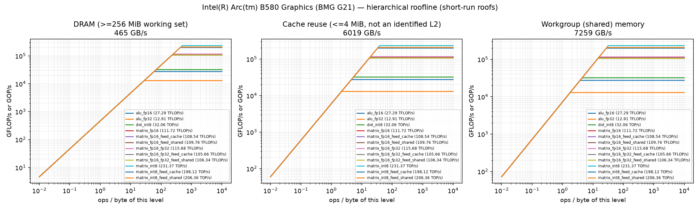
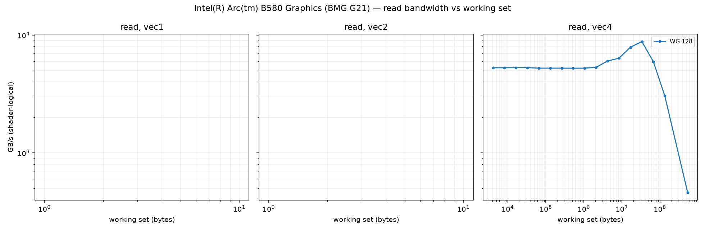
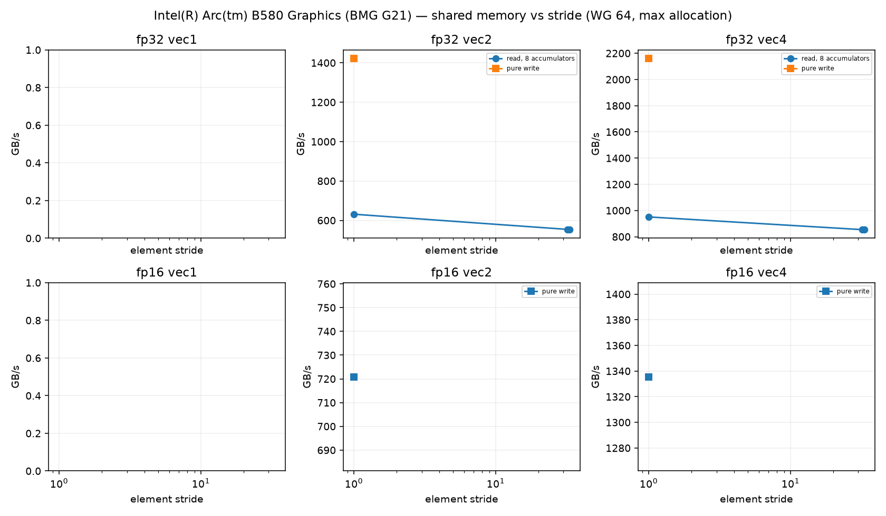
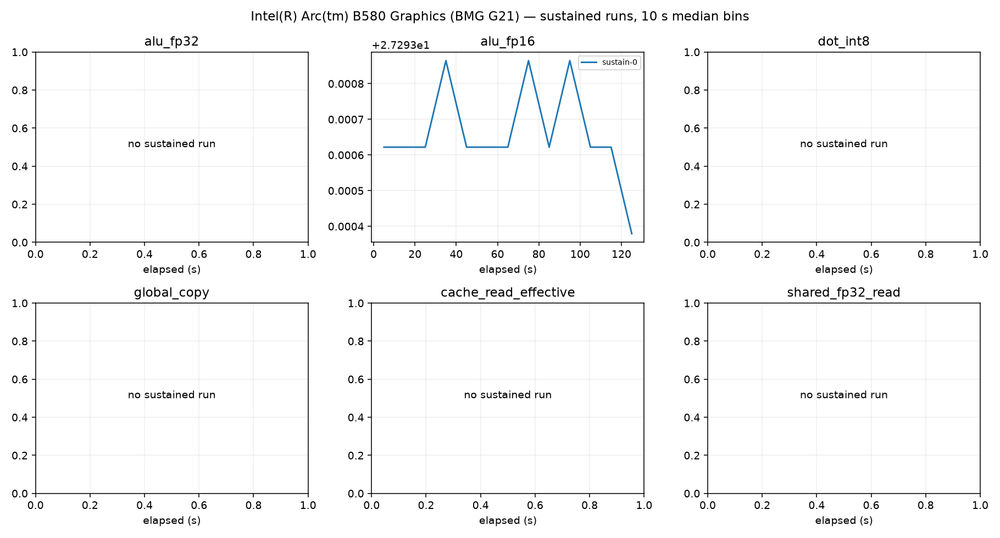

# Intel(R) Arc(tm) B580 Graphics (BMG G21) roofline report

Device: host AMD Ryzen 5 9600X 6-Core Processor (SoC AMD Ryzen 5 9600X 6-Core Processor), Fedora Linux 44 (Workstation Edition), driver 109060099, subgroup 32.
Plan(s): fast. GPU clock **DVFS-governed** (not pinned); results depend on the governor and thermal state.
Code: f87e89ae8b568644139fe04777136f8e05967994, runner 784e6acafa0a54e5. Rows from other runner or shader builds excluded: 0.

Validation policy: **pre_and_post**; checks bracket continuous sampling and do not guarantee detection of transient errors between checks. Historical pre-only rows are diagnostic only.
Excluded rows: 57; reasons are in all-configurations.csv.
Sustained roofs require three distinct stable batches per current confirmed configuration and duration

Short-run columns are the best validated configuration: median and best (minimum time, the STREAM/BabelStream convention) of the samples, and the differential rate (paired L vs L/2 runs, removing fixed per-dispatch cost). Sustained is the median of the last 60 s of each sustained run (durations are recorded in sustained-runs.csv). Controls never define a roof. `spill` marks variants whose driver statistics report register spilling: spills only slow a kernel, so the value is still an achievable lower bound.

| roof | short median | short best | differential | sustained | unit |
|---|---:|---:|---:|---:|---|
| alu_fp16 | 27.294 | 27.296 | 27.347 (fixed 0%) | 27.294 (1×) | TFLOP/s |
| alu_fp32 | 12.911 | 12.912 | 12.949 (fixed 0%) | — | TFLOP/s |
| cache_read_effective | 6019.340 | 6026.459 | 6025.409 (fixed 0%) | — | GB/s |
| dot_int8 | 32.062 | 32.065 | 32.149 (fixed 0%) | — | TOP/s |
| global_copy | 406.660 | 411.322 | 411.179 (fixed 1%) | — | GB/s |
| global_read | 465.218 | 467.820 | 471.468 (fixed 1%) | 465.201 (1×) | GB/s |
| global_triad | 393.806 | 395.026 | 394.505 (fixed 0%) | — | GB/s |
| global_write | 402.325 | 410.238 | 413.747 (fixed 3%) | — | GB/s |
| matrix_fp16 | 111.723 | 111.748 | 115.935 (fixed 4%) | — | TFLOP/s |
| matrix_fp16_feed_cache | 108.543 | 109.481 | 110.402 (fixed 2%) | — | TFLOP/s |
| matrix_fp16_feed_dram | 444.313 | 444.911 | 451.934 (fixed 2%) | — | GB/s |
| matrix_fp16_feed_shared | 109.764 | 109.898 | 113.777 (fixed 4%) | — | TFLOP/s |
| matrix_fp16_fp32 | 115.680 | 115.686 | 115.953 (fixed 0%) | 115.680 (1×) | TFLOP/s |
| matrix_fp16_fp32_feed_cache | 105.656 | 106.028 | 106.325 (fixed 1%) | — | TFLOP/s |
| matrix_fp16_fp32_feed_dram | 439.992 | 441.311 | 444.950 (fixed 1%) | — | GB/s |
| matrix_fp16_fp32_feed_shared | 106.342 | 106.517 | 106.805 (fixed 0%) | — | TFLOP/s |
| matrix_int8 | 231.371 | 231.387 | 231.909 (fixed 0%) | — | TOP/s |
| matrix_int8_feed_cache | 198.121 | 199.108 | 198.733 (fixed 0%) | — | TOP/s |
| matrix_int8_feed_dram | 436.662 | 437.554 | 442.344 (fixed 1%) | — | GB/s |
| matrix_int8_feed_shared | 206.363 | 206.553 | 212.204 (fixed 3%) | — | TOP/s |
| shared_fp16_read | 3450.249 | 3450.789 | 3649.239 (fixed 5%) | — | GB/s |
| shared_fp16_write | 4102.131 | 4102.507 | 4183.336 (fixed 2%) | — | GB/s |
| shared_fp32_read | 7259.064 | 7261.407 | 7267.860 (fixed 0%) | — | GB/s |
| shared_fp32_write | 6147.020 | 6147.294 | 6151.153 (fixed 0%) | — | GB/s |
| texture_rgba16f_buffer_cache | 1096.666 | 1098.390 | 1096.857 (fixed 0%) | — | GB/s |
| texture_rgba16f_buffer_dram | 420.630 | 421.086 | 420.900 (fixed 0%) | — | GB/s |
| texture_rgba16f_tex2d_cache | 985.742 | 986.999 | 986.071 (fixed 0%) | — | GB/s |
| texture_rgba16f_tex2d_dram | 260.466 | 262.875 | 260.134 (fixed -0%) | — | GB/s |
| texture_rgba16f_tex3d_cache | 996.900 | 999.228 | 997.718 (fixed 0%) | — | GB/s |
| texture_rgba16f_tex3d_dram | 441.002 | 442.297 | 441.424 (fixed 0%) | — | GB/s |
| texture_rgba32f_buffer_cache | 1113.703 | 1115.403 | 1113.596 (fixed -0%) | — | GB/s |
| texture_rgba32f_buffer_dram | 422.447 | 422.628 | 422.544 (fixed 0%) | — | GB/s |
| texture_rgba32f_tex2d_cache | 948.531 | 950.994 | 949.084 (fixed 0%) | — | GB/s |
| texture_rgba32f_tex2d_dram | 402.435 | 404.243 | 402.224 (fixed -0%) | — | GB/s |
| texture_rgba32f_tex3d_cache | 1011.579 | 1015.950 | 1009.893 (fixed -0%) | — | GB/s |
| texture_rgba32f_tex3d_dram | 572.946 | 576.916 | 572.795 (fixed -0%) | — | GB/s |

## Roof confirmation

Each roof's top candidates were re-measured in fresh processes, round-robin with alternating order. The roof is the median of the best candidate's repeats; the sweep maximum (a single run) is shown for comparison. Roofs without a quality-passing candidate (standard error of the median <= 3 %, not short, fixed cost <= 10 %) are marked unconfirmed.

| roof | confirmed median | repeat range | repeats | sweep max (unconfirmed) |
|---|---:|---:|---:|---:|
| alu_fp16 | 27.294 | 27.294–27.295 (0.0%) | 3 | 27.294 |
| alu_fp32 | 12.911 | 12.911–12.912 (0.0%) | 3 | 12.911 |
| cache_read_effective | 6019.340 | 6019.133–6019.374 (0.0%) | 3 | 6019.068 |
| dot_int8 | 32.062 | 32.061–32.062 (0.0%) | 3 | 32.059 |
| global_copy | 406.660 | 406.165–407.356 (0.3%) | 3 | 406.175 |
| global_read | 465.218 | 465.000–465.453 (0.1%) | 3 | 465.289 |
| global_triad | 393.806 | 393.701–393.843 (0.0%) | 3 | 393.698 |
| global_write | 402.325 | 401.830–404.039 (0.5%) | 3 | 403.199 |
| matrix_fp16 | 111.723 | 111.721–111.723 (0.0%) | 3 | 111.726 |
| matrix_fp16_feed_cache | 108.543 | 107.034–108.712 (1.5%) | 3 | 107.107 |
| matrix_fp16_feed_dram | 444.313 | 444.203–444.348 (0.0%) | 3 | 444.207 |
| matrix_fp16_feed_shared | 109.764 | 109.761–109.765 (0.0%) | 3 | 109.740 |
| matrix_fp16_fp32 | 115.680 | 115.678–115.680 (0.0%) | 3 | 115.686 |
| matrix_fp16_fp32_feed_cache | 105.656 | 105.653–105.735 (0.1%) | 3 | 105.240 |
| matrix_fp16_fp32_feed_dram | 439.992 | 439.746–440.855 (0.3%) | 3 | 439.898 |
| matrix_fp16_fp32_feed_shared | 106.342 | 106.342–106.396 (0.1%) | 3 | 106.351 |
| matrix_int8 | 231.371 | 231.355–231.375 (0.0%) | 3 | 231.362 |
| matrix_int8_feed_cache | 198.121 | 197.217–198.248 (0.5%) | 3 | 198.170 |
| matrix_int8_feed_dram | 436.662 | 436.564–436.711 (0.0%) | 3 | 435.952 |
| matrix_int8_feed_shared | 206.363 | 205.995–206.407 (0.2%) | 3 | 206.559 |
| shared_fp16_read | 3450.249 | 3450.016–3450.271 (0.0%) | 3 | 3450.229 |
| shared_fp16_write | 4102.131 | 4101.994–4102.145 (0.0%) | 3 | 4102.190 |
| shared_fp32_read | 7259.064 | 7258.851–7259.649 (0.0%) | 3 | 7259.756 |
| shared_fp32_write | 6147.020 | 6147.020–6147.131 (0.0%) | 3 | 6147.242 |
| texture_rgba16f_buffer_cache | 1096.666 | 1096.650–1096.720 (0.0%) | 3 | 1096.933 |
| texture_rgba16f_buffer_dram | 420.630 | 420.601–420.680 (0.0%) | 3 | 420.666 |
| texture_rgba16f_tex2d_cache | 985.742 | 984.607–985.758 (0.1%) | 3 | 985.577 |
| texture_rgba16f_tex2d_dram | 260.466 | 260.340–260.760 (0.2%) | 3 | 260.243 |
| texture_rgba16f_tex3d_cache | 996.900 | 996.593–997.312 (0.1%) | 3 | 996.770 |
| texture_rgba16f_tex3d_dram | 441.002 | 440.993–441.054 (0.0%) | 3 | 441.282 |
| texture_rgba32f_buffer_cache | 1113.703 | 1113.273–1113.797 (0.0%) | 3 | 1113.385 |
| texture_rgba32f_buffer_dram | 422.447 | 422.443–422.505 (0.0%) | 3 | 422.468 |
| texture_rgba32f_tex2d_cache | 948.531 | 948.268–949.211 (0.1%) | 3 | 949.017 |
| texture_rgba32f_tex2d_dram | 402.435 | 402.350–402.640 (0.1%) | 3 | 402.805 |
| texture_rgba32f_tex3d_cache | 1011.579 | 1011.384–1012.112 (0.1%) | 3 | 1012.770 |
| texture_rgba32f_tex3d_dram | 572.946 | 572.714–573.172 (0.1%) | 3 | 572.807 |

## Cooperative matrix fed from memory, by reuse

Best validated median per source and CHAINS (multiply-adds per loaded A/B tile pair). `load GB/s` counts the A/B tile bytes loaded. DRAM-fed rates grow with reuse until the matrix unit limits them, so the `matrix_*_feed_dram` roof above is a bandwidth; look a kernel's ops per loaded byte up here instead. `gates` lists quality gates the row failed (such rows never define a roof).

| dtype | source | CHAINS | ops / loaded byte | rate | load GB/s | gates |
|---|---|---:|---:|---:|---:|---|
| fp16 | shared | 8 | 42.7 | 109.765 TFLOP/s | 2572.6 | — |
| fp16 | cache | 1 | 5.3 | 17.993 TFLOP/s | 3373.8 | — |
| fp16 | cache | 2 | 10.7 | 35.384 TFLOP/s | 3317.3 | — |
| fp16 | cache | 4 | 21.3 | 68.632 TFLOP/s | 3217.1 | — |
| fp16 | cache | 8 | 42.7 | 108.712 TFLOP/s | 2547.9 | — |
| fp16 | dram | 1 | 5.3 | 2.321 TFLOP/s | 435.3 | — |
| fp16 | dram | 2 | 10.7 | 4.565 TFLOP/s | 427.9 | — |
| fp16 | dram | 4 | 21.3 | 8.894 TFLOP/s | 416.9 | — |
| fp16 | dram | 8 | 42.7 | 17.135 TFLOP/s | 401.6 | — |
| fp16_fp32 | shared | 1 | 5.3 | 27.516 TFLOP/s | 5159.2 | — |
| fp16_fp32 | shared | 2 | 10.7 | 53.509 TFLOP/s | 5016.5 | — |
| fp16_fp32 | shared | 4 | 21.3 | 101.921 TFLOP/s | 4777.6 | — |
| fp16_fp32 | shared | 8 | 42.7 | 106.396 TFLOP/s | 2493.7 | — |
| fp16_fp32 | cache | 1 | 5.3 | 18.560 TFLOP/s | 3480.0 | — |
| fp16_fp32 | cache | 2 | 10.7 | 36.572 TFLOP/s | 3428.6 | — |
| fp16_fp32 | cache | 4 | 21.3 | 70.957 TFLOP/s | 3326.1 | — |
| fp16_fp32 | cache | 8 | 42.7 | 105.735 TFLOP/s | 2478.2 | — |
| fp16_fp32 | dram | 1 | 5.3 | 2.332 TFLOP/s | 437.3 | — |
| fp16_fp32 | dram | 2 | 10.7 | 4.600 TFLOP/s | 431.3 | — |
| fp16_fp32 | dram | 4 | 21.3 | 9.018 TFLOP/s | 422.7 | — |
| fp16_fp32 | dram | 8 | 42.7 | 17.612 TFLOP/s | 412.8 | — |
| int8 | shared | 1 | 10.7 | 34.388 TOP/s | 3223.9 | — |
| int8 | shared | 2 | 21.3 | 72.873 TOP/s | 3415.9 | — |
| int8 | shared | 4 | 42.7 | 135.804 TOP/s | 3182.9 | — |
| int8 | shared | 8 | 85.3 | 206.559 TOP/s | 2420.6 | — |
| int8 | cache | 1 | 10.7 | 24.120 TOP/s | 2261.3 | — |
| int8 | cache | 2 | 21.3 | 48.472 TOP/s | 2272.1 | — |
| int8 | cache | 4 | 42.7 | 99.713 TOP/s | 2337.0 | — |
| int8 | cache | 8 | 85.3 | 198.248 TOP/s | 2323.2 | — |
| int8 | dram | 1 | 10.7 | 4.620 TOP/s | 433.1 | — |
| int8 | dram | 2 | 21.3 | 9.132 TOP/s | 428.1 | — |
| int8 | dram | 4 | 42.7 | 17.886 TOP/s | 419.2 | — |
| int8 | dram | 8 | 85.3 | 35.374 TOP/s | 414.5 | — |

## Device-state sentinel

`alu_fp32_v4_c16 wg256 groups512` measured before and after every stage and every 20 configurations. Values below 85 % of the median reading (11.680 TFLOP/s) mark a stage that ran on a throttled or otherwise degraded device; re-measure those stages.

| UTC | label | TFLOP/s | state |
|---|---|---:|---|
| 2026-10-09T17:50:11 | validate_start | 11.680 | ok |
| 2026-10-09T17:50:23 | validate_end | 11.680 | ok |
| 2026-10-09T17:50:59 | cache_end | 11.680 | ok |
| 2026-10-09T17:51:07 | sweep-memory_20 | 11.680 | ok |
| 2026-10-09T17:51:20 | memory_end | 11.680 | ok |
| 2026-10-09T17:51:42 | sweep-compute_40 | 11.680 | ok |
| 2026-10-09T17:52:15 | sweep-compute_60 | 11.681 | ok |
| 2026-10-09T17:52:48 | sweep-compute_80 | 11.680 | ok |
| 2026-10-09T17:53:21 | sweep-compute_100 | 11.680 | ok |
| 2026-10-09T17:53:53 | sweep-compute_120 | 11.680 | ok |
| 2026-10-09T17:54:27 | sweep-compute_140 | 11.680 | ok |
| 2026-10-09T17:55:02 | sweep-compute_160 | 11.680 | ok |
| 2026-10-09T17:55:26 | compute_end | 11.680 | ok |
| 2026-10-09T17:55:38 | sweep-matrix-feed_180 | 11.680 | ok |
| 2026-10-09T17:56:13 | sweep-matrix-feed_200 | 11.680 | ok |
| 2026-10-09T17:56:31 | matrix_feed_end | 11.680 | ok |
| 2026-10-09T17:56:50 | sweep-texture_220 | 11.680 | ok |
| 2026-10-09T17:56:54 | texture_end | 11.681 | ok |
| 2026-10-09T17:57:26 | sweep-shared_240 | 11.680 | ok |
| 2026-10-09T17:58:00 | sweep-shared_260 | 11.680 | ok |
| 2026-10-09T17:58:29 | shared_end | 11.680 | ok |
| 2026-10-09T17:58:34 | latency-capacity_280 | 11.680 | ok |
| 2026-10-09T17:59:09 | latency_end | 11.681 | ok |
| 2026-10-09T17:59:30 | confirm_300 | 11.680 | ok |
| 2026-10-09T18:00:06 | confirm_320 | 11.680 | ok |
| 2026-10-09T18:00:44 | confirm_340 | 11.680 | ok |
| 2026-10-09T18:01:18 | confirm_360 | 11.680 | ok |
| 2026-10-09T18:01:58 | confirm_380 | 11.680 | ok |
| 2026-10-09T18:02:32 | confirm_400 | 11.681 | ok |
| 2026-10-09T18:03:08 | confirm_420 | 11.680 | ok |
| 2026-10-09T18:03:46 | confirm_440 | 11.680 | ok |
| 2026-10-09T18:04:24 | confirm_460 | 11.681 | ok |
| 2026-10-09T18:04:29 | confirm_end | 11.680 | ok |
| 2026-10-09T18:04:31 | sustain_0 | 11.680 | ok |

## Ridge points (short-run roofs)

Arithmetic intensity (ops per byte of that level) at which each compute roof meets each memory roof.

| compute roof | global | cache | shared_fp32 | shared_fp16 |
|---|---:|---:|---:|---:|
| alu_fp16 | 58.67 | 4.53 | 3.76 | 6.65 |
| alu_fp32 | 27.75 | 2.14 | 1.78 | 3.15 |
| dot_int8 | 68.92 | 5.33 | 4.42 | 7.82 |
| matrix_fp16 | 240.15 | 18.56 | 15.39 | 27.24 |
| matrix_fp16_feed_cache | 233.32 | 18.03 | 14.95 | 26.46 |
| matrix_fp16_feed_shared | 235.94 | 18.24 | 15.12 | 26.76 |
| matrix_fp16_fp32 | 248.66 | 19.22 | 15.94 | 28.20 |
| matrix_fp16_fp32_feed_cache | 227.11 | 17.55 | 14.55 | 25.76 |
| matrix_fp16_fp32_feed_shared | 228.59 | 17.67 | 14.65 | 25.92 |
| matrix_int8 | 497.34 | 38.44 | 31.87 | 56.40 |
| matrix_int8_feed_cache | 425.87 | 32.91 | 27.29 | 48.30 |
| matrix_int8_feed_shared | 443.58 | 34.28 | 28.43 | 50.31 |

## Figures

See also [TUNING.md](TUNING.md), [SUPPLEMENT.md](SUPPLEMENT.md) (latency, TLB, line size, ERT, memory type) and [ISA-CHECK.md](ISA-CHECK.md).

## Limits

- Bandwidths are shader-logical bytes; physical DRAM/L2 traffic is not measurable without `VK_KHR_performance_query` (exposed: False).
- No vendor theoretical peaks are used; values are achievable rates on this device and driver.
- Cache knees move with workgroup size and are not cache capacities; see the pointer-chase results.
- Sustained values need 3 batches (plan `gold`) before they replace short-run roofs.
