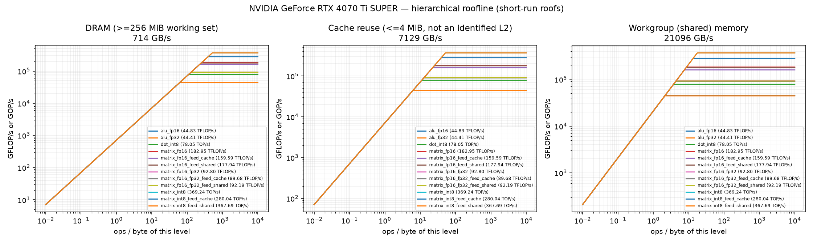
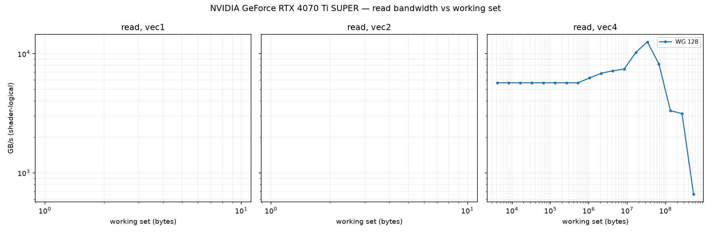
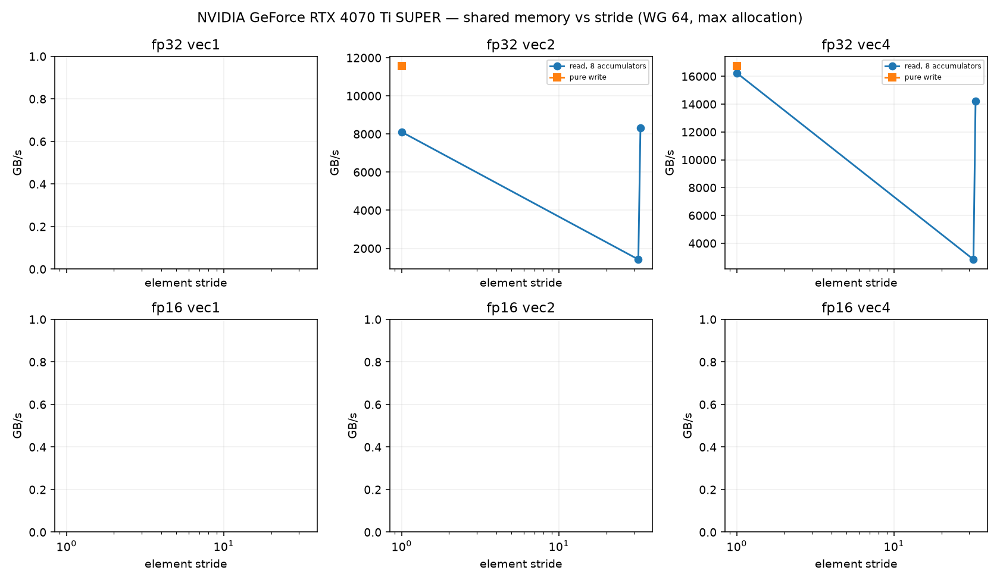
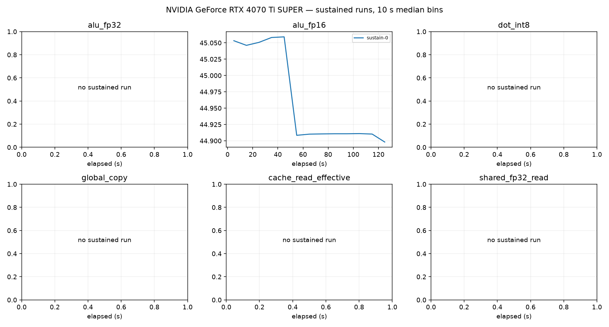

# NVIDIA GeForce RTX 4070 Ti SUPER roofline report

Device: host AMD EPYC 4464P 12-Core Processor (SoC AMD EPYC 4464P 12-Core Processor), Ubuntu 26.04.1 LTS, driver 2580660800, subgroup 32.
Plan(s): fast. GPU clock **DVFS-governed** (not pinned); results depend on the governor and thermal state.
Code: 7326bd778e81796c321ae0906afb0e1519f043fe, runner b1180c72e9c53970. Rows from other runner or shader builds excluded: 0.

Validation policy: **pre_and_post**; checks bracket continuous sampling and do not guarantee detection of transient errors between checks. Historical pre-only rows are diagnostic only.
Excluded rows: 65; reasons are in all-configurations.csv.
matrix_int8_feed_dram: repeat_unstable
Sustained roofs require three distinct stable batches per current confirmed configuration and duration

Short-run columns are the best validated configuration: median and best (minimum time, the STREAM/BabelStream convention) of the samples, and the differential rate (paired L vs L/2 runs, removing fixed per-dispatch cost). Sustained is the median of the last 60 s of each sustained run (durations are recorded in sustained-runs.csv). Controls never define a roof. `spill` marks variants whose driver statistics report register spilling: spills only slow a kernel, so the value is still an achievable lower bound.

| roof | short median | short best | differential | sustained | unit |
|---|---:|---:|---:|---:|---|
| alu_fp16 | 44.827 | 45.073 | 44.867 (fixed 0%) | 44.911 (1×) | TFLOP/s |
| alu_fp32 | 44.414 | 44.672 | 44.460 (fixed 0%) | — | TFLOP/s |
| cache_read_effective | 7129.060 | 7156.356 | 7137.522 (fixed 0%) | — | GB/s |
| dot_int8 | 78.051 | 78.131 | 78.149 (fixed 0%) | — | TOP/s |
| global_copy | 646.122 | 647.552 | 647.719 (fixed 0%) | — | GB/s |
| global_read | 713.530 | 721.401 | 740.164 (fixed 4%) | 2664.020 (1×) | GB/s |
| global_triad | 631.830 | 633.127 | 629.814 (fixed -0%) | — | GB/s |
| global_write | 642.438 | 645.228 | 641.932 (fixed -0%) | — | GB/s |
| matrix_fp16 | 182.946 | 183.004 | 184.482 (fixed 1%) | — | TFLOP/s |
| matrix_fp16_feed_cache | 159.588 | 159.771 | 161.321 (fixed 1%) | — | TFLOP/s |
| matrix_fp16_feed_dram | 650.217 | 650.558 | 659.159 (fixed 1%) | — | GB/s |
| matrix_fp16_feed_shared | 177.940 | 177.968 | 184.420 (fixed 4%) | — | TFLOP/s |
| matrix_fp16_fp32 | 92.804 | 92.815 | 92.869 (fixed 0%) | 92.314 (1×) | TFLOP/s |
| matrix_fp16_fp32_feed_cache | 89.677 | 89.692 | 89.789 (fixed 0%) | — | TFLOP/s |
| matrix_fp16_fp32_feed_dram | 669.570 | 670.020 | 708.254 (fixed 5%) | — | GB/s |
| matrix_fp16_fp32_feed_shared | 92.186 | 92.680 | 92.363 (fixed 0%) | — | TFLOP/s |
| matrix_int8 | 369.236 | 371.202 | 369.498 (fixed 0%) | — | TOP/s |
| matrix_int8_feed_cache | 280.042 | 281.604 | 281.067 (fixed 0%) | — | TOP/s |
| matrix_int8_feed_dram | 698.928 | 699.423 | 775.759 (fixed 10%) | — | GB/s |
| matrix_int8_feed_shared | 367.687 | 367.929 | 369.182 (fixed 0%) | — | TOP/s |
| shared_fp16_read | 1344.255 | 1349.969 | 1454.168 (fixed 8%) | — | GB/s |
| shared_fp16_write | 11812.031 | 11816.843 | 12153.383 (fixed 3%) | — | GB/s |
| shared_fp32_read | 21096.308 | 21220.651 | 21157.723 (fixed 0%) | — | GB/s |
| shared_fp32_write | 19169.565 | 19225.132 | 19182.124 (fixed 0%) | — | GB/s |
| texture_rgba16f_buffer_cache | 1670.877 | 1672.136 | 1671.055 (fixed 0%) | — | GB/s |
| texture_rgba16f_buffer_dram | 636.217 | 636.544 | 635.973 (fixed -0%) | — | GB/s |
| texture_rgba16f_tex2d_cache | 1569.699 | 1570.493 | 1569.574 (fixed -0%) | — | GB/s |
| texture_rgba16f_tex2d_dram | 509.947 | 513.375 | 510.348 (fixed 0%) | — | GB/s |
| texture_rgba16f_tex3d_cache | 1626.562 | 1627.429 | 1626.822 (fixed 0%) | — | GB/s |
| texture_rgba16f_tex3d_dram | 630.074 | 630.581 | 629.836 (fixed -0%) | — | GB/s |
| texture_rgba32f_buffer_cache | 1677.021 | 1677.584 | 1677.076 (fixed 0%) | — | GB/s |
| texture_rgba32f_buffer_dram | 634.793 | 635.009 | 634.660 (fixed -0%) | — | GB/s |
| texture_rgba32f_tex2d_cache | 1613.664 | 1614.319 | 1614.552 (fixed 0%) | — | GB/s |
| texture_rgba32f_tex2d_dram | 493.610 | 495.206 | 493.703 (fixed 0%) | — | GB/s |
| texture_rgba32f_tex3d_cache | 1648.297 | 1648.807 | 1648.674 (fixed 0%) | — | GB/s |
| texture_rgba32f_tex3d_dram | 630.667 | 631.238 | 630.600 (fixed -0%) | — | GB/s |

## Roof confirmation

Each roof's top candidates were re-measured in fresh processes, round-robin with alternating order. The roof is the median of the best candidate's repeats; the sweep maximum (a single run) is shown for comparison. Roofs without a quality-passing candidate (standard error of the median <= 3 %, not short, fixed cost <= 10 %) are marked unconfirmed.

| roof | confirmed median | repeat range | repeats | sweep max (unconfirmed) |
|---|---:|---:|---:|---:|
| alu_fp16 | 44.827 | 44.827–45.069 (0.5%) | 3 | 44.975 |
| alu_fp32 | 44.414 | 44.407–44.664 (0.6%) | 3 | 44.421 |
| cache_read_effective | 7129.060 | 7128.742–7152.239 (0.3%) | 3 | 7168.633 |
| dot_int8 | 78.051 | 78.031–78.114 (0.1%) | 3 | 78.046 |
| global_copy | 646.122 | 645.970–646.149 (0.0%) | 3 | 646.086 |
| global_read | 713.530 | 712.981–714.380 (0.2%) | 3 | 711.973 |
| global_triad | 631.830 | 631.411–631.938 (0.1%) | 3 | 632.149 |
| global_write | 642.438 | 641.197–642.648 (0.2%) | 3 | 642.048 |
| matrix_fp16 | 182.946 | 182.893–182.983 (0.0%) | 3 | 182.952 |
| matrix_fp16_feed_cache | 159.588 | 158.828–159.713 (0.6%) | 3 | 159.538 |
| matrix_fp16_feed_dram | 650.217 | 650.183–650.235 (0.0%) | 3 | 650.232 |
| matrix_fp16_feed_shared | 177.940 | 177.864–177.940 (0.0%) | 3 | 177.853 |
| matrix_fp16_fp32 | 92.804 | 92.316–92.807 (0.5%) | 3 | 92.808 |
| matrix_fp16_fp32_feed_cache | 89.677 | 89.588–89.681 (0.1%) | 3 | 89.596 |
| matrix_fp16_fp32_feed_dram | 669.570 | 669.544–669.626 (0.0%) | 3 | 669.585 |
| matrix_fp16_fp32_feed_shared | 92.186 | 92.179–92.670 (0.5%) | 3 | 92.181 |
| matrix_int8 | 369.236 | 369.232–371.164 (0.5%) | 3 | 371.142 |
| matrix_int8_feed_cache | 280.042 | 280.021–280.089 (0.0%) | 3 | 280.071 |
| matrix_int8_feed_dram | 698.928 | 698.871–698.981 (0.0%) | 3 | 702.696 |
| matrix_int8_feed_shared | 367.687 | 367.685–367.829 (0.0%) | 3 | 367.793 |
| shared_fp16_read | 1344.255 | 1344.233–1349.813 (0.4%) | 3 | 1349.728 |
| shared_fp16_write | 11812.031 | 11811.032–11813.968 (0.0%) | 3 | 11830.237 |
| shared_fp32_read | 21096.308 | 21084.399–21193.322 (0.5%) | 3 | 21072.400 |
| shared_fp32_write | 19169.565 | 19164.833–19171.566 (0.0%) | 3 | 19162.678 |
| texture_rgba16f_buffer_cache | 1670.877 | 1670.850–1671.441 (0.0%) | 3 | 1670.761 |
| texture_rgba16f_buffer_dram | 636.217 | 636.197–636.236 (0.0%) | 3 | 636.256 |
| texture_rgba16f_tex2d_cache | 1569.699 | 1569.565–1570.225 (0.0%) | 3 | 1569.624 |
| texture_rgba16f_tex2d_dram | 509.947 | 509.306–510.635 (0.3%) | 3 | 509.197 |
| texture_rgba16f_tex3d_cache | 1626.562 | 1626.510–1627.117 (0.0%) | 3 | 1626.450 |
| texture_rgba16f_tex3d_dram | 630.074 | 630.004–630.081 (0.0%) | 3 | 629.756 |
| texture_rgba32f_buffer_cache | 1677.021 | 1676.789–1677.084 (0.0%) | 3 | 1677.093 |
| texture_rgba32f_buffer_dram | 634.793 | 634.754–634.793 (0.0%) | 3 | 634.680 |
| texture_rgba32f_tex2d_cache | 1613.664 | 1613.277–1613.690 (0.0%) | 3 | 1613.380 |
| texture_rgba32f_tex2d_dram | 493.610 | 493.501–494.043 (0.1%) | 3 | 493.657 |
| texture_rgba32f_tex3d_cache | 1648.297 | 1648.042–1648.508 (0.0%) | 3 | 1647.893 |
| texture_rgba32f_tex3d_dram | 630.667 | 630.632–630.801 (0.0%) | 3 | 630.686 |

## Cooperative matrix fed from memory, by reuse

Best validated median per source and CHAINS (multiply-adds per loaded A/B tile pair). `load GB/s` counts the A/B tile bytes loaded. DRAM-fed rates grow with reuse until the matrix unit limits them, so the `matrix_*_feed_dram` roof above is a bandwidth; look a kernel's ops per loaded byte up here instead. `gates` lists quality gates the row failed (such rows never define a roof).

| dtype | source | CHAINS | ops / loaded byte | rate | load GB/s | gates |
|---|---|---:|---:|---:|---:|---|
| fp16 | shared | 4 | 32.0 | 173.553 TFLOP/s | 5423.5 | — |
| fp16 | shared | 8 | 64.0 | 177.940 TFLOP/s | 2780.3 | — |
| fp16 | cache | 1 | 8.0 | 28.507 TFLOP/s | 3563.4 | — |
| fp16 | cache | 2 | 16.0 | 54.768 TFLOP/s | 3423.0 | — |
| fp16 | cache | 4 | 32.0 | 109.276 TFLOP/s | 3414.9 | — |
| fp16 | cache | 8 | 64.0 | 159.713 TFLOP/s | 2495.5 | — |
| fp16 | dram | 1 | 8.0 | 5.083 TFLOP/s | 635.3 | — |
| fp16 | dram | 2 | 16.0 | 10.030 TFLOP/s | 626.9 | — |
| fp16 | dram | 4 | 32.0 | 19.655 TFLOP/s | 614.2 | — |
| fp16 | dram | 8 | 64.0 | 38.077 TFLOP/s | 595.0 | — |
| fp16_fp32 | shared | 1 | 8.0 | 92.670 TFLOP/s | 11583.7 | — |
| fp16_fp32 | shared | 2 | 16.0 | 92.649 TFLOP/s | 5790.6 | — |
| fp16_fp32 | shared | 4 | 32.0 | 92.153 TFLOP/s | 2879.8 | — |
| fp16_fp32 | shared | 8 | 64.0 | 92.139 TFLOP/s | 1439.7 | — |
| fp16_fp32 | cache | 1 | 8.0 | 46.776 TFLOP/s | 5846.9 | — |
| fp16_fp32 | cache | 2 | 16.0 | 69.469 TFLOP/s | 4341.8 | — |
| fp16_fp32 | cache | 4 | 32.0 | 87.086 TFLOP/s | 2721.4 | — |
| fp16_fp32 | cache | 8 | 64.0 | 89.681 TFLOP/s | 1401.3 | — |
| fp16_fp32 | dram | 1 | 8.0 | 5.202 TFLOP/s | 650.2 | — |
| fp16_fp32 | dram | 2 | 16.0 | 10.573 TFLOP/s | 660.8 | — |
| fp16_fp32 | dram | 8 | 64.0 | 39.090 TFLOP/s | 610.8 | — |
| int8 | shared | 1 | 16.0 | 365.882 TOP/s | 22867.6 | — |
| int8 | shared | 2 | 32.0 | 367.058 TOP/s | 11470.6 | — |
| int8 | shared | 4 | 64.0 | 367.829 TOP/s | 5747.3 | — |
| int8 | shared | 8 | 128.0 | 367.661 TOP/s | 2872.4 | — |
| int8 | cache | 1 | 16.0 | 54.255 TOP/s | 3390.9 | — |
| int8 | cache | 2 | 32.0 | 105.035 TOP/s | 3282.3 | — |
| int8 | cache | 4 | 64.0 | 189.356 TOP/s | 2958.7 | — |
| int8 | cache | 8 | 128.0 | 280.089 TOP/s | 2188.2 | — |
| int8 | dram | 1 | 16.0 | 10.424 TOP/s | 651.5 | — |
| int8 | dram | 2 | 32.0 | 22.074 TOP/s | 689.8 | — |
| int8 | dram | 4 | 64.0 | 45.534 TOP/s | 711.5 | — |
| int8 | dram | 8 | 128.0 | 78.447 TOP/s | 612.9 | — |

## Device-state sentinel

`alu_fp32_v4_c16 wg256 groups512` measured before and after every stage and every 20 configurations. Values below 85 % of the median reading (25.491 TFLOP/s) mark a stage that ran on a throttled or otherwise degraded device; re-measure those stages.

| UTC | label | TFLOP/s | state |
|---|---|---:|---|
| 2026-10-09T17:50:13 | validate_start | 25.664 | ok |
| 2026-10-09T17:50:24 | validate_end | 25.619 | ok |
| 2026-10-09T17:51:00 | cache_end | 25.583 | ok |
| 2026-10-09T17:51:07 | sweep-memory_20 | 25.585 | ok |
| 2026-10-09T17:51:20 | memory_end | 25.588 | ok |
| 2026-10-09T17:51:45 | sweep-compute_40 | 25.508 | ok |
| 2026-10-09T17:52:20 | sweep-compute_60 | 25.496 | ok |
| 2026-10-09T17:52:55 | sweep-compute_80 | 25.410 | ok |
| 2026-10-09T17:53:31 | sweep-compute_100 | 25.490 | ok |
| 2026-10-09T17:54:06 | sweep-compute_120 | 25.487 | ok |
| 2026-10-09T17:54:44 | sweep-compute_140 | 25.484 | ok |
| 2026-10-09T17:55:25 | sweep-compute_160 | 25.483 | ok |
| 2026-10-09T17:55:50 | compute_end | 25.499 | ok |
| 2026-10-09T17:56:02 | sweep-matrix-feed_180 | 25.496 | ok |
| 2026-10-09T17:56:55 | sweep-matrix-feed_200 | 25.403 | ok |
| 2026-10-09T17:57:14 | matrix_feed_end | 25.481 | ok |
| 2026-10-09T17:57:34 | sweep-texture_220 | 25.484 | ok |
| 2026-10-09T17:57:39 | texture_end | 25.488 | ok |
| 2026-10-09T17:58:24 | sweep-shared_240 | 25.497 | ok |
| 2026-10-09T17:59:05 | sweep-shared_260 | 25.430 | ok |
| 2026-10-09T17:59:44 | shared_end | 25.508 | ok |
| 2026-10-09T17:59:49 | latency-capacity_280 | 25.507 | ok |
| 2026-10-09T18:00:17 | latency_end | 25.519 | ok |
| 2026-10-09T18:00:39 | confirm_300 | 25.440 | ok |
| 2026-10-09T18:01:15 | confirm_320 | 25.496 | ok |
| 2026-10-09T18:01:56 | confirm_340 | 25.495 | ok |
| 2026-10-09T18:02:33 | confirm_360 | 25.494 | ok |
| 2026-10-09T18:03:14 | confirm_380 | 25.492 | ok |
| 2026-10-09T18:03:50 | confirm_400 | 25.488 | ok |
| 2026-10-09T18:04:25 | confirm_420 | 25.482 | ok |
| 2026-10-09T18:05:03 | confirm_440 | 25.487 | ok |
| 2026-10-09T18:05:43 | confirm_460 | 25.485 | ok |
| 2026-10-09T18:05:53 | confirm_end | 25.490 | ok |
| 2026-10-09T18:05:55 | sustain_0 | 25.487 | ok |

## Ridge points (short-run roofs)

Arithmetic intensity (ops per byte of that level) at which each compute roof meets each memory roof.

| compute roof | global | cache | shared_fp32 | shared_fp16 |
|---|---:|---:|---:|---:|
| alu_fp16 | 62.82 | 6.29 | 2.12 | 3.79 |
| alu_fp32 | 62.25 | 6.23 | 2.11 | 3.76 |
| dot_int8 | 109.39 | 10.95 | 3.70 | 6.61 |
| matrix_fp16 | 256.40 | 25.66 | 8.67 | 15.49 |
| matrix_fp16_feed_cache | 223.66 | 22.39 | 7.56 | 13.51 |
| matrix_fp16_feed_shared | 249.38 | 24.96 | 8.43 | 15.06 |
| matrix_fp16_fp32 | 130.06 | 13.02 | 4.40 | 7.86 |
| matrix_fp16_fp32_feed_cache | 125.68 | 12.58 | 4.25 | 7.59 |
| matrix_fp16_fp32_feed_shared | 129.20 | 12.93 | 4.37 | 7.80 |
| matrix_int8 | 517.48 | 51.79 | 17.50 | 31.26 |
| matrix_int8_feed_cache | 392.47 | 39.28 | 13.27 | 23.71 |
| matrix_int8_feed_shared | 515.31 | 51.58 | 17.43 | 31.13 |

## Figures

See also [TUNING.md](TUNING.md), [SUPPLEMENT.md](SUPPLEMENT.md) (latency, TLB, line size, ERT, memory type) and [ISA-CHECK.md](ISA-CHECK.md).

## Limits

- Bandwidths are shader-logical bytes; physical DRAM/L2 traffic is not measurable without `VK_KHR_performance_query` (exposed: False).
- No vendor theoretical peaks are used; values are achievable rates on this device and driver.
- Cache knees move with workgroup size and are not cache capacities; see the pointer-chase results.
- Sustained values need 3 batches (plan `gold`) before they replace short-run roofs.
