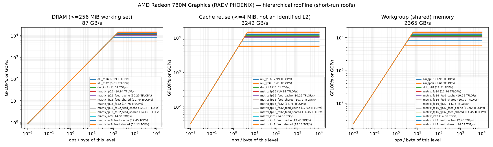
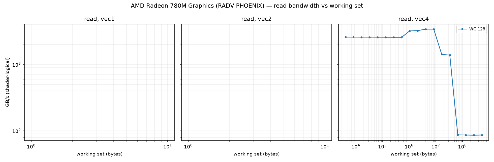
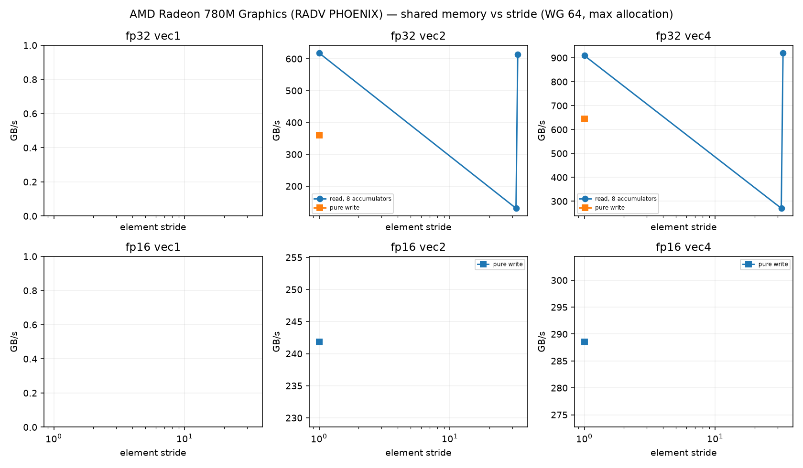
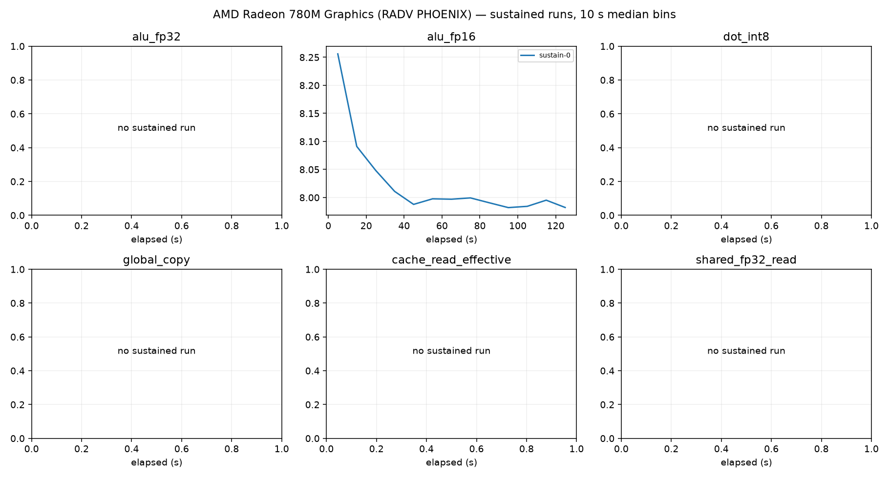

# AMD Radeon 780M Graphics (RADV PHOENIX) roofline report

Device: host AMD Ryzen 9 7940HS w/ Radeon 780M Graphics (SoC AMD Ryzen 9 7940HS w/ Radeon 780M Graphics), Rocky Linux 10.2 (Red Quartz), driver 104865799, subgroup 64.
Plan(s): fast. GPU clock **DVFS-governed** (not pinned); results depend on the governor and thermal state.
Code: 84361ac81182105d06a2f6d8293fa435192f1470, runner f63d4ef143187e42. Rows from other runner or shader builds excluded: 0.

Validation policy: **pre_and_post**; checks bracket continuous sampling and do not guarantee detection of transient errors between checks. Historical pre-only rows are diagnostic only.
Excluded rows: 64; reasons are in all-configurations.csv.
Sustained roofs require three distinct stable batches per current confirmed configuration and duration

Short-run columns are the best validated configuration: median and best (minimum time, the STREAM/BabelStream convention) of the samples, and the differential rate (paired L vs L/2 runs, removing fixed per-dispatch cost). Sustained is the median of the last 60 s of each sustained run (durations are recorded in sustained-runs.csv). Controls never define a roof. `spill` marks variants whose driver statistics report register spilling: spills only slow a kernel, so the value is still an achievable lower bound.

| roof | short median | short best | differential | sustained | unit |
|---|---:|---:|---:|---:|---|
| alu_fp16 | 7.985 | 8.294 | 8.026 (fixed 1%) | 7.991 (1×) | TFLOP/s |
| alu_fp32 | 5.612 | 5.687 | 5.643 (fixed 1%) | — | TFLOP/s |
| cache_read_effective | 3242.197 | 3398.047 | 3282.804 (fixed 1%) | — | GB/s |
| dot_int8 | 11.506 | 11.779 | 11.653 (fixed 1%) | — | TOP/s |
| global_copy | 71.449 | 72.137 | 70.217 (fixed -2%) | — | GB/s |
| global_read | 86.738 | 86.921 | 87.239 (fixed 1%) | 86.734 (1×) | GB/s |
| global_triad | 73.052 | 73.169 | 72.745 (fixed -0%) | — | GB/s |
| global_write | 77.593 | 78.125 | 76.902 (fixed -1%) | — | GB/s |
| matrix_fp16 | 10.935 | 10.960 | 10.993 (fixed 1%) | — | TFLOP/s |
| matrix_fp16_feed_cache | 10.247 | 10.299 | 10.342 (fixed 1%) | — | TFLOP/s |
| matrix_fp16_feed_dram | 81.763 | 81.889 | 81.726 (fixed -0%) | — | GB/s |
| matrix_fp16_feed_shared | 10.792 | 10.812 | 11.269 (fixed 4%) | — | TFLOP/s |
| matrix_fp16_fp32 | 14.764 | 14.789 | 14.781 (fixed 0%) | 14.764 (1×) | TFLOP/s |
| matrix_fp16_fp32_feed_cache | 12.919 | 12.958 | 13.053 (fixed 1%) | — | TFLOP/s |
| matrix_fp16_fp32_feed_dram | 81.328 | 81.614 | 85.198 (fixed 5%) | — | GB/s |
| matrix_fp16_fp32_feed_shared | 14.452 | 14.508 | 15.136 (fixed 5%) | — | TFLOP/s |
| matrix_int8 | 14.364 | 14.393 | 14.387 (fixed 0%) | — | TOP/s |
| matrix_int8_feed_cache | 12.449 | 12.479 | 12.447 (fixed -0%) | — | TOP/s |
| matrix_int8_feed_dram | 80.633 | 80.767 | 85.353 (fixed 6%) | — | GB/s |
| matrix_int8_feed_shared | 14.121 | 14.157 | 14.388 (fixed 2%) | — | TOP/s |
| shared_fp16_read | 2135.362 | 2156.254 | 2304.464 (fixed 7%) | — | GB/s |
| shared_fp16_write | 1697.666 | 1715.226 | 1778.363 (fixed 5%) | — | GB/s |
| shared_fp32_read | 2263.312 | 2282.112 | 2286.090 (fixed 1%) | — | GB/s |
| shared_fp32_write | 2365.031 | 2403.832 | 2360.359 (fixed -0%) | — | GB/s |
| texture_rgba16f_buffer_cache | 82.364 | 82.836 | 81.757 (fixed -1%) | — | GB/s |
| texture_rgba16f_buffer_dram | 83.819 | 84.032 | 83.903 (fixed 0%) | — | GB/s |
| texture_rgba16f_tex2d_cache | 82.877 | 83.462 | 82.359 (fixed -1%) | — | GB/s |
| texture_rgba16f_tex2d_dram | 46.499 | 49.968 | 45.693 (fixed -2%) | — | GB/s |
| texture_rgba16f_tex3d_cache | 82.274 | 82.806 | 82.179 (fixed -0%) | — | GB/s |
| texture_rgba16f_tex3d_dram | 40.803 | 41.298 | 41.156 (fixed 1%) | — | GB/s |
| texture_rgba32f_buffer_cache | 83.349 | 83.798 | 82.731 (fixed -1%) | — | GB/s |
| texture_rgba32f_buffer_dram | 83.540 | 84.039 | 83.576 (fixed 0%) | — | GB/s |
| texture_rgba32f_tex2d_cache | 83.682 | 84.341 | 83.543 (fixed -0%) | — | GB/s |
| texture_rgba32f_tex2d_dram | 43.499 | 43.869 | 43.313 (fixed -0%) | — | GB/s |
| texture_rgba32f_tex3d_cache | 82.417 | 83.598 | 82.018 (fixed -0%) | — | GB/s |
| texture_rgba32f_tex3d_dram | 39.869 | 40.341 | 39.907 (fixed 0%) | — | GB/s |

## Roof confirmation

Each roof's top candidates were re-measured in fresh processes, round-robin with alternating order. The roof is the median of the best candidate's repeats; the sweep maximum (a single run) is shown for comparison. Roofs without a quality-passing candidate (standard error of the median <= 3 %, not short, fixed cost <= 10 %) are marked unconfirmed.

| roof | confirmed median | repeat range | repeats | sweep max (unconfirmed) |
|---|---:|---:|---:|---:|
| alu_fp16 | 7.985 | 7.920–8.154 (2.9%) | 3 | 8.028 |
| alu_fp32 | 5.612 | 5.521–5.667 (2.6%) | 3 | 5.743 |
| cache_read_effective | 3242.197 | 3195.123–3317.207 (3.8%) | 3 | 3419.737 |
| dot_int8 | 11.506 | 11.389–11.574 (1.6%) | 3 | 11.608 |
| global_copy | 71.449 | 71.444–71.465 (0.0%) | 3 | 71.478 |
| global_read | 86.738 | 86.714–86.787 (0.1%) | 3 | 86.717 |
| global_triad | 73.052 | 73.024–73.075 (0.1%) | 3 | 73.057 |
| global_write | 77.593 | 77.584–77.617 (0.0%) | 3 | 77.594 |
| matrix_fp16 | 10.935 | 10.931–10.937 (0.1%) | 3 | 10.937 |
| matrix_fp16_feed_cache | 10.247 | 10.153–10.266 (1.1%) | 3 | 10.205 |
| matrix_fp16_feed_dram | 81.763 | 81.739–81.766 (0.0%) | 3 | 81.755 |
| matrix_fp16_feed_shared | 10.792 | 10.775–10.793 (0.2%) | 3 | 10.805 |
| matrix_fp16_fp32 | 14.764 | 14.758–14.778 (0.1%) | 3 | 14.764 |
| matrix_fp16_fp32_feed_cache | 12.919 | 12.787–12.936 (1.2%) | 3 | 12.806 |
| matrix_fp16_fp32_feed_dram | 81.328 | 81.327–81.367 (0.0%) | 3 | 81.363 |
| matrix_fp16_fp32_feed_shared | 14.452 | 14.451–14.486 (0.2%) | 3 | 14.466 |
| matrix_int8 | 14.364 | 14.329–14.372 (0.3%) | 3 | 14.377 |
| matrix_int8_feed_cache | 12.449 | 12.423–12.455 (0.3%) | 3 | 12.452 |
| matrix_int8_feed_dram | 80.633 | 80.620–80.634 (0.0%) | 3 | 80.615 |
| matrix_int8_feed_shared | 14.121 | 14.117–14.133 (0.1%) | 3 | 14.118 |
| shared_fp16_read | 2135.362 | 2111.405–2147.340 (1.7%) | 3 | 2149.928 |
| shared_fp16_write | 1697.666 | 1690.874–1700.253 (0.6%) | 3 | 1703.239 |
| shared_fp32_read | 2263.312 | 2245.519–2272.153 (1.2%) | 3 | 2272.586 |
| shared_fp32_write | 2365.031 | 2353.056–2369.013 (0.7%) | 3 | 2368.981 |
| texture_rgba16f_buffer_cache | 82.364 | 82.316–82.395 (0.1%) | 3 | 82.309 |
| texture_rgba16f_buffer_dram | 83.819 | 83.686–83.824 (0.2%) | 3 | 83.785 |
| texture_rgba16f_tex2d_cache | 82.877 | 82.680–82.904 (0.3%) | 3 | 82.822 |
| texture_rgba16f_tex2d_dram | 46.499 | 46.160–46.532 (0.8%) | 3 | 45.619 |
| texture_rgba16f_tex3d_cache | 82.274 | 82.265–82.292 (0.0%) | 3 | 82.340 |
| texture_rgba16f_tex3d_dram | 40.803 | 40.784–40.935 (0.4%) | 3 | 40.898 |
| texture_rgba32f_buffer_cache | 83.349 | 83.249–83.510 (0.3%) | 3 | 83.212 |
| texture_rgba32f_buffer_dram | 83.540 | 83.467–83.755 (0.3%) | 3 | 83.468 |
| texture_rgba32f_tex2d_cache | 83.682 | 83.564–83.949 (0.5%) | 3 | 83.593 |
| texture_rgba32f_tex2d_dram | 43.499 | 43.466–43.529 (0.1%) | 3 | 43.450 |
| texture_rgba32f_tex3d_cache | 82.417 | 82.363–82.548 (0.2%) | 3 | 82.268 |
| texture_rgba32f_tex3d_dram | 39.869 | 39.869–39.923 (0.1%) | 3 | 39.957 |

## Cooperative matrix fed from memory, by reuse

Best validated median per source and CHAINS (multiply-adds per loaded A/B tile pair). `load GB/s` counts the A/B tile bytes loaded. DRAM-fed rates grow with reuse until the matrix unit limits them, so the `matrix_*_feed_dram` roof above is a bandwidth; look a kernel's ops per loaded byte up here instead. `gates` lists quality gates the row failed (such rows never define a roof).

| dtype | source | CHAINS | ops / loaded byte | rate | load GB/s | gates |
|---|---|---:|---:|---:|---:|---|
| fp16 | shared | 1 | 8.0 | 2.387 TFLOP/s | 298.3 | — |
| fp16 | shared | 2 | 16.0 | 4.765 TFLOP/s | 297.8 | — |
| fp16 | shared | 4 | 32.0 | 9.162 TFLOP/s | 286.3 | — |
| fp16 | shared | 8 | 64.0 | 10.805 TFLOP/s | 168.8 | — |
| fp16 | cache | 1 | 8.0 | 3.955 TFLOP/s | 494.4 | — |
| fp16 | cache | 2 | 16.0 | 6.599 TFLOP/s | 412.5 | — |
| fp16 | cache | 8 | 64.0 | 10.266 TFLOP/s | 160.4 | — |
| fp16 | dram | 1 | 8.0 | 0.622 TFLOP/s | 77.7 | — |
| fp16 | dram | 2 | 16.0 | 1.219 TFLOP/s | 76.2 | — |
| fp16 | dram | 4 | 32.0 | 2.311 TFLOP/s | 72.2 | — |
| fp16 | dram | 8 | 64.0 | 4.483 TFLOP/s | 70.1 | — |
| fp16_fp32 | shared | 1 | 8.0 | 2.413 TFLOP/s | 301.6 | — |
| fp16_fp32 | shared | 2 | 16.0 | 4.806 TFLOP/s | 300.4 | — |
| fp16_fp32 | shared | 4 | 32.0 | 9.623 TFLOP/s | 300.7 | — |
| fp16_fp32 | shared | 8 | 64.0 | 14.486 TFLOP/s | 226.3 | — |
| fp16_fp32 | cache | 1 | 8.0 | 4.034 TFLOP/s | 504.3 | — |
| fp16_fp32 | cache | 2 | 16.0 | 7.934 TFLOP/s | 495.9 | — |
| fp16_fp32 | cache | 4 | 32.0 | 10.783 TFLOP/s | 337.0 | — |
| fp16_fp32 | cache | 8 | 64.0 | 12.936 TFLOP/s | 202.1 | — |
| fp16_fp32 | dram | 1 | 8.0 | 0.608 TFLOP/s | 75.9 | — |
| fp16_fp32 | dram | 2 | 16.0 | 1.177 TFLOP/s | 73.6 | — |
| fp16_fp32 | dram | 4 | 32.0 | 2.311 TFLOP/s | 72.2 | — |
| fp16_fp32 | dram | 8 | 64.0 | 4.676 TFLOP/s | 73.1 | — |
| int8 | shared | 1 | 16.0 | 4.040 TOP/s | 252.5 | — |
| int8 | shared | 2 | 32.0 | 8.034 TOP/s | 251.1 | — |
| int8 | shared | 4 | 64.0 | 12.887 TOP/s | 201.4 | — |
| int8 | shared | 8 | 128.0 | 14.133 TOP/s | 110.4 | — |
| int8 | cache | 1 | 16.0 | 4.872 TOP/s | 304.5 | — |
| int8 | cache | 2 | 32.0 | 7.414 TOP/s | 231.7 | — |
| int8 | cache | 4 | 64.0 | 10.361 TOP/s | 161.9 | — |
| int8 | cache | 8 | 128.0 | 12.455 TOP/s | 97.3 | — |
| int8 | dram | 1 | 16.0 | 1.226 TOP/s | 76.6 | — |
| int8 | dram | 2 | 32.0 | 2.280 TOP/s | 71.3 | — |
| int8 | dram | 4 | 64.0 | 4.552 TOP/s | 71.1 | — |
| int8 | dram | 8 | 128.0 | 9.084 TOP/s | 71.0 | — |

## Device-state sentinel

`alu_fp32_v4_c16 wg256 groups512` measured before and after every stage and every 20 configurations. Values below 85 % of the median reading (3.193 TFLOP/s) mark a stage that ran on a throttled or otherwise degraded device; re-measure those stages.

| UTC | label | TFLOP/s | state |
|---|---|---:|---|
| 2026-10-09T19:14:08 | validate_start | 3.269 | ok |
| 2026-10-09T19:14:11 | validate_end | 3.276 | ok |
| 2026-10-09T19:14:40 | cache_end | 3.272 | ok |
| 2026-10-09T19:14:47 | sweep-memory_20 | 3.271 | ok |
| 2026-10-09T19:15:00 | memory_end | 3.273 | ok |
| 2026-10-09T19:15:21 | sweep-compute_40 | 3.216 | ok |
| 2026-10-09T19:15:51 | sweep-compute_60 | 3.183 | ok |
| 2026-10-09T19:16:22 | sweep-compute_80 | 3.184 | ok |
| 2026-10-09T19:16:53 | sweep-compute_100 | 3.173 | ok |
| 2026-10-09T19:17:27 | sweep-compute_120 | 3.169 | ok |
| 2026-10-09T19:18:07 | sweep-compute_140 | 3.171 | ok |
| 2026-10-09T19:18:43 | sweep-compute_160 | 3.167 | ok |
| 2026-10-09T19:19:04 | compute_end | 3.174 | ok |
| 2026-10-09T19:19:15 | sweep-matrix-feed_180 | 3.173 | ok |
| 2026-10-09T19:19:50 | sweep-matrix-feed_200 | 3.162 | ok |
| 2026-10-09T19:20:08 | matrix_feed_end | 3.146 | ok |
| 2026-10-09T19:20:27 | sweep-texture_220 | 3.197 | ok |
| 2026-10-09T19:20:32 | texture_end | 3.188 | ok |
| 2026-10-09T19:21:02 | sweep-shared_240 | 3.213 | ok |
| 2026-10-09T19:21:32 | sweep-shared_260 | 3.228 | ok |
| 2026-10-09T19:22:02 | sweep-shared_280 | 3.231 | ok |
| 2026-10-09T19:22:05 | shared_end | 3.216 | ok |
| 2026-10-09T19:22:32 | latency_end | 3.256 | ok |
| 2026-10-09T19:22:46 | confirm_300 | 3.184 | ok |
| 2026-10-09T19:23:19 | confirm_320 | 3.167 | ok |
| 2026-10-09T19:23:57 | confirm_340 | 3.204 | ok |
| 2026-10-09T19:24:34 | confirm_360 | 3.211 | ok |
| 2026-10-09T19:25:12 | confirm_380 | 3.199 | ok |
| 2026-10-09T19:25:45 | confirm_400 | 3.151 | ok |
| 2026-10-09T19:26:15 | confirm_420 | 3.139 | ok |
| 2026-10-09T19:26:48 | confirm_440 | 3.149 | ok |
| 2026-10-09T19:27:27 | confirm_460 | 3.192 | ok |
| 2026-10-09T19:27:41 | confirm_end | 3.199 | ok |
| 2026-10-09T19:27:43 | sustain_0 | 3.194 | ok |

## Ridge points (short-run roofs)

Arithmetic intensity (ops per byte of that level) at which each compute roof meets each memory roof.

| compute roof | global | cache | shared_fp32 | shared_fp16 |
|---|---:|---:|---:|---:|
| alu_fp16 | 92.06 | 2.46 | 3.38 | 3.74 |
| alu_fp32 | 64.70 | 1.73 | 2.37 | 2.63 |
| dot_int8 | 132.65 | 3.55 | 4.86 | 5.39 |
| matrix_fp16 | 126.07 | 3.37 | 4.62 | 5.12 |
| matrix_fp16_feed_cache | 118.13 | 3.16 | 4.33 | 4.80 |
| matrix_fp16_feed_shared | 124.42 | 3.33 | 4.56 | 5.05 |
| matrix_fp16_fp32 | 170.21 | 4.55 | 6.24 | 6.91 |
| matrix_fp16_fp32_feed_cache | 148.94 | 3.98 | 5.46 | 6.05 |
| matrix_fp16_fp32_feed_shared | 166.62 | 4.46 | 6.11 | 6.77 |
| matrix_int8 | 165.60 | 4.43 | 6.07 | 6.73 |
| matrix_int8_feed_cache | 143.53 | 3.84 | 5.26 | 5.83 |
| matrix_int8_feed_shared | 162.80 | 4.36 | 5.97 | 6.61 |

## Figures

See also [TUNING.md](TUNING.md), [SUPPLEMENT.md](SUPPLEMENT.md) (latency, TLB, line size, ERT, memory type) and [ISA-CHECK.md](ISA-CHECK.md).

## Limits

- Bandwidths are shader-logical bytes; physical DRAM/L2 traffic is not measurable without `VK_KHR_performance_query` (exposed: False).
- No vendor theoretical peaks are used; values are achievable rates on this device and driver.
- Cache knees move with workgroup size and are not cache capacities; see the pointer-chase results.
- Sustained values need 3 batches (plan `gold`) before they replace short-run roofs.
