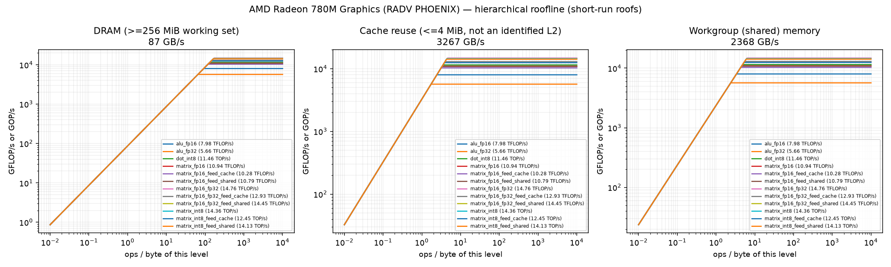
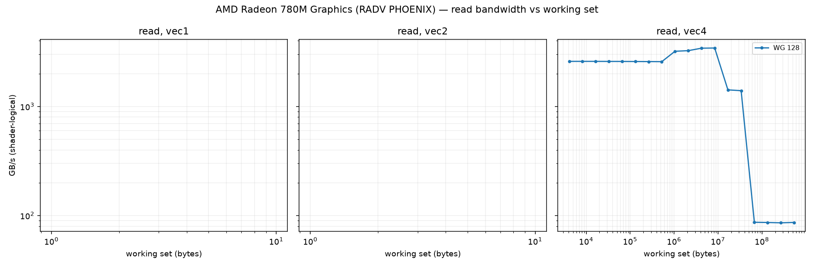
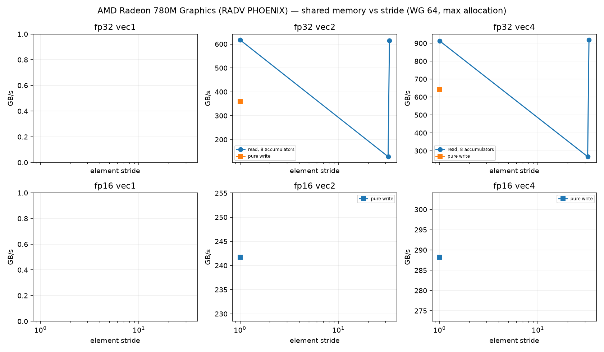
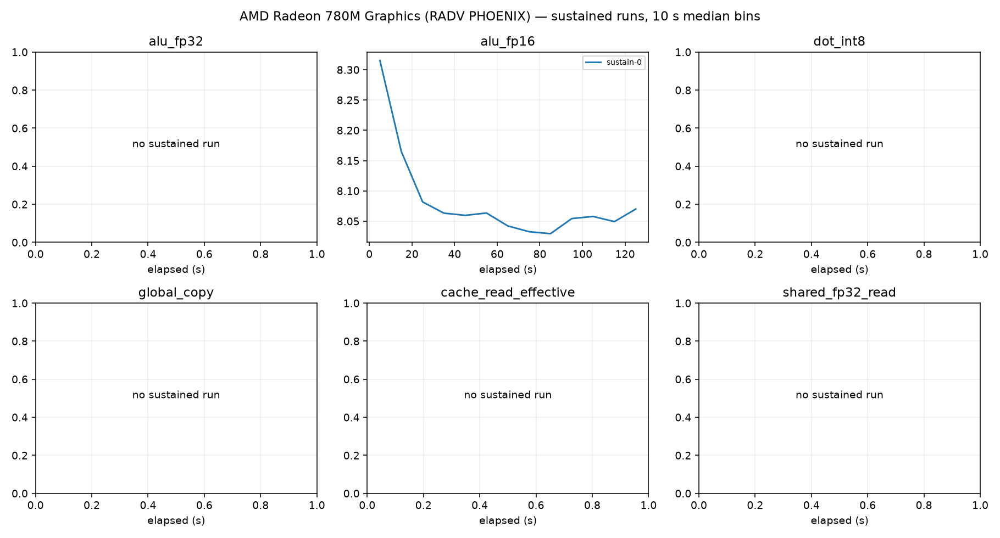

# AMD Radeon 780M Graphics (RADV PHOENIX) roofline report

Device: host AMD Ryzen 9 7940HS w/ Radeon 780M Graphics (SoC AMD Ryzen 9 7940HS w/ Radeon 780M Graphics), Rocky Linux 10.2 (Red Quartz), driver 104865799, subgroup 64.
Plan(s): fast. GPU clock **DVFS-governed** (not pinned); results depend on the governor and thermal state.
Code: 84361ac81182105d06a2f6d8293fa435192f1470, runner f63d4ef143187e42. Rows from other runner or shader builds excluded: 0.

Validation policy: **pre_and_post**; checks bracket continuous sampling and do not guarantee detection of transient errors between checks. Historical pre-only rows are diagnostic only.
Excluded rows: 64; reasons are in all-configurations.csv.
Sustained roofs require three distinct stable batches per current confirmed configuration and duration

Short-run columns are the best validated configuration: median and best (minimum time, the STREAM/BabelStream convention) of the samples, and the differential rate (paired L vs L/2 runs, removing fixed per-dispatch cost). Sustained is the median of the last 60 s of each sustained run (durations are recorded in sustained-runs.csv). Controls never define a roof. `spill` marks variants whose driver statistics report register spilling: spills only slow a kernel, so the value is still an achievable lower bound.

| roof | short median | short best | differential | sustained | unit |
|---|---:|---:|---:|---:|---|
| alu_fp16 | 7.983 | 8.370 | 8.017 (fixed 0%) | 8.044 (1×) | TFLOP/s |
| alu_fp32 | 5.659 | 5.831 | 5.678 (fixed 0%) | — | TFLOP/s |
| cache_read_effective | 3266.910 | 3329.837 | 3313.853 (fixed 1%) | — | GB/s |
| dot_int8 | 11.460 | 11.784 | 11.580 (fixed 1%) | — | TOP/s |
| global_copy | 71.457 | 71.731 | 70.065 (fixed -2%) | — | GB/s |
| global_read | 86.728 | 86.859 | 87.240 (fixed 1%) | 86.718 (1×) | GB/s |
| global_triad | 73.022 | 73.297 | 72.688 (fixed -0%) | — | GB/s |
| global_write | 77.619 | 79.239 | 77.011 (fixed -1%) | — | GB/s |
| matrix_fp16 | 10.938 | 10.958 | 10.996 (fixed 1%) | — | TFLOP/s |
| matrix_fp16_feed_cache | 10.278 | 10.298 | 10.363 (fixed 1%) | — | TFLOP/s |
| matrix_fp16_feed_dram | 81.744 | 82.047 | 81.685 (fixed -0%) | — | GB/s |
| matrix_fp16_feed_shared | 10.795 | 10.815 | 11.271 (fixed 4%) | — | TFLOP/s |
| matrix_fp16_fp32 | 14.764 | 14.810 | 14.790 (fixed 0%) | 14.762 (1×) | TFLOP/s |
| matrix_fp16_fp32_feed_cache | 12.934 | 12.958 | 13.056 (fixed 1%) | — | TFLOP/s |
| matrix_fp16_fp32_feed_dram | 81.351 | 81.511 | 85.239 (fixed 5%) | — | GB/s |
| matrix_fp16_fp32_feed_shared | 14.454 | 14.499 | 15.139 (fixed 5%) | — | TFLOP/s |
| matrix_int8 | 14.364 | 14.388 | 14.393 (fixed 0%) | — | TOP/s |
| matrix_int8_feed_cache | 12.451 | 12.483 | 12.442 (fixed -0%) | — | TOP/s |
| matrix_int8_feed_dram | 80.604 | 80.736 | 85.359 (fixed 6%) | — | GB/s |
| matrix_int8_feed_shared | 14.126 | 14.156 | 14.396 (fixed 2%) | — | TOP/s |
| shared_fp16_read | 2145.382 | 2155.653 | 2313.365 (fixed 7%) | — | GB/s |
| shared_fp16_write | 1694.042 | 1723.234 | 1774.347 (fixed 5%) | — | GB/s |
| shared_fp32_read | 2265.466 | 2285.460 | 2285.363 (fixed 1%) | — | GB/s |
| shared_fp32_write | 2368.421 | 2417.707 | 2368.239 (fixed -0%) | — | GB/s |
| texture_rgba16f_buffer_cache | 82.516 | 84.012 | 82.235 (fixed -0%) | — | GB/s |
| texture_rgba16f_buffer_dram | 83.730 | 84.051 | 83.776 (fixed 0%) | — | GB/s |
| texture_rgba16f_tex2d_cache | 82.711 | 84.690 | 82.416 (fixed -0%) | — | GB/s |
| texture_rgba16f_tex2d_dram | 45.834 | 49.339 | 46.028 (fixed 0%) | — | GB/s |
| texture_rgba16f_tex3d_cache | 82.297 | 82.726 | 81.889 (fixed -0%) | — | GB/s |
| texture_rgba16f_tex3d_dram | 40.809 | 41.441 | 40.987 (fixed 0%) | — | GB/s |
| texture_rgba32f_buffer_cache | 83.270 | 83.879 | 83.019 (fixed -0%) | — | GB/s |
| texture_rgba32f_buffer_dram | 83.507 | 84.201 | 83.341 (fixed -0%) | — | GB/s |
| texture_rgba32f_tex2d_cache | 83.676 | 84.320 | 83.346 (fixed -0%) | — | GB/s |
| texture_rgba32f_tex2d_dram | 43.469 | 43.874 | 43.252 (fixed -1%) | — | GB/s |
| texture_rgba32f_tex3d_cache | 82.336 | 84.330 | 81.881 (fixed -1%) | — | GB/s |
| texture_rgba32f_tex3d_dram | 39.885 | 40.219 | 39.814 (fixed -0%) | — | GB/s |

## Roof confirmation

Each roof's top candidates were re-measured in fresh processes, round-robin with alternating order. The roof is the median of the best candidate's repeats; the sweep maximum (a single run) is shown for comparison. Roofs without a quality-passing candidate (standard error of the median <= 3 %, not short, fixed cost <= 10 %) are marked unconfirmed.

| roof | confirmed median | repeat range | repeats | sweep max (unconfirmed) |
|---|---:|---:|---:|---:|
| alu_fp16 | 7.983 | 7.955–8.203 (3.1%) | 3 | 8.131 |
| alu_fp32 | 5.659 | 5.587–5.752 (2.9%) | 3 | 5.803 |
| cache_read_effective | 3266.910 | 3259.108–3294.849 (1.1%) | 3 | 3425.203 |
| dot_int8 | 11.460 | 11.402–11.587 (1.6%) | 3 | 11.540 |
| global_copy | 71.457 | 71.419–71.589 (0.2%) | 3 | 71.379 |
| global_read | 86.728 | 86.670–86.730 (0.1%) | 3 | 86.714 |
| global_triad | 73.022 | 73.018–73.089 (0.1%) | 3 | 73.015 |
| global_write | 77.619 | 77.513–77.622 (0.1%) | 3 | 77.688 |
| matrix_fp16 | 10.938 | 10.935–10.943 (0.1%) | 3 | 10.955 |
| matrix_fp16_feed_cache | 10.278 | 10.159–10.281 (1.2%) | 3 | 10.211 |
| matrix_fp16_feed_dram | 81.744 | 81.720–81.784 (0.1%) | 3 | 81.773 |
| matrix_fp16_feed_shared | 10.795 | 10.792–10.799 (0.1%) | 3 | 10.803 |
| matrix_fp16_fp32 | 14.764 | 14.763–14.767 (0.0%) | 3 | 14.753 |
| matrix_fp16_fp32_feed_cache | 12.934 | 12.811–12.942 (1.0%) | 3 | 12.904 |
| matrix_fp16_fp32_feed_dram | 81.351 | 81.334–81.369 (0.0%) | 3 | 81.291 |
| matrix_fp16_fp32_feed_shared | 14.454 | 14.454–14.469 (0.1%) | 3 | 14.458 |
| matrix_int8 | 14.364 | 14.360–14.365 (0.0%) | 3 | 14.381 |
| matrix_int8_feed_cache | 12.451 | 12.446–12.453 (0.1%) | 3 | 12.450 |
| matrix_int8_feed_dram | 80.604 | 80.574–80.606 (0.0%) | 3 | 80.583 |
| matrix_int8_feed_shared | 14.126 | 14.117–14.136 (0.1%) | 3 | 14.136 |
| shared_fp16_read | 2145.382 | 2126.703–2148.463 (1.0%) | 3 | 2141.744 |
| shared_fp16_write | 1694.042 | 1690.448–1710.463 (1.2%) | 3 | 1709.173 |
| shared_fp32_read | 2265.466 | 2239.606–2276.050 (1.6%) | 3 | 2284.091 |
| shared_fp32_write | 2368.421 | 2362.206–2373.776 (0.5%) | 3 | 2374.278 |
| texture_rgba16f_buffer_cache | 82.516 | 82.399–83.892 (1.8%) | 3 | 82.552 |
| texture_rgba16f_buffer_dram | 83.730 | 83.628–83.732 (0.1%) | 3 | 83.811 |
| texture_rgba16f_tex2d_cache | 82.711 | 82.656–84.501 (2.2%) | 3 | 82.795 |
| texture_rgba16f_tex2d_dram | 45.834 | 45.348–46.132 (1.7%) | 3 | 45.806 |
| texture_rgba16f_tex3d_cache | 82.297 | 82.224–82.319 (0.1%) | 3 | 82.415 |
| texture_rgba16f_tex3d_dram | 40.809 | 40.768–40.901 (0.3%) | 3 | 40.826 |
| texture_rgba32f_buffer_cache | 83.270 | 83.265–83.412 (0.2%) | 3 | 83.319 |
| texture_rgba32f_buffer_dram | 83.507 | 83.429–83.549 (0.1%) | 3 | 83.594 |
| texture_rgba32f_tex2d_cache | 83.676 | 83.651–83.921 (0.3%) | 3 | 83.520 |
| texture_rgba32f_tex2d_dram | 43.469 | 43.449–43.528 (0.2%) | 3 | 43.524 |
| texture_rgba32f_tex3d_cache | 82.336 | 82.263–82.446 (0.2%) | 3 | 82.501 |
| texture_rgba32f_tex3d_dram | 39.885 | 39.778–39.968 (0.5%) | 3 | 39.824 |

## Cooperative matrix fed from memory, by reuse

Best validated median per source and CHAINS (multiply-adds per loaded A/B tile pair). `load GB/s` counts the A/B tile bytes loaded. DRAM-fed rates grow with reuse until the matrix unit limits them, so the `matrix_*_feed_dram` roof above is a bandwidth; look a kernel's ops per loaded byte up here instead. `gates` lists quality gates the row failed (such rows never define a roof).

| dtype | source | CHAINS | ops / loaded byte | rate | load GB/s | gates |
|---|---|---:|---:|---:|---:|---|
| fp16 | shared | 1 | 8.0 | 2.392 TFLOP/s | 298.9 | — |
| fp16 | shared | 2 | 16.0 | 4.769 TFLOP/s | 298.1 | — |
| fp16 | shared | 4 | 32.0 | 9.168 TFLOP/s | 286.5 | — |
| fp16 | shared | 8 | 64.0 | 10.803 TFLOP/s | 168.8 | — |
| fp16 | cache | 1 | 8.0 | 3.996 TFLOP/s | 499.4 | — |
| fp16 | cache | 2 | 16.0 | 6.651 TFLOP/s | 415.7 | — |
| fp16 | cache | 8 | 64.0 | 10.281 TFLOP/s | 160.6 | — |
| fp16 | dram | 1 | 8.0 | 0.622 TFLOP/s | 77.8 | — |
| fp16 | dram | 2 | 16.0 | 1.219 TFLOP/s | 76.2 | — |
| fp16 | dram | 4 | 32.0 | 2.311 TFLOP/s | 72.2 | — |
| fp16 | dram | 8 | 64.0 | 4.484 TFLOP/s | 70.1 | — |
| fp16_fp32 | shared | 1 | 8.0 | 2.407 TFLOP/s | 300.8 | — |
| fp16_fp32 | shared | 2 | 16.0 | 4.821 TFLOP/s | 301.3 | — |
| fp16_fp32 | shared | 4 | 32.0 | 9.633 TFLOP/s | 301.0 | — |
| fp16_fp32 | shared | 8 | 64.0 | 14.469 TFLOP/s | 226.1 | — |
| fp16_fp32 | cache | 1 | 8.0 | 4.081 TFLOP/s | 510.2 | — |
| fp16_fp32 | cache | 2 | 16.0 | 7.931 TFLOP/s | 495.7 | — |
| fp16_fp32 | cache | 4 | 32.0 | 10.842 TFLOP/s | 338.8 | — |
| fp16_fp32 | cache | 8 | 64.0 | 12.942 TFLOP/s | 202.2 | — |
| fp16_fp32 | dram | 1 | 8.0 | 0.608 TFLOP/s | 75.9 | — |
| fp16_fp32 | dram | 2 | 16.0 | 1.176 TFLOP/s | 73.5 | — |
| fp16_fp32 | dram | 4 | 32.0 | 2.312 TFLOP/s | 72.3 | — |
| fp16_fp32 | dram | 8 | 64.0 | 4.678 TFLOP/s | 73.1 | — |
| int8 | shared | 1 | 16.0 | 4.040 TOP/s | 252.5 | — |
| int8 | shared | 2 | 32.0 | 8.034 TOP/s | 251.0 | — |
| int8 | shared | 4 | 64.0 | 12.864 TOP/s | 201.0 | — |
| int8 | shared | 8 | 128.0 | 14.136 TOP/s | 110.4 | — |
| int8 | cache | 1 | 16.0 | 4.862 TOP/s | 303.9 | — |
| int8 | cache | 2 | 32.0 | 7.473 TOP/s | 233.5 | — |
| int8 | cache | 4 | 64.0 | 10.405 TOP/s | 162.6 | — |
| int8 | cache | 8 | 128.0 | 12.453 TOP/s | 97.3 | — |
| int8 | dram | 1 | 16.0 | 1.225 TOP/s | 76.6 | — |
| int8 | dram | 2 | 32.0 | 2.280 TOP/s | 71.2 | — |
| int8 | dram | 4 | 64.0 | 4.561 TOP/s | 71.3 | — |
| int8 | dram | 8 | 128.0 | 9.085 TOP/s | 71.0 | — |

## Device-state sentinel

`alu_fp32_v4_c16 wg256 groups512` measured before and after every stage and every 20 configurations. Values below 85 % of the median reading (3.210 TFLOP/s) mark a stage that ran on a throttled or otherwise degraded device; re-measure those stages.

| UTC | label | TFLOP/s | state |
|---|---|---:|---|
| 2026-10-09T17:49:53 | validate_start | 3.277 | ok |
| 2026-10-09T17:49:56 | validate_end | 3.275 | ok |
| 2026-10-09T17:50:25 | cache_end | 3.273 | ok |
| 2026-10-09T17:50:32 | sweep-memory_20 | 3.272 | ok |
| 2026-10-09T17:50:45 | memory_end | 3.271 | ok |
| 2026-10-09T17:51:06 | sweep-compute_40 | 3.241 | ok |
| 2026-10-09T17:51:36 | sweep-compute_60 | 3.206 | ok |
| 2026-10-09T17:52:07 | sweep-compute_80 | 3.226 | ok |
| 2026-10-09T17:52:39 | sweep-compute_100 | 3.194 | ok |
| 2026-10-09T17:53:12 | sweep-compute_120 | 3.184 | ok |
| 2026-10-09T17:53:53 | sweep-compute_140 | 3.196 | ok |
| 2026-10-09T17:54:29 | sweep-compute_160 | 3.189 | ok |
| 2026-10-09T17:54:51 | compute_end | 3.207 | ok |
| 2026-10-09T17:55:01 | sweep-matrix-feed_180 | 3.214 | ok |
| 2026-10-09T17:55:36 | sweep-matrix-feed_200 | 3.193 | ok |
| 2026-10-09T17:55:55 | matrix_feed_end | 3.171 | ok |
| 2026-10-09T17:56:13 | sweep-texture_220 | 3.230 | ok |
| 2026-10-09T17:56:18 | texture_end | 3.221 | ok |
| 2026-10-09T17:56:48 | sweep-shared_240 | 3.228 | ok |
| 2026-10-09T17:57:18 | sweep-shared_260 | 3.260 | ok |
| 2026-10-09T17:57:48 | sweep-shared_280 | 3.231 | ok |
| 2026-10-09T17:57:51 | shared_end | 3.206 | ok |
| 2026-10-09T17:58:17 | latency_end | 3.262 | ok |
| 2026-10-09T17:58:31 | confirm_300 | 3.219 | ok |
| 2026-10-09T17:59:05 | confirm_320 | 3.122 | ok |
| 2026-10-09T17:59:42 | confirm_340 | 3.210 | ok |
| 2026-10-09T18:00:19 | confirm_360 | 3.209 | ok |
| 2026-10-09T18:00:57 | confirm_380 | 3.204 | ok |
| 2026-10-09T18:01:30 | confirm_400 | 3.166 | ok |
| 2026-10-09T18:02:00 | confirm_420 | 3.148 | ok |
| 2026-10-09T18:02:33 | confirm_440 | 3.167 | ok |
| 2026-10-09T18:03:12 | confirm_460 | 3.212 | ok |
| 2026-10-09T18:03:27 | confirm_end | 3.207 | ok |
| 2026-10-09T18:03:28 | sustain_0 | 3.199 | ok |

## Ridge points (short-run roofs)

Arithmetic intensity (ops per byte of that level) at which each compute roof meets each memory roof.

| compute roof | global | cache | shared_fp32 | shared_fp16 |
|---|---:|---:|---:|---:|
| alu_fp16 | 92.05 | 2.44 | 3.37 | 3.72 |
| alu_fp32 | 65.25 | 1.73 | 2.39 | 2.64 |
| dot_int8 | 132.13 | 3.51 | 4.84 | 5.34 |
| matrix_fp16 | 126.12 | 3.35 | 4.62 | 5.10 |
| matrix_fp16_feed_cache | 118.51 | 3.15 | 4.34 | 4.79 |
| matrix_fp16_feed_shared | 124.47 | 3.30 | 4.56 | 5.03 |
| matrix_fp16_fp32 | 170.23 | 4.52 | 6.23 | 6.88 |
| matrix_fp16_fp32_feed_cache | 149.13 | 3.96 | 5.46 | 6.03 |
| matrix_fp16_fp32_feed_shared | 166.66 | 4.42 | 6.10 | 6.74 |
| matrix_int8 | 165.62 | 4.40 | 6.06 | 6.70 |
| matrix_int8_feed_cache | 143.56 | 3.81 | 5.26 | 5.80 |
| matrix_int8_feed_shared | 162.88 | 4.32 | 5.96 | 6.58 |

## Figures

See also [TUNING.md](TUNING.md), [SUPPLEMENT.md](SUPPLEMENT.md) (latency, TLB, line size, ERT, memory type) and [ISA-CHECK.md](ISA-CHECK.md).

## Limits

- Bandwidths are shader-logical bytes; physical DRAM/L2 traffic is not measurable without `VK_KHR_performance_query` (exposed: False).
- No vendor theoretical peaks are used; values are achievable rates on this device and driver.
- Cache knees move with workgroup size and are not cache capacities; see the pointer-chase results.
- Sustained values need 3 batches (plan `gold`) before they replace short-run roofs.
