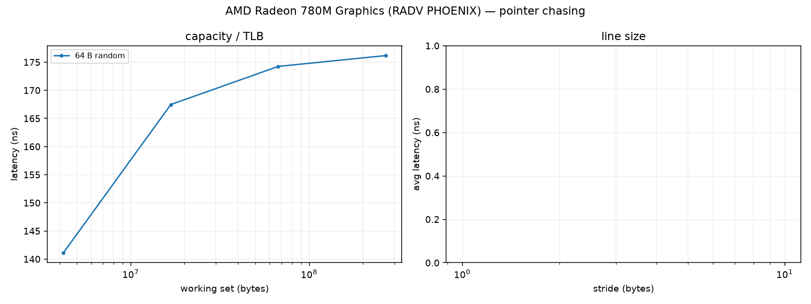

# AMD Radeon 780M Graphics (RADV PHOENIX) supplementary measurements

## Load-to-use latency (pointer chasing)

One invocation follows a host-built chain `j = next[j]`; every load depends on the previous one. Each dispatch walks the whole chain (2^16..2^20 loads); latency is the differential per-load time (fixed dispatch cost removed), in ns (clocks are not pinned unless the report says so).

| working set (random, 64 B nodes) | latency ns |
|---:|---:|
| 4096 KiB | 141.1 |
| 16384 KiB | 167.5 |
| 65536 KiB | 174.2 |
| 262144 KiB | 176.2 |

