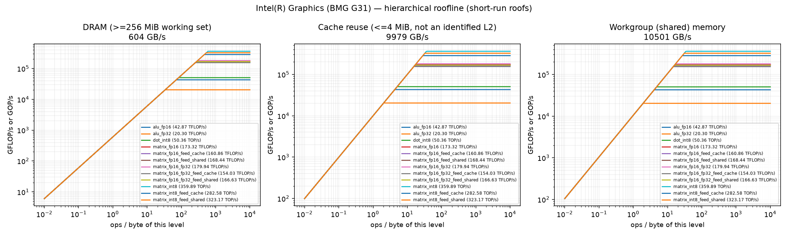
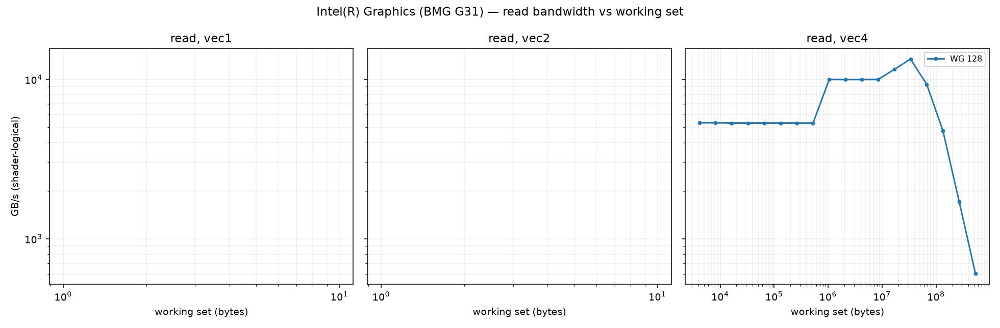
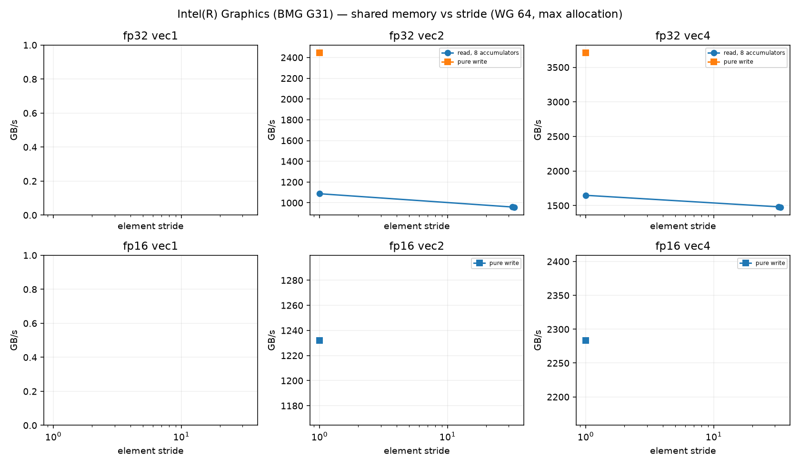
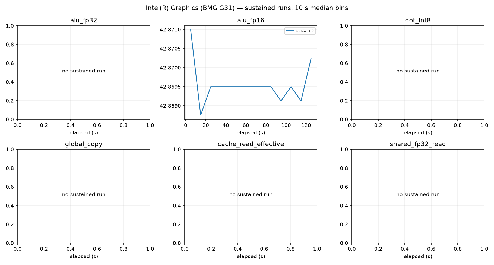

# Intel(R) Graphics (BMG G31) roofline report

Device: host Intel(R) Core(TM) i9-14900K (SoC Intel(R) Core(TM) i9-14900K), Fedora Linux 44 (Cloud Edition), driver 109060099, subgroup 32.
Plan(s): fast. GPU clock state **unavailable** (frequency and pinning not verified).
Code: None, runner 810e098c8abb2dfb. Rows from other runner or shader builds excluded: 0.

Validation policy: **pre_and_post**; checks bracket continuous sampling and do not guarantee detection of transient errors between checks. Historical pre-only rows are diagnostic only.
Excluded rows: 62; reasons are in all-configurations.csv.
Sustained roofs require three distinct stable batches per current confirmed configuration and duration

Short-run columns are the best validated configuration: median and best (minimum time, the STREAM/BabelStream convention) of the samples, and the differential rate (paired L vs L/2 runs, removing fixed per-dispatch cost). Sustained is the median of the last 60 s of each sustained run (durations are recorded in sustained-runs.csv). Controls never define a roof. `spill` marks variants whose driver statistics report register spilling: spills only slow a kernel, so the value is still an achievable lower bound.

| roof | short median | short best | differential | sustained | unit |
|---|---:|---:|---:|---:|---|
| alu_fp16 | 42.870 | 42.872 | 42.948 (fixed 0%) | 42.869 (1×) | TFLOP/s |
| alu_fp32 | 20.300 | 20.301 | 20.362 (fixed 0%) | — | TFLOP/s |
| cache_read_effective | 9978.783 | 9982.029 | 9994.353 (fixed 0%) | — | GB/s |
| dot_int8 | 50.365 | 50.366 | 50.418 (fixed 0%) | — | TOP/s |
| global_copy | 532.567 | 557.406 | 538.535 (fixed 1%) | — | GB/s |
| global_read | 604.379 | 606.814 | 607.444 (fixed 1%) | 604.020 (1×) | GB/s |
| global_triad | 483.140 | 497.617 | 468.434 (fixed -3%) | — | GB/s |
| global_write | 510.723 | 527.214 | 511.373 (fixed 0%) | — | GB/s |
| matrix_fp16 | 173.324 | 173.332 | 180.314 (fixed 4%) | — | TFLOP/s |
| matrix_fp16_feed_cache | 160.857 | 162.142 | 165.806 (fixed 3%) | — | TFLOP/s |
| matrix_fp16_feed_dram | 598.296 | 598.923 | 607.863 (fixed 2%) | — | GB/s |
| matrix_fp16_feed_shared | 168.442 | 168.611 | 177.637 (fixed 5%) | — | TFLOP/s |
| matrix_fp16_fp32 | 179.942 | 179.951 | 180.434 (fixed 0%) | 179.939 (1×) | TFLOP/s |
| matrix_fp16_fp32_feed_cache | 154.031 | 155.818 | 155.153 (fixed 1%) | — | TFLOP/s |
| matrix_fp16_fp32_feed_dram | 590.534 | 592.009 | 596.004 (fixed 1%) | — | GB/s |
| matrix_fp16_fp32_feed_shared | 166.629 | 166.894 | 167.154 (fixed 0%) | — | TFLOP/s |
| matrix_int8 | 359.888 | 359.916 | 360.875 (fixed 0%) | — | TOP/s |
| matrix_int8_feed_cache | 282.576 | 285.070 | 284.420 (fixed 1%) | — | TOP/s |
| matrix_int8_feed_dram | 610.465 | 616.822 | 651.270 (fixed 6%) | — | GB/s |
| matrix_int8_feed_shared | 323.167 | 323.911 | 328.235 (fixed 2%) | — | TOP/s |
| shared_fp16_read | 3331.016 | 3331.250 | 3493.088 (fixed 5%) | — | GB/s |
| shared_fp16_write | 6455.677 | 6457.035 | 6607.080 (fixed 2%) | — | GB/s |
| shared_fp32_read | 10017.521 | 10021.274 | 10033.467 (fixed 0%) | — | GB/s |
| shared_fp32_write | 10500.945 | 10501.982 | 10508.152 (fixed 0%) | — | GB/s |
| texture_rgba16f_buffer_cache | 2272.591 | 2273.074 | 2273.658 (fixed 0%) | — | GB/s |
| texture_rgba16f_buffer_dram | 564.104 | 564.909 | 563.983 (fixed -0%) | — | GB/s |
| texture_rgba16f_tex2d_cache | 2014.600 | 2015.224 | 2015.153 (fixed 0%) | — | GB/s |
| texture_rgba16f_tex2d_dram | 536.665 | 541.771 | 536.538 (fixed -0%) | — | GB/s |
| texture_rgba16f_tex3d_cache | 1970.429 | 1970.890 | 1970.873 (fixed 0%) | — | GB/s |
| texture_rgba16f_tex3d_dram | 558.860 | 564.414 | 558.528 (fixed -0%) | — | GB/s |
| texture_rgba32f_buffer_cache | 2283.943 | 2284.831 | 2284.732 (fixed 0%) | — | GB/s |
| texture_rgba32f_buffer_dram | 567.279 | 567.828 | 567.519 (fixed 0%) | — | GB/s |
| texture_rgba32f_tex2d_cache | 2060.102 | 2060.616 | 2060.614 (fixed 0%) | — | GB/s |
| texture_rgba32f_tex2d_dram | 721.802 | 731.919 | 718.092 (fixed -1%) | — | GB/s |
| texture_rgba32f_tex3d_cache | 1993.267 | 1994.219 | 1993.685 (fixed 0%) | — | GB/s |
| texture_rgba32f_tex3d_dram | 764.870 | 769.768 | 767.865 (fixed 0%) | — | GB/s |

## Roof confirmation

Each roof's top candidates were re-measured in fresh processes, round-robin with alternating order. The roof is the median of the best candidate's repeats; the sweep maximum (a single run) is shown for comparison. Roofs without a quality-passing candidate (standard error of the median <= 3 %, not short, fixed cost <= 10 %) are marked unconfirmed.

| roof | confirmed median | repeat range | repeats | sweep max (unconfirmed) |
|---|---:|---:|---:|---:|
| alu_fp16 | 42.870 | 42.870–42.870 (0.0%) | 3 | 42.868 |
| alu_fp32 | 20.300 | 20.287–20.300 (0.1%) | 3 | 20.300 |
| cache_read_effective | 9978.783 | 9978.129–9979.161 (0.0%) | 3 | 9978.331 |
| dot_int8 | 50.365 | 50.364–50.365 (0.0%) | 3 | 50.365 |
| global_copy | 532.567 | 532.544–533.472 (0.2%) | 3 | 539.009 |
| global_read | 604.379 | 603.532–604.517 (0.2%) | 3 | 603.332 |
| global_triad | 483.140 | 482.839–486.538 (0.8%) | 3 | 481.040 |
| global_write | 510.723 | 508.351–514.988 (1.3%) | 3 | 509.564 |
| matrix_fp16 | 173.324 | 173.324–173.326 (0.0%) | 3 | 173.324 |
| matrix_fp16_feed_cache | 160.857 | 160.746–161.223 (0.3%) | 3 | 161.031 |
| matrix_fp16_feed_dram | 598.296 | 598.087–598.341 (0.0%) | 3 | 598.319 |
| matrix_fp16_feed_shared | 168.442 | 168.401–168.443 (0.0%) | 3 | 168.351 |
| matrix_fp16_fp32 | 179.942 | 179.940–179.945 (0.0%) | 3 | 179.929 |
| matrix_fp16_fp32_feed_cache | 154.031 | 153.449–154.554 (0.7%) | 3 | 154.091 |
| matrix_fp16_fp32_feed_dram | 590.534 | 588.526–590.635 (0.4%) | 3 | 615.795 |
| matrix_fp16_fp32_feed_shared | 166.629 | 166.585–166.650 (0.0%) | 3 | 166.530 |
| matrix_int8 | 359.888 | 359.888–359.891 (0.0%) | 3 | 359.891 |
| matrix_int8_feed_cache | 282.576 | 280.757–282.644 (0.7%) | 3 | 279.339 |
| matrix_int8_feed_dram | 610.465 | 609.856–615.165 (0.9%) | 3 | 616.735 |
| matrix_int8_feed_shared | 323.167 | 322.602–323.431 (0.3%) | 3 | 323.274 |
| shared_fp16_read | 3331.016 | 3330.958–3331.046 (0.0%) | 3 | 3330.884 |
| shared_fp16_write | 6455.677 | 6455.299–6455.817 (0.0%) | 3 | 6455.362 |
| shared_fp32_read | 10017.521 | 10017.521–10017.622 (0.0%) | 3 | 10018.408 |
| shared_fp32_write | 10500.945 | 10500.826–10501.435 (0.0%) | 3 | 10500.604 |
| texture_rgba16f_buffer_cache | 2272.591 | 2272.532–2272.631 (0.0%) | 3 | 2272.729 |
| texture_rgba16f_buffer_dram | 564.104 | 564.104–564.128 (0.0%) | 3 | 564.070 |
| texture_rgba16f_tex2d_cache | 2014.600 | 2014.529–2014.618 (0.0%) | 3 | 2014.707 |
| texture_rgba16f_tex2d_dram | 536.665 | 535.960–537.376 (0.3%) | 3 | 536.577 |
| texture_rgba16f_tex3d_cache | 1970.429 | 1970.428–1970.566 (0.0%) | 3 | 1970.690 |
| texture_rgba16f_tex3d_dram | 558.860 | 558.659–559.317 (0.1%) | 3 | 559.488 |
| texture_rgba32f_buffer_cache | 2283.943 | 2283.923–2284.454 (0.0%) | 3 | 2283.842 |
| texture_rgba32f_buffer_dram | 567.279 | 567.244–567.318 (0.0%) | 3 | 567.328 |
| texture_rgba32f_tex2d_cache | 2060.102 | 2059.919–2060.276 (0.0%) | 3 | 2060.205 |
| texture_rgba32f_tex2d_dram | 721.802 | 721.433–722.874 (0.2%) | 3 | 720.608 |
| texture_rgba32f_tex3d_cache | 1993.267 | 1993.258–1993.414 (0.0%) | 3 | 1993.313 |
| texture_rgba32f_tex3d_dram | 764.870 | 763.731–764.998 (0.2%) | 3 | 763.894 |

## Cooperative matrix fed from memory, by reuse

Best validated median per source and CHAINS (multiply-adds per loaded A/B tile pair). `load GB/s` counts the A/B tile bytes loaded. DRAM-fed rates grow with reuse until the matrix unit limits them, so the `matrix_*_feed_dram` roof above is a bandwidth; look a kernel's ops per loaded byte up here instead. `gates` lists quality gates the row failed (such rows never define a roof).

| dtype | source | CHAINS | ops / loaded byte | rate | load GB/s | gates |
|---|---|---:|---:|---:|---:|---|
| fp16 | shared | 8 | 42.7 | 168.443 TFLOP/s | 3947.9 | — |
| fp16 | cache | 1 | 5.3 | 29.778 TFLOP/s | 5583.4 | — |
| fp16 | cache | 2 | 10.7 | 57.677 TFLOP/s | 5407.2 | — |
| fp16 | cache | 4 | 21.3 | 108.376 TFLOP/s | 5080.1 | — |
| fp16 | cache | 8 | 42.7 | 161.223 TFLOP/s | 3778.7 | — |
| fp16 | dram | 1 | 5.3 | 3.126 TFLOP/s | 586.1 | — |
| fp16 | dram | 2 | 10.7 | 6.146 TFLOP/s | 576.2 | — |
| fp16 | dram | 4 | 21.3 | 11.965 TFLOP/s | 560.9 | — |
| fp16 | dram | 8 | 42.7 | 23.027 TFLOP/s | 539.7 | — |
| fp16_fp32 | shared | 1 | 5.3 | 42.365 TFLOP/s | 7943.4 | — |
| fp16_fp32 | shared | 2 | 10.7 | 82.619 TFLOP/s | 7745.5 | — |
| fp16_fp32 | shared | 4 | 21.3 | 155.650 TFLOP/s | 7296.1 | — |
| fp16_fp32 | shared | 8 | 42.7 | 166.650 TFLOP/s | 3905.9 | — |
| fp16_fp32 | cache | 1 | 5.3 | 27.501 TFLOP/s | 5156.5 | — |
| fp16_fp32 | cache | 2 | 10.7 | 53.185 TFLOP/s | 4986.1 | — |
| fp16_fp32 | cache | 4 | 21.3 | 102.607 TFLOP/s | 4809.7 | — |
| fp16_fp32 | cache | 8 | 42.7 | 154.554 TFLOP/s | 3622.4 | — |
| fp16_fp32 | dram | 1 | 5.3 | 3.131 TFLOP/s | 587.0 | — |
| fp16_fp32 | dram | 2 | 10.7 | 6.211 TFLOP/s | 582.3 | — |
| fp16_fp32 | dram | 4 | 21.3 | 13.003 TFLOP/s | 609.5 | — |
| fp16_fp32 | dram | 8 | 42.7 | 24.344 TFLOP/s | 570.6 | — |
| int8 | shared | 1 | 10.7 | 53.899 TOP/s | 5053.0 | — |
| int8 | shared | 2 | 21.3 | 113.830 TOP/s | 5335.8 | — |
| int8 | shared | 4 | 42.7 | 211.260 TOP/s | 4951.4 | — |
| int8 | shared | 8 | 85.3 | 323.431 TOP/s | 3790.2 | — |
| int8 | cache | 1 | 10.7 | 36.456 TOP/s | 3417.8 | — |
| int8 | cache | 2 | 21.3 | 74.093 TOP/s | 3473.1 | — |
| int8 | cache | 4 | 42.7 | 145.964 TOP/s | 3421.0 | — |
| int8 | cache | 8 | 85.3 | 282.644 TOP/s | 3312.2 | — |
| int8 | dram | 1 | 10.7 | 6.439 TOP/s | 603.6 | — |
| int8 | dram | 2 | 21.3 | 13.042 TOP/s | 611.3 | — |
| int8 | dram | 4 | 42.7 | 25.626 TOP/s | 600.6 | — |
| int8 | dram | 8 | 85.3 | 47.970 TOP/s | 562.1 | — |

## Device-state sentinel

`alu_fp32_v4_c16 wg256 groups512` measured before and after every stage and every 20 configurations. Values below 85 % of the median reading (18.350 TFLOP/s) mark a stage that ran on a throttled or otherwise degraded device; re-measure those stages.

| UTC | label | TFLOP/s | state |
|---|---|---:|---|
| 2026-09-26T17:51:09 | validate_start | 18.351 | ok |
| 2026-09-26T17:51:15 | validate_end | 18.351 | ok |
| 2026-09-26T17:51:51 | cache_end | 18.350 | ok |
| 2026-09-26T17:51:59 | sweep-memory_20 | 18.350 | ok |
| 2026-09-26T17:52:12 | memory_end | 18.350 | ok |
| 2026-09-26T17:52:34 | sweep-compute_40 | 18.350 | ok |
| 2026-09-26T17:53:06 | sweep-compute_60 | 18.350 | ok |
| 2026-09-26T17:53:38 | sweep-compute_80 | 18.350 | ok |
| 2026-09-26T17:54:11 | sweep-compute_100 | 18.351 | ok |
| 2026-09-26T17:54:44 | sweep-compute_120 | 18.350 | ok |
| 2026-09-26T17:55:19 | sweep-compute_140 | 18.350 | ok |
| 2026-09-26T17:55:54 | sweep-compute_160 | 18.349 | ok |
| 2026-09-26T17:56:16 | compute_end | 18.350 | ok |
| 2026-09-26T17:56:26 | sweep-matrix-feed_180 | 18.350 | ok |
| 2026-09-26T17:56:59 | sweep-matrix-feed_200 | 18.350 | ok |
| 2026-09-26T17:57:17 | matrix_feed_end | 18.350 | ok |
| 2026-09-26T17:57:35 | sweep-texture_220 | 18.349 | ok |
| 2026-09-26T17:57:39 | texture_end | 18.350 | ok |
| 2026-09-26T17:58:14 | sweep-shared_240 | 18.349 | ok |
| 2026-09-26T17:58:49 | sweep-shared_260 | 18.350 | ok |
| 2026-09-26T17:59:20 | shared_end | 18.349 | ok |
| 2026-09-26T17:59:24 | latency-capacity_280 | 18.350 | ok |
| 2026-09-26T17:59:56 | latency_end | 18.350 | ok |
| 2026-09-26T18:00:16 | confirm_300 | 18.350 | ok |
| 2026-09-26T18:00:51 | confirm_320 | 18.349 | ok |
| 2026-09-26T18:01:30 | confirm_340 | 18.350 | ok |
| 2026-09-26T18:02:03 | confirm_360 | 18.351 | ok |
| 2026-09-26T18:02:44 | confirm_380 | 18.350 | ok |
| 2026-09-26T18:03:18 | confirm_400 | 18.350 | ok |
| 2026-09-26T18:03:51 | confirm_420 | 18.350 | ok |
| 2026-09-26T18:04:28 | confirm_440 | 18.350 | ok |
| 2026-09-26T18:05:04 | confirm_460 | 18.350 | ok |
| 2026-09-26T18:05:09 | confirm_end | 18.350 | ok |
| 2026-09-26T18:05:10 | sustain_0 | 18.350 | ok |

## Ridge points (short-run roofs)

Arithmetic intensity (ops per byte of that level) at which each compute roof meets each memory roof.

| compute roof | global | cache | shared_fp32 | shared_fp16 |
|---|---:|---:|---:|---:|
| alu_fp16 | 70.93 | 4.30 | 4.08 | 6.64 |
| alu_fp32 | 33.59 | 2.03 | 1.93 | 3.14 |
| dot_int8 | 83.33 | 5.05 | 4.80 | 7.80 |
| matrix_fp16 | 286.78 | 17.37 | 16.51 | 26.85 |
| matrix_fp16_feed_cache | 266.15 | 16.12 | 15.32 | 24.92 |
| matrix_fp16_feed_shared | 278.70 | 16.88 | 16.04 | 26.09 |
| matrix_fp16_fp32 | 297.73 | 18.03 | 17.14 | 27.87 |
| matrix_fp16_fp32_feed_cache | 254.86 | 15.44 | 14.67 | 23.86 |
| matrix_fp16_fp32_feed_shared | 275.70 | 16.70 | 15.87 | 25.81 |
| matrix_int8 | 595.47 | 36.07 | 34.27 | 55.75 |
| matrix_int8_feed_cache | 467.55 | 28.32 | 26.91 | 43.77 |
| matrix_int8_feed_shared | 534.71 | 32.39 | 30.78 | 50.06 |

## Figures

See also [TUNING.md](TUNING.md), [SUPPLEMENT.md](SUPPLEMENT.md) (latency, TLB, line size, ERT, memory type) and [ISA-CHECK.md](ISA-CHECK.md).

## Limits

- Bandwidths are shader-logical bytes; physical DRAM/L2 traffic is not measurable without `VK_KHR_performance_query` (exposed: False).
- No vendor theoretical peaks are used; values are achievable rates on this device and driver.
- Cache knees move with workgroup size and are not cache capacities; see the pointer-chase results.
- Sustained values need 3 batches (plan `gold`) before they replace short-run roofs.
