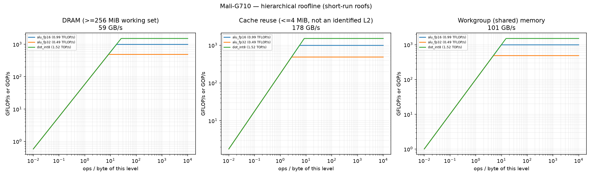
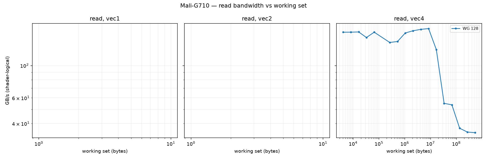
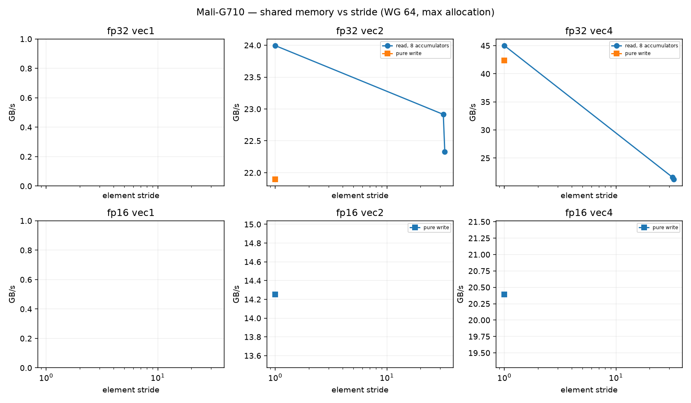
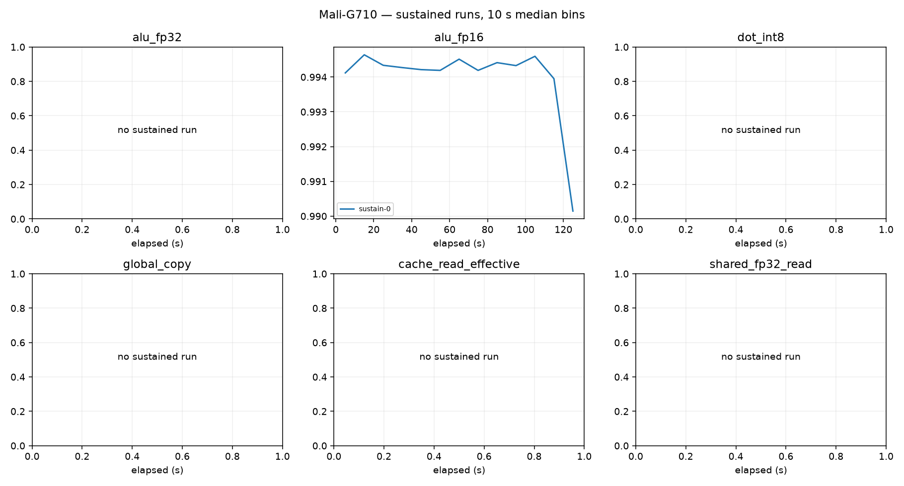

# Mali-G710 roofline report

Device: Google Pixel 7a (SoC GS201), Android 17, driver 226504704, subgroup 16.
Plan(s): fast. GPU clock **DVFS-governed** (not pinned); results depend on the governor and thermal state.
Code: None, runner ec26df94490ba8a6. Rows from other runner or shader builds excluded: 0.

Validation policy: **pre_and_post**; checks bracket continuous sampling and do not guarantee detection of transient errors between checks. Historical pre-only rows are diagnostic only.
Excluded rows: 48; reasons are in all-configurations.csv.
shared_fp32_0: repeat_unstable
shared_fp32_2: repeat_unstable
shared_fp32_0: repeat_unstable
Sustained roofs require three distinct stable batches per current confirmed configuration and duration

Short-run columns are the best validated configuration: median and best (minimum time, the STREAM/BabelStream convention) of the samples, and the differential rate (paired L vs L/2 runs, removing fixed per-dispatch cost). Sustained is the median of the last 60 s of each sustained run (durations are recorded in sustained-runs.csv). Controls never define a roof. `spill` marks variants whose driver statistics report register spilling: spills only slow a kernel, so the value is still an achievable lower bound.

| roof | short median | short best | differential | sustained | unit |
|---|---:|---:|---:|---:|---|
| alu_fp16 | 0.994 | 0.997 | 1.006 (fixed 1%) | 0.994 (1×) | TFLOP/s |
| alu_fp32 | 0.487 | 0.489 | 0.501 (fixed 3%) | — | TFLOP/s |
| cache_read_effective | 177.885 | 179.341 | 179.974 (fixed 1%) | — | GB/s |
| dot_int8 | 1.517 | 1.518 | 1.559 (fixed 3%) | — | TOP/s |
| global_copy | 58.501 | 59.128 | 63.563 (fixed 8%) | — | GB/s |
| global_read | 33.467 | 34.748 | 33.150 (fixed -1%) | 33.699 (1×) | GB/s |
| global_triad | 35.741 | 36.114 | 38.712 (fixed 8%) | — | GB/s |
| global_write | 40.031 | 41.373 | 43.876 (fixed 9%) | — | GB/s |
| shared_fp16_read | 94.497 | 95.948 | 96.488 (fixed 2%) | — | GB/s |
| shared_fp16_write | 77.856 | 82.926 | 81.120 (fixed 3%) | — | GB/s |
| shared_fp32_read | 93.720 | 94.111 | 94.380 (fixed 1%) | — | GB/s |
| shared_fp32_write | 101.055 | 105.993 | 102.792 (fixed 2%) | — | GB/s |
| texture_rgba16f_buffer_cache | 36.475 | 36.741 | 36.098 (fixed -1%) | — | GB/s |
| texture_rgba16f_buffer_dram | 35.586 | 35.663 | 35.539 (fixed -0%) | — | GB/s |
| texture_rgba16f_tex2d_cache | 33.841 | 34.076 | 33.402 (fixed -1%) | — | GB/s |
| texture_rgba16f_tex2d_dram | 9.247 | 9.259 | 9.243 (fixed -0%) | — | GB/s |
| texture_rgba16f_tex3d_cache | 35.699 | 36.025 | 35.415 (fixed -1%) | — | GB/s |
| texture_rgba16f_tex3d_dram | 37.159 | 37.857 | 37.048 (fixed -0%) | — | GB/s |
| texture_rgba32f_buffer_cache | 36.243 | 36.529 | 35.782 (fixed -1%) | — | GB/s |
| texture_rgba32f_buffer_dram | 34.974 | 35.061 | 34.910 (fixed -0%) | — | GB/s |
| texture_rgba32f_tex2d_cache | 34.507 | 34.705 | 34.041 (fixed -1%) | — | GB/s |
| texture_rgba32f_tex2d_dram | 18.315 | 18.343 | 18.312 (fixed -0%) | — | GB/s |
| texture_rgba32f_tex3d_cache | 35.715 | 36.067 | 35.266 (fixed -1%) | — | GB/s |
| texture_rgba32f_tex3d_dram | 36.137 | 36.262 | 36.054 (fixed -0%) | — | GB/s |

## Roof confirmation

Each roof's top candidates were re-measured in fresh processes, round-robin with alternating order. The roof is the median of the best candidate's repeats; the sweep maximum (a single run) is shown for comparison. Roofs without a quality-passing candidate (standard error of the median <= 3 %, not short, fixed cost <= 10 %) are marked unconfirmed.

| roof | confirmed median | repeat range | repeats | sweep max (unconfirmed) |
|---|---:|---:|---:|---:|
| alu_fp16 | 0.994 | 0.993–0.995 (0.1%) | 3 | 0.992 |
| alu_fp32 | 0.487 | 0.487–0.488 (0.1%) | 3 | 0.487 |
| cache_read_effective | 177.885 | 177.262–177.947 (0.4%) | 3 | 177.423 |
| dot_int8 | 1.517 | 1.514–1.517 (0.2%) | 3 | 1.515 |
| global_copy | 58.501 | 58.427–58.561 (0.2%) | 3 | 58.794 |
| global_read | 33.467 | 33.297–33.491 (0.6%) | 3 | 33.382 |
| global_triad | 35.741 | 35.670–35.809 (0.4%) | 3 | 35.728 |
| global_write | 40.031 | 39.963–40.100 (0.3%) | 3 | 42.290 |
| shared_fp16_read | 94.497 | 91.696–95.113 (3.6%) | 3 | 91.950 |
| shared_fp16_write | 77.856 | 77.144–78.568 (1.8%) | 2 | 80.733 |
| shared_fp32_read | unconfirmed | — | — | 93.720 |
| shared_fp32_write | 101.055 | 100.657–103.259 (2.6%) | 3 | 103.492 |
| texture_rgba16f_buffer_cache | 36.475 | 36.349–36.556 (0.6%) | 3 | 36.433 |
| texture_rgba16f_buffer_dram | 35.586 | 35.521–35.600 (0.2%) | 3 | 35.564 |
| texture_rgba16f_tex2d_cache | 33.841 | 33.830–33.902 (0.2%) | 3 | 33.771 |
| texture_rgba16f_tex2d_dram | 9.247 | 9.244–9.248 (0.0%) | 3 | 9.272 |
| texture_rgba16f_tex3d_cache | 35.699 | 35.625–35.811 (0.5%) | 3 | 35.644 |
| texture_rgba16f_tex3d_dram | 37.159 | 37.083–37.635 (1.5%) | 3 | 37.263 |
| texture_rgba32f_buffer_cache | 36.243 | 36.230–36.256 (0.1%) | 3 | 36.216 |
| texture_rgba32f_buffer_dram | 34.974 | 34.930–34.979 (0.1%) | 3 | 35.010 |
| texture_rgba32f_tex2d_cache | 34.507 | 34.465–34.518 (0.2%) | 3 | 34.567 |
| texture_rgba32f_tex2d_dram | 18.315 | 18.301–18.326 (0.1%) | 3 | 18.314 |
| texture_rgba32f_tex3d_cache | 35.715 | 35.703–35.731 (0.1%) | 3 | 35.682 |
| texture_rgba32f_tex3d_dram | 36.137 | 36.127–36.143 (0.0%) | 3 | 36.142 |

## Device-state sentinel

`alu_fp32_v4_c16 wg256 groups512` measured before and after every stage and every 20 configurations. Values below 85 % of the median reading (0.433 TFLOP/s) mark a stage that ran on a throttled or otherwise degraded device; re-measure those stages.

| UTC | label | TFLOP/s | state |
|---|---|---:|---|
| 2026-09-26T19:42:48 | validate_start | 0.432 | ok |
| 2026-09-26T19:43:06 | validate_end | 0.432 | ok |
| 2026-09-26T19:43:57 | cache_end | 0.432 | ok |
| 2026-09-26T19:44:09 | sweep-memory_20 | 0.433 | ok |
| 2026-09-26T19:44:37 | memory_end | 0.432 | ok |
| 2026-09-26T19:45:12 | sweep-compute_40 | 0.432 | ok |
| 2026-09-26T19:46:23 | sweep-compute_60 | 0.432 | ok |
| 2026-09-26T19:47:47 | sweep-compute_80 | 0.433 | ok |
| 2026-09-26T19:49:43 | sweep-compute_100 | 0.432 | ok |
| 2026-09-26T19:51:49 | sweep-compute_120 | 0.433 | ok |
| 2026-09-26T19:54:40 | sweep-compute_140 | 0.433 | ok |
| 2026-09-26T19:57:09 | sweep-compute_160 | 0.433 | ok |
| 2026-09-26T19:57:18 | compute_end | 0.432 | ok |
| 2026-09-26T19:57:55 | texture_end | 0.432 | ok |
| 2026-09-26T19:58:14 | sweep-shared_180 | 0.433 | ok |
| 2026-09-26T19:59:09 | sweep-shared_200 | 0.433 | ok |
| 2026-09-26T20:00:03 | sweep-shared_220 | 0.432 | ok |
| 2026-09-26T20:00:34 | shared_end | 0.433 | ok |
| 2026-09-26T20:01:49 | latency-capacity_240 | 0.433 | ok |
| 2026-09-26T20:01:53 | latency_end | 0.433 | ok |
| 2026-09-26T20:03:33 | confirm_260 | 0.433 | ok |
| 2026-09-26T20:04:35 | confirm_280 | 0.433 | ok |
| 2026-09-26T20:05:40 | confirm_300 | 0.432 | ok |
| 2026-09-26T20:07:54 | confirm_320 | 0.432 | ok |
| 2026-09-26T20:09:02 | confirm_340 | 0.432 | ok |
| 2026-09-26T20:09:19 | confirm_end | 0.433 | ok |
| 2026-09-26T20:09:22 | sustain_0 | 0.433 | ok |

## Ridge points (short-run roofs)

Arithmetic intensity (ops per byte of that level) at which each compute roof meets each memory roof.

| compute roof | global | cache | shared_fp32 | shared_fp16 |
|---|---:|---:|---:|---:|
| alu_fp16 | 17.00 | 5.59 | 9.84 | 10.52 |
| alu_fp32 | 8.33 | 2.74 | 4.82 | 5.16 |
| dot_int8 | 25.93 | 8.53 | 15.01 | 16.05 |

## Figures

See also [TUNING.md](TUNING.md), [SUPPLEMENT.md](SUPPLEMENT.md) (latency, TLB, line size, ERT, memory type) and [ISA-CHECK.md](ISA-CHECK.md).

## Limits

- Bandwidths are shader-logical bytes; physical DRAM/L2 traffic is not measurable without `VK_KHR_performance_query` (exposed: False).
- No vendor theoretical peaks are used; values are achievable rates on this device and driver.
- Cache knees move with workgroup size and are not cache capacities; see the pointer-chase results.
- Sustained values need 3 batches (plan `gold`) before they replace short-run roofs.
