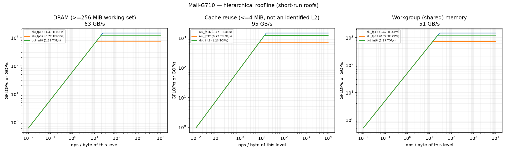
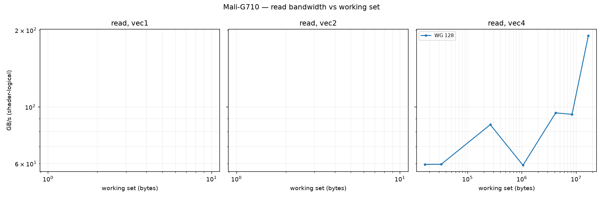
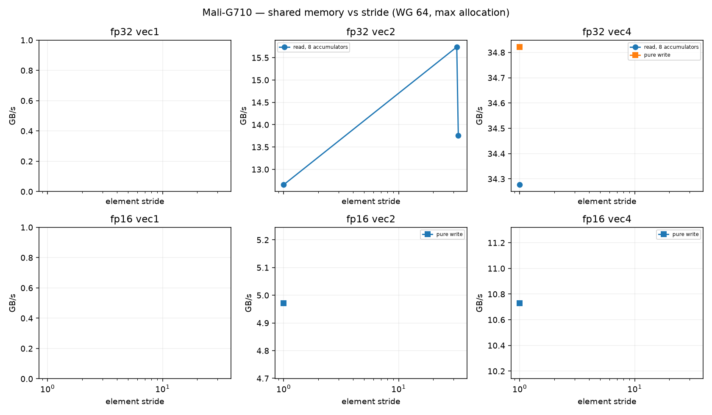
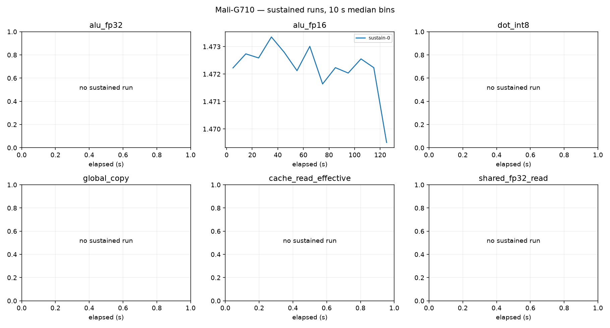

# Mali-G710 roofline report

Device: Google Pixel 7a (SoC GS201), Android 17, driver 226504704, subgroup 16.
Plan(s): fast. GPU clock **DVFS-governed** (not pinned); results depend on the governor and thermal state.
Code: None, runner ec26df94490ba8a6. Rows from other runner or shader builds excluded: 0.

Validation policy: **pre_and_post**; checks bracket continuous sampling and do not guarantee detection of transient errors between checks. Historical pre-only rows are diagnostic only.
Excluded rows: 176; reasons are in all-configurations.csv.
dot_int8: insufficient_quality_repeats, repeat_unstable
dot_int8: repeat_unstable
cache_read_effective: insufficient_quality_repeats
cache_read_effective: insufficient_quality_repeats
shared_fp16_2: repeat_unstable
shared_fp16_2: insufficient_quality_repeats
shared_fp16_0: repeat_unstable
shared_fp16_0: insufficient_quality_repeats
shared_fp32_0: insufficient_quality_repeats
shared_fp32_2: repeat_unstable
texture_rgba16f_tex3d_cache: repeat_unstable
texture_rgba32f_tex3d_cache: repeat_unstable
Sustained roofs require three distinct stable batches per current confirmed configuration and duration

Short-run columns are the best validated configuration: median and best (minimum time, the STREAM/BabelStream convention) of the samples, and the differential rate (paired L vs L/2 runs, removing fixed per-dispatch cost). Sustained is the median of the last 60 s of each sustained run (durations are recorded in sustained-runs.csv). Controls never define a roof. `spill` marks variants whose driver statistics report register spilling: spills only slow a kernel, so the value is still an achievable lower bound.

| roof | short median | short best | differential | sustained | unit |
|---|---:|---:|---:|---:|---|
| alu_fp16 | 1.472 | 1.477 | 1.489 (fixed 1%) | 1.472 (1×) | TFLOP/s |
| alu_fp32 | 0.718 | 0.727 | 0.789 (fixed 9%) | — | TFLOP/s |
| cache_read_effective | 94.856 | 95.386 | 98.476 (fixed 4%) | — | GB/s |
| dot_int8 | 1.225 | 1.329 | 1.290 (fixed 5%) | — | TOP/s |
| global_copy | 62.712 | 63.532 | 68.058 (fixed 8%) | — | GB/s |
| global_triad | 35.840 | 36.285 | 39.032 (fixed 8%) | — | GB/s |
| global_write | 40.069 | 41.503 | 43.649 (fixed 8%) | — | GB/s |
| shared_fp16_read | 51.471 | 54.508 | 56.400 (fixed 9%) | — | GB/s |
| shared_fp16_write | 28.251 | 28.364 | 28.971 (fixed 2%) | — | GB/s |
| shared_fp32_read | 32.072 | 35.350 | 32.162 (fixed 0%) | — | GB/s |
| shared_fp32_write | 38.565 | 39.788 | 38.992 (fixed 2%) | — | GB/s |
| texture_rgba16f_buffer_cache | 35.602 | 36.445 | 35.367 (fixed -1%) | — | GB/s |
| texture_rgba16f_tex2d_dram | 9.218 | 9.238 | 9.224 (fixed 0%) | — | GB/s |
| texture_rgba16f_tex3d_cache | 34.610 | 34.759 | 34.322 (fixed -1%) | — | GB/s |
| texture_rgba32f_tex3d_cache | 34.368 | 34.548 | 33.966 (fixed -1%) | — | GB/s |

## Roof confirmation

Each roof's top candidates were re-measured in fresh processes, round-robin with alternating order. The roof is the median of the best candidate's repeats; the sweep maximum (a single run) is shown for comparison. Roofs without a quality-passing candidate (standard error of the median <= 3 %, not short, fixed cost <= 10 %) are marked unconfirmed.

| roof | confirmed median | repeat range | repeats | sweep max (unconfirmed) |
|---|---:|---:|---:|---:|
| alu_fp16 | 1.472 | 1.465–1.473 (0.6%) | 3 | 1.472 |
| alu_fp32 | 0.718 | 0.715–0.719 (0.6%) | 3 | 0.715 |
| cache_read_effective | unconfirmed | — | — | 94.856 |
| dot_int8 | unconfirmed | — | — | 1.225 |
| global_copy | 62.712 | 62.038–62.933 (1.4%) | 3 | 62.290 |
| global_triad | 35.840 | 35.805–35.857 (0.1%) | 3 | 43.729 |
| global_write | 40.069 | 39.751–40.242 (1.2%) | 3 | 42.542 |
| shared_fp16_read | unconfirmed | — | — | 51.471 |
| shared_fp16_write | unconfirmed | — | — | 28.251 |
| shared_fp32_read | 32.072 | 31.391–32.253 (2.7%) | 3 | 62.997 |
| shared_fp32_write | 38.565 | 38.371–38.760 (1.0%) | 2 | 56.281 |
| texture_rgba16f_buffer_cache | 35.602 | 35.560–35.657 (0.3%) | 3 | 35.518 |
| texture_rgba16f_tex2d_dram | 9.218 | 9.218–9.225 (0.1%) | 3 | 9.210 |
| texture_rgba16f_tex3d_cache | unconfirmed | — | — | 34.610 |
| texture_rgba32f_tex3d_cache | unconfirmed | — | — | 34.368 |

## Device-state sentinel

`alu_fp32_v4_c16 wg256 groups512` measured before and after every stage and every 20 configurations. Values below 85 % of the median reading (0.637 TFLOP/s) mark a stage that ran on a throttled or otherwise degraded device; re-measure those stages.

| UTC | label | TFLOP/s | state |
|---|---|---:|---|
| 2026-09-26T17:51:32 | validate_start | 0.637 | ok |
| 2026-09-26T17:51:52 | validate_end | 0.637 | ok |
| 2026-09-26T17:52:51 | cache_end | 0.638 | ok |
| 2026-09-26T17:53:04 | sweep-memory_20 | 0.637 | ok |
| 2026-09-26T17:53:37 | memory_end | 0.638 | ok |
| 2026-09-26T17:54:24 | sweep-compute_40_quality_retry2 | 0.639 | ok |
| 2026-09-26T17:55:35 | sweep-compute_60 | 0.635 | ok |
| 2026-09-26T17:56:56 | sweep-compute_80 | 0.637 | ok |
| 2026-09-26T17:58:40 | sweep-compute_100 | 0.637 | ok |
| 2026-09-26T18:00:32 | sweep-compute_120 | 0.637 | ok |
| 2026-09-26T18:02:52 | sweep-compute_140 | 0.637 | ok |
| 2026-09-26T18:04:41 | sweep-compute_160 | 0.638 | ok |
| 2026-09-26T18:04:53 | compute_end_quality_retry1 | 0.637 | ok |
| 2026-09-26T18:05:37 | texture_end | 0.636 | ok |
| 2026-09-26T18:05:57 | sweep-shared_180 | 0.638 | ok |
| 2026-09-26T18:06:57 | sweep-shared_200 | 0.638 | ok |
| 2026-09-26T18:07:58 | sweep-shared_220 | 0.637 | ok |
| 2026-09-26T18:08:35 | shared_end_quality_retry1 | 0.635 | ok |
| 2026-09-26T18:09:42 | latency-capacity_240 | 0.637 | ok |
| 2026-09-26T18:09:45 | latency_end | 0.638 | ok |
| 2026-09-26T18:11:12 | confirm_260 | 0.640 | ok |
| 2026-09-26T18:12:22 | confirm_280 | 0.638 | ok |
| 2026-09-26T18:14:08 | confirm_300 | 0.635 | ok |
| 2026-09-26T18:15:01 | confirm_end | 0.638 | ok |
| 2026-09-26T18:15:04 | sustain_0 | 0.638 | ok |

## Ridge points (short-run roofs)

Arithmetic intensity (ops per byte of that level) at which each compute roof meets each memory roof.

| compute roof | global | cache | shared_fp32 | shared_fp16 |
|---|---:|---:|---:|---:|
| alu_fp16 | 23.47 | 15.51 | 38.16 | 28.59 |
| alu_fp32 | 11.46 | 7.57 | 18.63 | 13.96 |
| dot_int8 | 19.54 | 12.92 | 31.77 | 23.80 |

## Figures

See also [TUNING.md](TUNING.md), [SUPPLEMENT.md](SUPPLEMENT.md) (latency, TLB, line size, ERT, memory type) and [ISA-CHECK.md](ISA-CHECK.md).

## Limits

- Bandwidths are shader-logical bytes; physical DRAM/L2 traffic is not measurable without `VK_KHR_performance_query` (exposed: False).
- No vendor theoretical peaks are used; values are achievable rates on this device and driver.
- Cache knees move with workgroup size and are not cache capacities; see the pointer-chase results.
- Sustained values need 3 batches (plan `gold`) before they replace short-run roofs.
