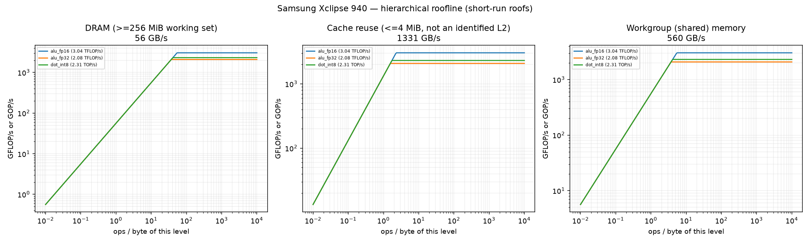
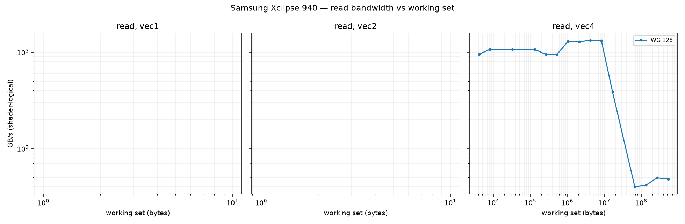
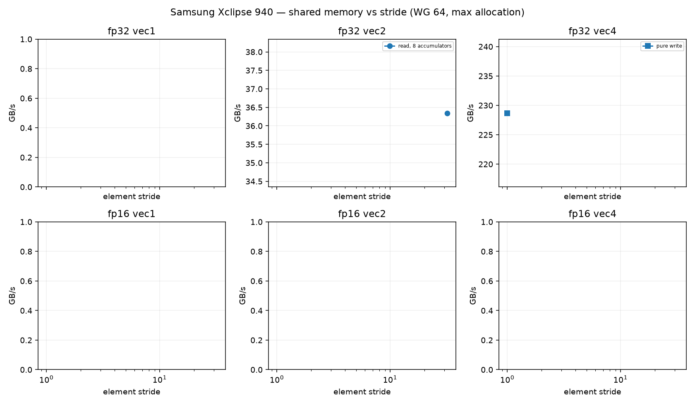
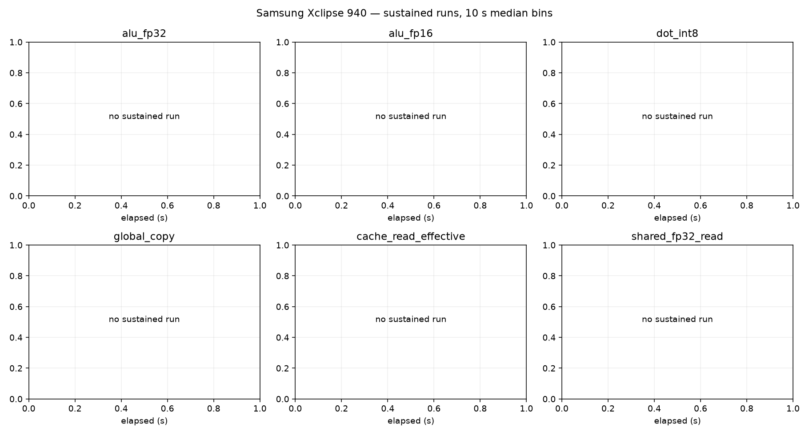

# Samsung Xclipse 940 roofline report

Device: samsung SM-S926B (SoC s5e9945), Android 16, driver 100663830, subgroup 64.
Plan(s): fast. GPU clock **DVFS-governed** (not pinned); results depend on the governor and thermal state.
Code: None, runner ec26df94490ba8a6. Rows from other runner or shader builds excluded: 0.

Validation policy: **pre_and_post**; checks bracket continuous sampling and do not guarantee detection of transient errors between checks. Historical pre-only rows are diagnostic only.
Excluded rows: 165; reasons are in all-configurations.csv.
alu_fp16: insufficient_quality_repeats
alu_fp16: repeat_unstable
alu_fp32: insufficient_quality_repeats
dot_int8: repeat_unstable
dot_int8: repeat_unstable
memory_fp32_2: repeat_unstable
cache_read_effective: repeat_unstable
cache_read_effective: repeat_unstable
memory_fp32_1: repeat_unstable
shared_fp16_0: insufficient_quality_repeats
shared_fp16_0: repeat_unstable
shared_fp16_2: insufficient_quality_repeats
shared_fp16_2: insufficient_quality_repeats
shared_fp32_0: insufficient_quality_repeats
shared_fp32_0: insufficient_quality_repeats
shared_fp32_2: repeat_unstable
texture_rgba32f_tex3d_cache: insufficient_quality_repeats
Sustained roofs require three distinct stable batches per current confirmed configuration and duration

Short-run columns are the best validated configuration: median and best (minimum time, the STREAM/BabelStream convention) of the samples, and the differential rate (paired L vs L/2 runs, removing fixed per-dispatch cost). Sustained is the median of the last 60 s of each sustained run (durations are recorded in sustained-runs.csv). Controls never define a roof. `spill` marks variants whose driver statistics report register spilling: spills only slow a kernel, so the value is still an achievable lower bound.

| roof | short median | short best | differential | sustained | unit |
|---|---:|---:|---:|---:|---|
| alu_fp16 | 3.044 | 3.044 | 3.066 (fixed 1%) | — | TFLOP/s |
| alu_fp32 | 2.084 | 2.348 | 2.089 (fixed 0%) | — | TFLOP/s |
| cache_read_effective | 1330.608 | 1331.560 | 1353.137 (fixed 2%) | — | GB/s |
| dot_int8 | 2.314 | 2.314 | 2.336 (fixed 1%) | — | TOP/s |
| global_copy | 46.977 | 47.341 | 46.912 (fixed -0%) | — | GB/s |
| global_read | 49.364 | 49.444 | 49.609 (fixed 0%) | 49.450 (1×) | GB/s |
| global_triad | 50.777 | 50.907 | 50.645 (fixed -0%) | — | GB/s |
| global_write | 56.228 | 56.533 | 56.392 (fixed 0%) | — | GB/s |
| shared_fp16_read | 497.197 | 557.942 | 530.670 (fixed 6%) | — | GB/s |
| shared_fp16_write | 389.145 | 391.522 | 397.526 (fixed 2%) | — | GB/s |
| shared_fp32_read | 560.111 | 579.031 | 576.812 (fixed 3%) | — | GB/s |
| shared_fp32_write | 457.239 | 457.338 | 458.652 (fixed 0%) | — | GB/s |
| texture_rgba16f_buffer_cache | 38.309 | 44.444 | 38.262 (fixed -0%) | — | GB/s |
| texture_rgba16f_buffer_dram | 50.647 | 50.772 | 50.660 (fixed 0%) | — | GB/s |
| texture_rgba16f_tex2d_dram | 26.445 | 28.255 | 26.342 (fixed -0%) | — | GB/s |
| texture_rgba16f_tex3d_dram | 42.121 | 44.362 | 42.413 (fixed 1%) | — | GB/s |
| texture_rgba32f_buffer_dram | 49.929 | 50.489 | 49.898 (fixed -0%) | — | GB/s |
| texture_rgba32f_tex2d_dram | 26.291 | 26.848 | 26.307 (fixed 0%) | — | GB/s |
| texture_rgba32f_tex3d_cache | 44.202 | 44.315 | 44.138 (fixed -0%) | — | GB/s |
| texture_rgba32f_tex3d_dram | 46.401 | 48.061 | 46.366 (fixed -0%) | — | GB/s |

## Roof confirmation

Each roof's top candidates were re-measured in fresh processes, round-robin with alternating order. The roof is the median of the best candidate's repeats; the sweep maximum (a single run) is shown for comparison. Roofs without a quality-passing candidate (standard error of the median <= 3 %, not short, fixed cost <= 10 %) are marked unconfirmed.

| roof | confirmed median | repeat range | repeats | sweep max (unconfirmed) |
|---|---:|---:|---:|---:|
| alu_fp16 | unconfirmed | — | — | 3.044 |
| alu_fp32 | 2.084 | 2.084–2.084 (0.0%) | 2 | 2.348 |
| cache_read_effective | unconfirmed | — | — | 1330.608 |
| dot_int8 | unconfirmed | — | — | 2.314 |
| global_copy | 46.977 | 46.973–47.314 (0.7%) | 3 | 46.208 |
| global_read | 49.364 | 49.279–49.371 (0.2%) | 3 | 48.736 |
| global_triad | 50.777 | 50.502–50.869 (0.7%) | 3 | 53.988 |
| global_write | 56.228 | 55.478–56.253 (1.4%) | 3 | 55.432 |
| shared_fp16_read | unconfirmed | — | — | 497.197 |
| shared_fp16_write | unconfirmed | — | — | 389.145 |
| shared_fp32_read | unconfirmed | — | — | 560.111 |
| shared_fp32_write | 457.239 | 457.225–457.254 (0.0%) | 2 | 474.309 |
| texture_rgba16f_buffer_cache | 38.309 | 38.307–38.312 (0.0%) | 2 | 38.305 |
| texture_rgba16f_buffer_dram | 50.647 | 49.784–50.670 (1.7%) | 3 | 50.158 |
| texture_rgba16f_tex2d_dram | 26.445 | 26.326–26.654 (1.2%) | 3 | 26.477 |
| texture_rgba16f_tex3d_dram | 42.121 | 41.911–43.582 (4.0%) | 3 | 43.155 |
| texture_rgba32f_buffer_dram | 49.929 | 49.844–50.453 (1.2%) | 3 | 50.478 |
| texture_rgba32f_tex2d_dram | 26.291 | 25.850–26.311 (1.8%) | 3 | 25.953 |
| texture_rgba32f_tex3d_cache | unconfirmed | — | — | 44.202 |
| texture_rgba32f_tex3d_dram | 46.401 | 46.354–47.733 (3.0%) | 3 | 47.809 |

## Device-state sentinel

`alu_fp32_v4_c16 wg256 groups512` measured before and after every stage and every 20 configurations. Values below 85 % of the median reading (1.820 TFLOP/s) mark a stage that ran on a throttled or otherwise degraded device; re-measure those stages.

| UTC | label | TFLOP/s | state |
|---|---|---:|---|
| 2026-09-26T17:52:04 | validate_start | 1.820 | ok |
| 2026-09-26T17:52:28 | validate_end_quality_retry2 | 1.616 | ok |
| 2026-09-26T17:53:13 | cache_end | 1.819 | ok |
| 2026-09-26T17:53:24 | sweep-memory_20_quality_retry1 | 1.820 | ok |
| 2026-09-26T17:53:47 | memory_end_quality_retry1 | 1.820 | ok |
| 2026-09-26T17:54:21 | sweep-compute_40 | 1.820 | ok |
| 2026-09-26T17:55:11 | sweep-compute_60 | 1.820 | ok |
| 2026-09-26T17:56:01 | sweep-compute_80 | 1.819 | ok |
| 2026-09-26T17:56:56 | sweep-compute_100_quality_retry1 | 1.820 | ok |
| 2026-09-26T17:57:51 | sweep-compute_120 | 1.820 | ok |
| 2026-09-26T17:58:57 | sweep-compute_140 | 1.820 | ok |
| 2026-09-26T18:00:00 | sweep-compute_160 | 1.820 | ok |
| 2026-09-26T18:00:09 | compute_end_quality_retry1 | 1.820 | ok |
| 2026-09-26T18:00:47 | texture_end_quality_retry2 | 1.616 | ok |
| 2026-09-26T18:01:05 | sweep-shared_180 | 1.820 | ok |
| 2026-09-26T18:01:55 | sweep-shared_200 | 1.820 | ok |
| 2026-09-26T18:02:48 | sweep-shared_220 | 1.820 | ok |
| 2026-09-26T18:03:17 | shared_end_quality_retry1 | 1.820 | ok |
| 2026-09-26T18:04:12 | latency-capacity_240 | 1.820 | ok |
| 2026-09-26T18:04:15 | latency_end | 1.820 | ok |
| 2026-09-26T18:05:15 | confirm_260_quality_retry2 | 1.820 | ok |
| 2026-09-26T18:06:12 | confirm_280 | 1.820 | ok |
| 2026-09-26T18:07:08 | confirm_300 | 1.820 | ok |
| 2026-09-26T18:08:07 | confirm_320_quality_retry1 | 1.820 | ok |
| 2026-09-26T18:08:44 | confirm_end | 1.820 | ok |
| 2026-09-26T18:08:46 | sustain_0 | 1.820 | ok |

## Ridge points (short-run roofs)

Arithmetic intensity (ops per byte of that level) at which each compute roof meets each memory roof.

| compute roof | global | cache | shared_fp32 | shared_fp16 |
|---|---:|---:|---:|---:|
| alu_fp16 | 54.14 | 2.29 | 5.43 | 6.12 |
| alu_fp32 | 37.06 | 1.57 | 3.72 | 4.19 |
| dot_int8 | 41.15 | 1.74 | 4.13 | 4.65 |

## Figures

See also [TUNING.md](TUNING.md), [SUPPLEMENT.md](SUPPLEMENT.md) (latency, TLB, line size, ERT, memory type) and [ISA-CHECK.md](ISA-CHECK.md).

## Limits

- Bandwidths are shader-logical bytes; physical DRAM/L2 traffic is not measurable without `VK_KHR_performance_query` (exposed: False).
- No vendor theoretical peaks are used; values are achievable rates on this device and driver.
- Cache knees move with workgroup size and are not cache capacities; see the pointer-chase results.
- Sustained values need 3 batches (plan `gold`) before they replace short-run roofs.
