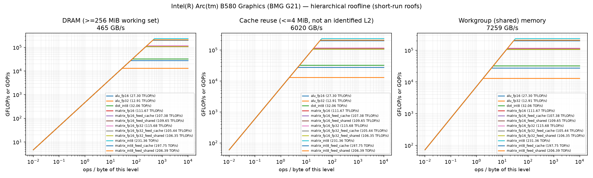
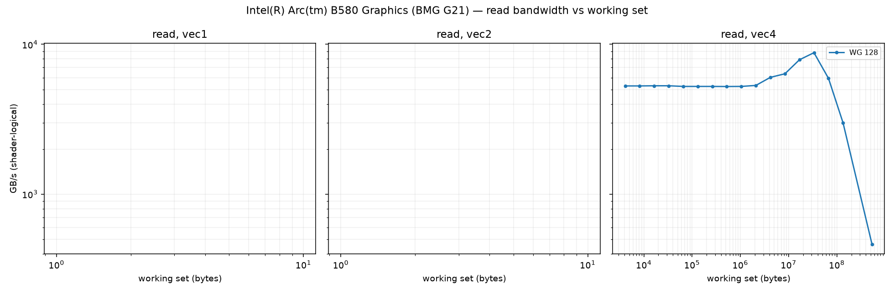
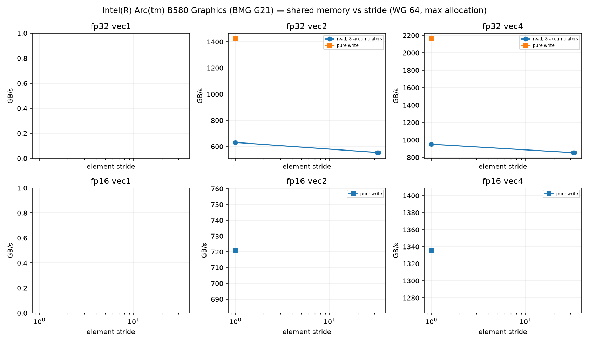
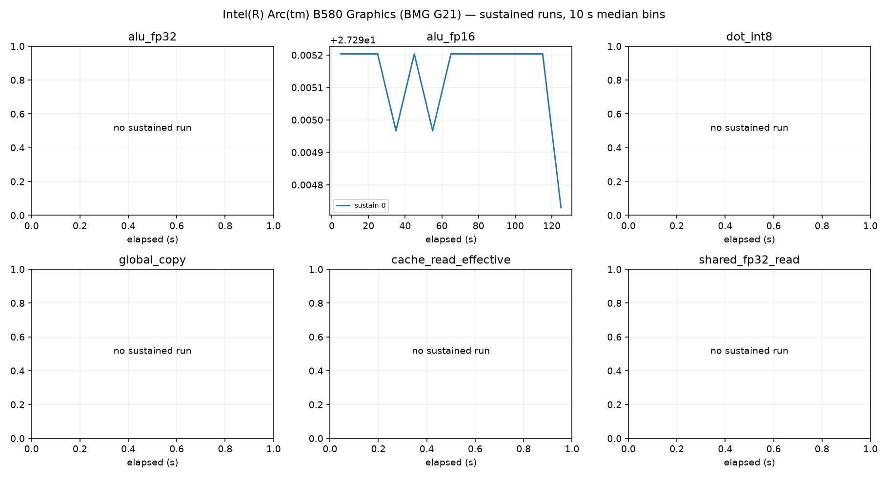

# Intel(R) Arc(tm) B580 Graphics (BMG G21) roofline report

Device: host AMD Ryzen 5 9600X 6-Core Processor (SoC AMD Ryzen 5 9600X 6-Core Processor), Fedora Linux 44 (Workstation Edition), driver 109060099, subgroup 32.
Plan(s): fast. GPU clock **DVFS-governed** (not pinned); results depend on the governor and thermal state.
Code: None, runner 810e098c8abb2dfb. Rows from other runner or shader builds excluded: 0.

Validation policy: **pre_and_post**; checks bracket continuous sampling and do not guarantee detection of transient errors between checks. Historical pre-only rows are diagnostic only.
Excluded rows: 56; reasons are in all-configurations.csv.
Sustained roofs require three distinct stable batches per current confirmed configuration and duration

Short-run columns are the best validated configuration: median and best (minimum time, the STREAM/BabelStream convention) of the samples, and the differential rate (paired L vs L/2 runs, removing fixed per-dispatch cost). Sustained is the median of the last 60 s of each sustained run (durations are recorded in sustained-runs.csv). Controls never define a roof. `spill` marks variants whose driver statistics report register spilling: spills only slow a kernel, so the value is still an achievable lower bound.

| roof | short median | short best | differential | sustained | unit |
|---|---:|---:|---:|---:|---|
| alu_fp16 | 27.295 | 27.297 | 27.349 (fixed 0%) | 27.295 (1×) | TFLOP/s |
| alu_fp32 | 12.913 | 12.914 | 12.949 (fixed 0%) | — | TFLOP/s |
| cache_read_effective | 6020.185 | 6027.459 | 6027.164 (fixed 0%) | — | GB/s |
| dot_int8 | 32.060 | 32.063 | 32.149 (fixed 0%) | — | TOP/s |
| global_copy | 408.202 | 414.565 | 414.046 (fixed 1%) | — | GB/s |
| global_read | 465.231 | 467.248 | 470.832 (fixed 1%) | 465.273 (1×) | GB/s |
| global_triad | 391.292 | 393.951 | 390.830 (fixed -0%) | — | GB/s |
| global_write | 394.218 | 401.281 | 407.742 (fixed 3%) | — | GB/s |
| matrix_fp16 | 111.667 | 111.768 | 115.922 (fixed 4%) | — | TFLOP/s |
| matrix_fp16_feed_cache | 107.379 | 108.160 | 109.606 (fixed 2%) | — | TFLOP/s |
| matrix_fp16_feed_dram | 444.310 | 444.971 | 451.837 (fixed 2%) | — | GB/s |
| matrix_fp16_feed_shared | 109.655 | 109.720 | 113.685 (fixed 4%) | — | TFLOP/s |
| matrix_fp16_fp32 | 115.676 | 115.687 | 115.953 (fixed 0%) | 115.677 (1×) | TFLOP/s |
| matrix_fp16_fp32_feed_cache | 105.439 | 106.014 | 106.118 (fixed 1%) | — | TFLOP/s |
| matrix_fp16_fp32_feed_dram | 440.921 | 441.810 | 447.163 (fixed 1%) | — | GB/s |
| matrix_fp16_fp32_feed_shared | 106.349 | 106.513 | 106.831 (fixed 0%) | — | TFLOP/s |
| matrix_int8 | 231.360 | 231.381 | 231.922 (fixed 0%) | — | TOP/s |
| matrix_int8_feed_cache | 197.747 | 199.029 | 199.571 (fixed 1%) | — | TOP/s |
| matrix_int8_feed_dram | 436.816 | 437.947 | 443.196 (fixed 1%) | — | GB/s |
| matrix_int8_feed_shared | 206.393 | 206.676 | 212.212 (fixed 3%) | — | TOP/s |
| shared_fp16_read | 3450.211 | 3451.224 | 3648.829 (fixed 5%) | — | GB/s |
| shared_fp16_write | 4102.181 | 4102.473 | 4183.420 (fixed 2%) | — | GB/s |
| shared_fp32_read | 7258.851 | 7261.247 | 7267.433 (fixed 0%) | — | GB/s |
| shared_fp32_write | 6147.160 | 6147.456 | 6151.374 (fixed 0%) | — | GB/s |
| texture_rgba16f_buffer_cache | 1071.864 | 1073.371 | 1071.799 (fixed -0%) | — | GB/s |
| texture_rgba16f_buffer_dram | 421.587 | 421.980 | 421.854 (fixed 0%) | — | GB/s |
| texture_rgba16f_tex2d_cache | 988.670 | 989.978 | 988.400 (fixed -0%) | — | GB/s |
| texture_rgba16f_tex2d_dram | 261.513 | 263.967 | 262.424 (fixed 0%) | — | GB/s |
| texture_rgba16f_tex3d_cache | 992.295 | 995.024 | 992.423 (fixed 0%) | — | GB/s |
| texture_rgba16f_tex3d_dram | 441.866 | 443.077 | 441.898 (fixed 0%) | — | GB/s |
| texture_rgba32f_buffer_cache | 1079.801 | 1080.724 | 1079.632 (fixed -0%) | — | GB/s |
| texture_rgba32f_buffer_dram | 423.107 | 423.336 | 423.243 (fixed 0%) | — | GB/s |
| texture_rgba32f_tex2d_cache | 968.195 | 969.646 | 968.052 (fixed -0%) | — | GB/s |
| texture_rgba32f_tex2d_dram | 397.023 | 398.627 | 397.430 (fixed 0%) | — | GB/s |
| texture_rgba32f_tex3d_cache | 1010.235 | 1012.501 | 1009.655 (fixed -0%) | — | GB/s |
| texture_rgba32f_tex3d_dram | 571.942 | 575.082 | 572.483 (fixed 0%) | — | GB/s |

## Roof confirmation

Each roof's top candidates were re-measured in fresh processes, round-robin with alternating order. The roof is the median of the best candidate's repeats; the sweep maximum (a single run) is shown for comparison. Roofs without a quality-passing candidate (standard error of the median <= 3 %, not short, fixed cost <= 10 %) are marked unconfirmed.

| roof | confirmed median | repeat range | repeats | sweep max (unconfirmed) |
|---|---:|---:|---:|---:|
| alu_fp16 | 27.295 | 27.295–27.295 (0.0%) | 3 | 27.295 |
| alu_fp32 | 12.913 | 12.912–12.913 (0.0%) | 3 | 12.913 |
| cache_read_effective | 6020.185 | 6019.652–6020.485 (0.0%) | 3 | 6021.202 |
| dot_int8 | 32.060 | 32.060–32.062 (0.0%) | 3 | 32.060 |
| global_copy | 408.202 | 407.797–409.380 (0.4%) | 3 | 408.497 |
| global_read | 465.231 | 465.214–465.340 (0.0%) | 3 | 465.143 |
| global_triad | 391.292 | 391.069–391.562 (0.1%) | 3 | 391.146 |
| global_write | 394.218 | 393.470–395.684 (0.6%) | 3 | 395.964 |
| matrix_fp16 | 111.667 | 111.663–111.677 (0.0%) | 3 | 111.672 |
| matrix_fp16_feed_cache | 107.379 | 107.327–107.764 (0.4%) | 3 | 107.391 |
| matrix_fp16_feed_dram | 444.310 | 444.163–444.319 (0.0%) | 3 | 444.094 |
| matrix_fp16_feed_shared | 109.655 | 109.634–109.661 (0.0%) | 3 | 109.646 |
| matrix_fp16_fp32 | 115.676 | 115.671–115.682 (0.0%) | 3 | 115.684 |
| matrix_fp16_fp32_feed_cache | 105.439 | 105.414–105.531 (0.1%) | 3 | 105.402 |
| matrix_fp16_fp32_feed_dram | 440.921 | 439.327–441.030 (0.4%) | 3 | 440.356 |
| matrix_fp16_fp32_feed_shared | 106.349 | 106.331–106.409 (0.1%) | 3 | 106.308 |
| matrix_int8 | 231.360 | 231.356–231.367 (0.0%) | 3 | 231.365 |
| matrix_int8_feed_cache | 197.747 | 197.563–198.160 (0.3%) | 3 | 197.741 |
| matrix_int8_feed_dram | 436.816 | 436.527–437.001 (0.1%) | 3 | 437.587 |
| matrix_int8_feed_shared | 206.393 | 206.326–206.426 (0.0%) | 3 | 206.019 |
| shared_fp16_read | 3450.211 | 3450.144–3450.271 (0.0%) | 3 | 3449.969 |
| shared_fp16_write | 4102.181 | 4102.154–4102.190 (0.0%) | 3 | 4102.154 |
| shared_fp32_read | 7258.851 | 7258.638–7259.330 (0.0%) | 3 | 7258.744 |
| shared_fp32_write | 6147.160 | 6146.772–6147.296 (0.0%) | 3 | 6147.131 |
| texture_rgba16f_buffer_cache | 1071.864 | 1071.817–1072.063 (0.0%) | 3 | 1071.976 |
| texture_rgba16f_buffer_dram | 421.587 | 421.497–421.626 (0.0%) | 3 | 421.515 |
| texture_rgba16f_tex2d_cache | 988.670 | 988.537–988.755 (0.0%) | 3 | 988.709 |
| texture_rgba16f_tex2d_dram | 261.513 | 261.286–261.521 (0.1%) | 3 | 261.276 |
| texture_rgba16f_tex3d_cache | 992.295 | 991.787–992.295 (0.1%) | 3 | 992.364 |
| texture_rgba16f_tex3d_dram | 441.866 | 441.855–441.908 (0.0%) | 3 | 441.926 |
| texture_rgba32f_buffer_cache | 1079.801 | 1079.549–1079.811 (0.0%) | 3 | 1079.209 |
| texture_rgba32f_buffer_dram | 423.107 | 423.103–423.107 (0.0%) | 3 | 423.158 |
| texture_rgba32f_tex2d_cache | 968.195 | 967.865–968.195 (0.0%) | 3 | 967.384 |
| texture_rgba32f_tex2d_dram | 397.023 | 396.771–397.130 (0.1%) | 3 | 396.777 |
| texture_rgba32f_tex3d_cache | 1010.235 | 1009.936–1010.420 (0.0%) | 3 | 1010.343 |
| texture_rgba32f_tex3d_dram | 571.942 | 571.936–572.365 (0.1%) | 3 | 572.467 |

## Cooperative matrix fed from memory, by reuse

Best validated median per source and CHAINS (multiply-adds per loaded A/B tile pair). `load GB/s` counts the A/B tile bytes loaded. DRAM-fed rates grow with reuse until the matrix unit limits them, so the `matrix_*_feed_dram` roof above is a bandwidth; look a kernel's ops per loaded byte up here instead. `gates` lists quality gates the row failed (such rows never define a roof).

| dtype | source | CHAINS | ops / loaded byte | rate | load GB/s | gates |
|---|---|---:|---:|---:|---:|---|
| fp16 | shared | 8 | 42.7 | 109.661 TFLOP/s | 2570.2 | — |
| fp16 | cache | 1 | 5.3 | 17.942 TFLOP/s | 3364.2 | — |
| fp16 | cache | 2 | 10.7 | 35.358 TFLOP/s | 3314.8 | — |
| fp16 | cache | 4 | 21.3 | 67.659 TFLOP/s | 3171.5 | — |
| fp16 | cache | 8 | 42.7 | 107.764 TFLOP/s | 2525.7 | — |
| fp16 | dram | 1 | 5.3 | 2.321 TFLOP/s | 435.3 | — |
| fp16 | dram | 2 | 10.7 | 4.563 TFLOP/s | 427.8 | — |
| fp16 | dram | 4 | 21.3 | 8.896 TFLOP/s | 417.0 | — |
| fp16 | dram | 8 | 42.7 | 17.147 TFLOP/s | 401.9 | — |
| fp16_fp32 | shared | 1 | 5.3 | 27.516 TFLOP/s | 5159.3 | — |
| fp16_fp32 | shared | 2 | 10.7 | 53.555 TFLOP/s | 5020.8 | — |
| fp16_fp32 | shared | 4 | 21.3 | 101.946 TFLOP/s | 4778.7 | — |
| fp16_fp32 | shared | 8 | 42.7 | 106.409 TFLOP/s | 2493.9 | — |
| fp16_fp32 | cache | 1 | 5.3 | 18.508 TFLOP/s | 3470.3 | — |
| fp16_fp32 | cache | 2 | 10.7 | 36.577 TFLOP/s | 3429.1 | — |
| fp16_fp32 | cache | 4 | 21.3 | 70.116 TFLOP/s | 3286.7 | — |
| fp16_fp32 | cache | 8 | 42.7 | 105.531 TFLOP/s | 2473.4 | — |
| fp16_fp32 | dram | 1 | 5.3 | 2.333 TFLOP/s | 437.5 | — |
| fp16_fp32 | dram | 2 | 10.7 | 4.602 TFLOP/s | 431.4 | — |
| fp16_fp32 | dram | 4 | 21.3 | 9.026 TFLOP/s | 423.1 | — |
| fp16_fp32 | dram | 8 | 42.7 | 16.891 TFLOP/s | 395.9 | — |
| int8 | shared | 1 | 10.7 | 34.433 TOP/s | 3228.1 | — |
| int8 | shared | 2 | 21.3 | 72.971 TOP/s | 3420.5 | — |
| int8 | shared | 4 | 42.7 | 135.612 TOP/s | 3178.4 | — |
| int8 | shared | 8 | 85.3 | 206.426 TOP/s | 2419.1 | — |
| int8 | cache | 1 | 10.7 | 25.494 TOP/s | 2390.1 | — |
| int8 | cache | 2 | 21.3 | 49.631 TOP/s | 2326.4 | — |
| int8 | cache | 4 | 42.7 | 99.552 TOP/s | 2333.3 | — |
| int8 | cache | 8 | 85.3 | 198.160 TOP/s | 2322.2 | — |
| int8 | dram | 1 | 10.7 | 4.628 TOP/s | 433.9 | — |
| int8 | dram | 2 | 21.3 | 9.131 TOP/s | 428.0 | — |
| int8 | dram | 4 | 42.7 | 17.903 TOP/s | 419.6 | — |
| int8 | dram | 8 | 85.3 | 35.224 TOP/s | 412.8 | — |

## Device-state sentinel

`alu_fp32_v4_c16 wg256 groups512` measured before and after every stage and every 20 configurations. Values below 85 % of the median reading (11.679 TFLOP/s) mark a stage that ran on a throttled or otherwise degraded device; re-measure those stages.

| UTC | label | TFLOP/s | state |
|---|---|---:|---|
| 2026-09-26T17:50:59 | validate_start | 11.680 | ok |
| 2026-09-26T17:51:06 | validate_end | 11.680 | ok |
| 2026-09-26T17:51:41 | cache_end | 11.679 | ok |
| 2026-09-26T17:51:49 | sweep-memory_20 | 11.679 | ok |
| 2026-09-26T17:52:00 | memory_end | 11.679 | ok |
| 2026-09-26T17:52:22 | sweep-compute_40 | 11.679 | ok |
| 2026-09-26T17:52:53 | sweep-compute_60 | 11.679 | ok |
| 2026-09-26T17:53:23 | sweep-compute_80 | 11.679 | ok |
| 2026-09-26T17:53:54 | sweep-compute_100 | 11.680 | ok |
| 2026-09-26T17:54:24 | sweep-compute_120 | 11.680 | ok |
| 2026-09-26T17:54:55 | sweep-compute_140 | 11.680 | ok |
| 2026-09-26T17:55:27 | sweep-compute_160 | 11.679 | ok |
| 2026-09-26T17:55:49 | compute_end | 11.679 | ok |
| 2026-09-26T17:55:58 | sweep-matrix-feed_180 | 11.680 | ok |
| 2026-09-26T17:56:30 | sweep-matrix-feed_200 | 11.679 | ok |
| 2026-09-26T17:56:47 | matrix_feed_end | 11.679 | ok |
| 2026-09-26T17:57:04 | sweep-texture_220 | 11.679 | ok |
| 2026-09-26T17:57:08 | texture_end | 11.679 | ok |
| 2026-09-26T17:57:38 | sweep-shared_240 | 11.679 | ok |
| 2026-09-26T17:58:09 | sweep-shared_260 | 11.680 | ok |
| 2026-09-26T17:58:38 | shared_end | 11.679 | ok |
| 2026-09-26T17:58:42 | latency-capacity_280 | 11.679 | ok |
| 2026-09-26T17:59:16 | latency_end | 11.679 | ok |
| 2026-09-26T17:59:35 | confirm_300 | 11.679 | ok |
| 2026-09-26T18:00:09 | confirm_320 | 11.679 | ok |
| 2026-09-26T18:00:46 | confirm_340 | 11.679 | ok |
| 2026-09-26T18:01:18 | confirm_360 | 11.679 | ok |
| 2026-09-26T18:01:55 | confirm_380 | 11.679 | ok |
| 2026-09-26T18:02:27 | confirm_400 | 11.680 | ok |
| 2026-09-26T18:02:58 | confirm_420 | 11.679 | ok |
| 2026-09-26T18:03:35 | confirm_440 | 11.679 | ok |
| 2026-09-26T18:04:08 | confirm_460 | 11.679 | ok |
| 2026-09-26T18:04:13 | confirm_end | 11.680 | ok |
| 2026-09-26T18:04:14 | sustain_0 | 11.679 | ok |

## Ridge points (short-run roofs)

Arithmetic intensity (ops per byte of that level) at which each compute roof meets each memory roof.

| compute roof | global | cache | shared_fp32 | shared_fp16 |
|---|---:|---:|---:|---:|
| alu_fp16 | 58.67 | 4.53 | 3.76 | 6.65 |
| alu_fp32 | 27.76 | 2.14 | 1.78 | 3.15 |
| dot_int8 | 68.91 | 5.33 | 4.42 | 7.82 |
| matrix_fp16 | 240.03 | 18.55 | 15.38 | 27.22 |
| matrix_fp16_feed_cache | 230.81 | 17.84 | 14.79 | 26.18 |
| matrix_fp16_feed_shared | 235.70 | 18.21 | 15.11 | 26.73 |
| matrix_fp16_fp32 | 248.64 | 19.21 | 15.94 | 28.20 |
| matrix_fp16_fp32_feed_cache | 226.64 | 17.51 | 14.53 | 25.70 |
| matrix_fp16_fp32_feed_shared | 228.59 | 17.67 | 14.65 | 25.92 |
| matrix_int8 | 497.30 | 38.43 | 31.87 | 56.40 |
| matrix_int8_feed_cache | 425.05 | 32.85 | 27.24 | 48.21 |
| matrix_int8_feed_shared | 443.64 | 34.28 | 28.43 | 50.31 |

## Figures

See also [TUNING.md](TUNING.md), [SUPPLEMENT.md](SUPPLEMENT.md) (latency, TLB, line size, ERT, memory type) and [ISA-CHECK.md](ISA-CHECK.md).

## Limits

- Bandwidths are shader-logical bytes; physical DRAM/L2 traffic is not measurable without `VK_KHR_performance_query` (exposed: False).
- No vendor theoretical peaks are used; values are achievable rates on this device and driver.
- Cache knees move with workgroup size and are not cache capacities; see the pointer-chase results.
- Sustained values need 3 batches (plan `gold`) before they replace short-run roofs.
