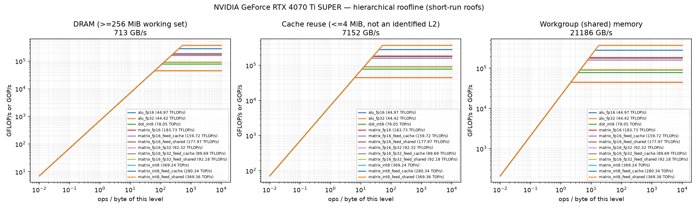
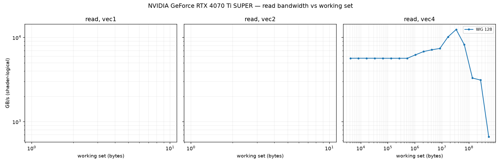
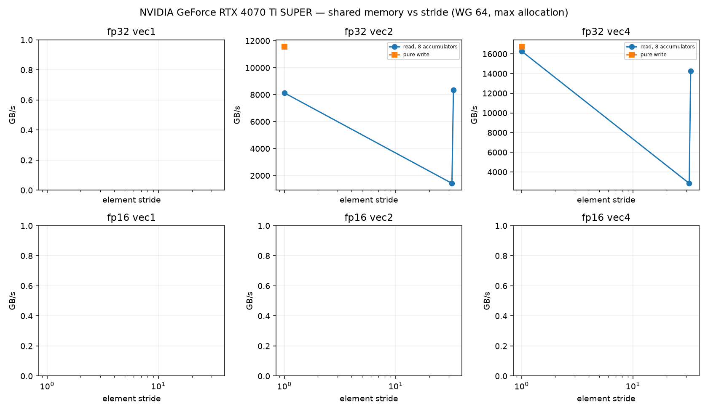
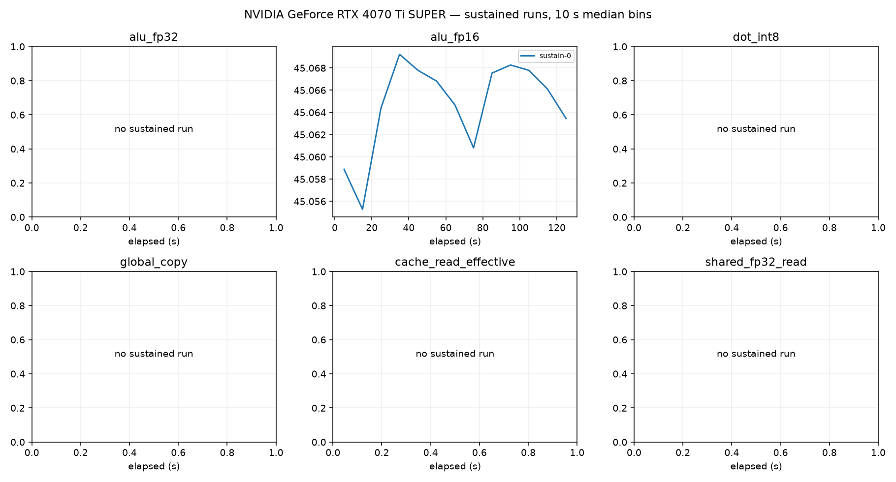

# NVIDIA GeForce RTX 4070 Ti SUPER roofline report

Device: host AMD EPYC 4464P 12-Core Processor (SoC AMD EPYC 4464P 12-Core Processor), Ubuntu 26.04.1 LTS, driver 2580660800, subgroup 32.
Plan(s): fast. GPU clock **DVFS-governed** (not pinned); results depend on the governor and thermal state.
Code: None, runner 5edad6896f44f511. Rows from other runner or shader builds excluded: 0.

Validation policy: **pre_and_post**; checks bracket continuous sampling and do not guarantee detection of transient errors between checks. Historical pre-only rows are diagnostic only.
Excluded rows: 64; reasons are in all-configurations.csv.
matrix_fp16_fp32_feed_dram: repeat_unstable
Sustained roofs require three distinct stable batches per current confirmed configuration and duration

Short-run columns are the best validated configuration: median and best (minimum time, the STREAM/BabelStream convention) of the samples, and the differential rate (paired L vs L/2 runs, removing fixed per-dispatch cost). Sustained is the median of the last 60 s of each sustained run (durations are recorded in sustained-runs.csv). Controls never define a roof. `spill` marks variants whose driver statistics report register spilling: spills only slow a kernel, so the value is still an achievable lower bound.

| roof | short median | short best | differential | sustained | unit |
|---|---:|---:|---:|---:|---|
| alu_fp16 | 44.967 | 45.074 | 45.004 (fixed 0%) | 45.066 (1×) | TFLOP/s |
| alu_fp32 | 44.418 | 44.673 | 44.528 (fixed 0%) | — | TFLOP/s |
| cache_read_effective | 7151.736 | 7169.756 | 7160.578 (fixed 0%) | — | GB/s |
| dot_int8 | 78.050 | 78.127 | 78.153 (fixed 0%) | — | TOP/s |
| global_copy | 645.977 | 647.572 | 648.101 (fixed 0%) | — | GB/s |
| global_read | 713.255 | 719.925 | 742.619 (fixed 4%) | 2664.922 (1×) | GB/s |
| global_triad | 632.515 | 634.912 | 631.046 (fixed -0%) | — | GB/s |
| global_write | 642.461 | 645.715 | 642.565 (fixed 0%) | — | GB/s |
| matrix_fp16 | 183.729 | 183.756 | 185.429 (fixed 1%) | — | TFLOP/s |
| matrix_fp16_feed_cache | 159.722 | 159.782 | 161.507 (fixed 1%) | — | TFLOP/s |
| matrix_fp16_feed_dram | 650.226 | 650.441 | 659.108 (fixed 1%) | — | GB/s |
| matrix_fp16_feed_shared | 177.972 | 178.716 | 184.452 (fixed 4%) | — | TFLOP/s |
| matrix_fp16_fp32 | 92.318 | 92.816 | 92.376 (fixed 0%) | 92.807 (1×) | TFLOP/s |
| matrix_fp16_fp32_feed_cache | 89.689 | 89.709 | 89.803 (fixed 0%) | — | TFLOP/s |
| matrix_fp16_fp32_feed_dram | 669.619 | 670.069 | 708.296 (fixed 5%) | — | GB/s |
| matrix_fp16_fp32_feed_shared | 92.183 | 92.679 | 92.377 (fixed 0%) | — | TFLOP/s |
| matrix_int8 | 369.236 | 371.205 | 369.514 (fixed 0%) | — | TOP/s |
| matrix_int8_feed_cache | 280.341 | 281.864 | 281.853 (fixed 1%) | — | TOP/s |
| matrix_int8_feed_dram | 698.920 | 699.644 | 775.529 (fixed 10%) | — | GB/s |
| matrix_int8_feed_shared | 369.362 | 369.639 | 370.952 (fixed 0%) | — | TOP/s |
| shared_fp16_read | 1350.039 | 1350.245 | 1460.170 (fixed 8%) | — | GB/s |
| shared_fp16_write | 11830.801 | 11838.953 | 12175.511 (fixed 3%) | — | GB/s |
| shared_fp32_read | 21185.691 | 21230.825 | 21213.105 (fixed 0%) | — | GB/s |
| shared_fp32_write | 19191.254 | 19254.297 | 19200.257 (fixed 0%) | — | GB/s |
| texture_rgba16f_buffer_cache | 1679.115 | 1680.213 | 1679.470 (fixed 0%) | — | GB/s |
| texture_rgba16f_buffer_dram | 636.226 | 636.522 | 636.110 (fixed -0%) | — | GB/s |
| texture_rgba16f_tex2d_cache | 1578.004 | 1578.584 | 1578.046 (fixed 0%) | — | GB/s |
| texture_rgba16f_tex2d_dram | 509.960 | 513.701 | 509.784 (fixed -0%) | — | GB/s |
| texture_rgba16f_tex3d_cache | 1635.095 | 1635.732 | 1635.461 (fixed 0%) | — | GB/s |
| texture_rgba16f_tex3d_dram | 629.909 | 630.714 | 630.084 (fixed 0%) | — | GB/s |
| texture_rgba32f_buffer_cache | 1685.265 | 1686.012 | 1685.315 (fixed 0%) | — | GB/s |
| texture_rgba32f_buffer_dram | 634.702 | 635.035 | 634.686 (fixed -0%) | — | GB/s |
| texture_rgba32f_tex2d_cache | 1621.749 | 1622.398 | 1622.182 (fixed 0%) | — | GB/s |
| texture_rgba32f_tex2d_dram | 493.727 | 495.687 | 492.974 (fixed -0%) | — | GB/s |
| texture_rgba32f_tex3d_cache | 1656.179 | 1657.198 | 1656.544 (fixed 0%) | — | GB/s |
| texture_rgba32f_tex3d_dram | 630.657 | 631.199 | 630.549 (fixed -0%) | — | GB/s |

## Roof confirmation

Each roof's top candidates were re-measured in fresh processes, round-robin with alternating order. The roof is the median of the best candidate's repeats; the sweep maximum (a single run) is shown for comparison. Roofs without a quality-passing candidate (standard error of the median <= 3 %, not short, fixed cost <= 10 %) are marked unconfirmed.

| roof | confirmed median | repeat range | repeats | sweep max (unconfirmed) |
|---|---:|---:|---:|---:|
| alu_fp16 | 44.967 | 44.965–45.068 (0.2%) | 3 | 44.972 |
| alu_fp32 | 44.418 | 44.174–44.662 (1.1%) | 3 | 44.412 |
| cache_read_effective | 7151.736 | 7128.661–7167.160 (0.5%) | 3 | 7152.102 |
| dot_int8 | 78.050 | 78.034–78.114 (0.1%) | 3 | 77.900 |
| global_copy | 645.977 | 645.470–646.023 (0.1%) | 3 | 646.023 |
| global_read | 713.255 | 712.779–714.287 (0.2%) | 3 | 712.529 |
| global_triad | 632.515 | 631.637–632.685 (0.2%) | 3 | 632.316 |
| global_write | 642.461 | 642.441–643.200 (0.1%) | 3 | 641.792 |
| matrix_fp16 | 183.729 | 182.954–183.736 (0.4%) | 3 | 182.962 |
| matrix_fp16_feed_cache | 159.722 | 158.756–159.733 (0.6%) | 3 | 158.823 |
| matrix_fp16_feed_dram | 650.226 | 650.192–650.229 (0.0%) | 3 | 650.161 |
| matrix_fp16_feed_shared | 177.972 | 177.948–178.692 (0.4%) | 3 | 177.961 |
| matrix_fp16_fp32 | 92.318 | 92.315–92.807 (0.5%) | 3 | 92.808 |
| matrix_fp16_fp32_feed_cache | 89.689 | 89.681–89.693 (0.0%) | 3 | 89.690 |
| matrix_fp16_fp32_feed_dram | 669.619 | 669.596–669.653 (0.0%) | 3 | 684.161 |
| matrix_fp16_fp32_feed_shared | 92.183 | 92.182–92.662 (0.5%) | 3 | 92.183 |
| matrix_int8 | 369.236 | 369.222–371.162 (0.5%) | 3 | 371.152 |
| matrix_int8_feed_cache | 280.341 | 280.115–281.621 (0.5%) | 3 | 280.049 |
| matrix_int8_feed_dram | 698.920 | 698.899–699.100 (0.0%) | 3 | 698.973 |
| matrix_int8_feed_shared | 369.362 | 367.607–369.395 (0.5%) | 3 | 367.806 |
| shared_fp16_read | 1350.039 | 1344.262–1350.054 (0.4%) | 3 | 1349.962 |
| shared_fp16_write | 11830.801 | 11813.343–11830.801 (0.1%) | 3 | 11840.083 |
| shared_fp32_read | 21185.691 | 21160.329–21189.767 (0.1%) | 3 | 21080.156 |
| shared_fp32_write | 19191.254 | 19167.077–19246.498 (0.4%) | 3 | 19246.967 |
| texture_rgba16f_buffer_cache | 1679.115 | 1679.052–1679.649 (0.0%) | 3 | 1670.707 |
| texture_rgba16f_buffer_dram | 636.226 | 636.220–636.262 (0.0%) | 3 | 636.295 |
| texture_rgba16f_tex2d_cache | 1578.004 | 1577.936–1578.273 (0.0%) | 3 | 1570.058 |
| texture_rgba16f_tex2d_dram | 509.960 | 509.713–510.042 (0.1%) | 3 | 510.079 |
| texture_rgba16f_tex3d_cache | 1635.095 | 1635.095–1635.191 (0.0%) | 3 | 1626.892 |
| texture_rgba16f_tex3d_dram | 629.909 | 629.874–630.119 (0.0%) | 3 | 629.950 |
| texture_rgba32f_buffer_cache | 1685.265 | 1685.131–1685.274 (0.0%) | 3 | 1677.245 |
| texture_rgba32f_buffer_dram | 634.702 | 634.683–634.741 (0.0%) | 3 | 634.689 |
| texture_rgba32f_tex2d_cache | 1621.749 | 1614.319–1621.827 (0.5%) | 3 | 1613.819 |
| texture_rgba32f_tex2d_dram | 493.727 | 493.474–494.031 (0.1%) | 3 | 494.085 |
| texture_rgba32f_tex3d_cache | 1656.179 | 1648.701–1656.615 (0.5%) | 3 | 1647.919 |
| texture_rgba32f_tex3d_dram | 630.657 | 630.651–630.769 (0.0%) | 3 | 630.514 |

## Cooperative matrix fed from memory, by reuse

Best validated median per source and CHAINS (multiply-adds per loaded A/B tile pair). `load GB/s` counts the A/B tile bytes loaded. DRAM-fed rates grow with reuse until the matrix unit limits them, so the `matrix_*_feed_dram` roof above is a bandwidth; look a kernel's ops per loaded byte up here instead. `gates` lists quality gates the row failed (such rows never define a roof).

| dtype | source | CHAINS | ops / loaded byte | rate | load GB/s | gates |
|---|---|---:|---:|---:|---:|---|
| fp16 | shared | 4 | 32.0 | 173.568 TFLOP/s | 5424.0 | — |
| fp16 | shared | 8 | 64.0 | 178.692 TFLOP/s | 2792.1 | — |
| fp16 | cache | 1 | 8.0 | 28.572 TFLOP/s | 3571.5 | — |
| fp16 | cache | 2 | 16.0 | 54.799 TFLOP/s | 3424.9 | — |
| fp16 | cache | 4 | 32.0 | 109.340 TFLOP/s | 3416.9 | — |
| fp16 | cache | 8 | 64.0 | 159.733 TFLOP/s | 2495.8 | — |
| fp16 | dram | 1 | 8.0 | 5.083 TFLOP/s | 635.3 | — |
| fp16 | dram | 2 | 16.0 | 10.030 TFLOP/s | 626.9 | — |
| fp16 | dram | 4 | 32.0 | 19.653 TFLOP/s | 614.2 | — |
| fp16 | dram | 8 | 64.0 | 38.076 TFLOP/s | 594.9 | — |
| fp16_fp32 | shared | 1 | 8.0 | 92.662 TFLOP/s | 11582.7 | — |
| fp16_fp32 | shared | 2 | 16.0 | 92.657 TFLOP/s | 5791.0 | — |
| fp16_fp32 | shared | 4 | 32.0 | 92.153 TFLOP/s | 2879.8 | — |
| fp16_fp32 | shared | 8 | 64.0 | 92.152 TFLOP/s | 1439.9 | — |
| fp16_fp32 | cache | 1 | 8.0 | 47.326 TFLOP/s | 5915.7 | — |
| fp16_fp32 | cache | 2 | 16.0 | 72.573 TFLOP/s | 4535.8 | — |
| fp16_fp32 | cache | 4 | 32.0 | 87.269 TFLOP/s | 2727.1 | — |
| fp16_fp32 | cache | 8 | 64.0 | 89.693 TFLOP/s | 1401.4 | — |
| fp16_fp32 | dram | 1 | 8.0 | 5.201 TFLOP/s | 650.1 | — |
| fp16_fp32 | dram | 2 | 16.0 | 10.882 TFLOP/s | 680.2 | — |
| fp16_fp32 | dram | 4 | 32.0 | 24.523 TFLOP/s | 766.3 | — |
| fp16_fp32 | dram | 8 | 64.0 | 39.077 TFLOP/s | 610.6 | — |
| int8 | shared | 1 | 16.0 | 366.135 TOP/s | 22883.4 | — |
| int8 | shared | 2 | 32.0 | 367.047 TOP/s | 11470.2 | — |
| int8 | shared | 4 | 64.0 | 369.373 TOP/s | 5771.4 | — |
| int8 | shared | 8 | 128.0 | 369.395 TOP/s | 2885.9 | — |
| int8 | cache | 1 | 16.0 | 54.913 TOP/s | 3432.0 | — |
| int8 | cache | 2 | 32.0 | 105.069 TOP/s | 3283.4 | — |
| int8 | cache | 4 | 64.0 | 189.291 TOP/s | 2957.7 | — |
| int8 | cache | 8 | 128.0 | 281.621 TOP/s | 2200.2 | — |
| int8 | dram | 1 | 16.0 | 10.428 TOP/s | 651.8 | — |
| int8 | dram | 2 | 32.0 | 22.077 TOP/s | 689.9 | — |
| int8 | dram | 8 | 128.0 | 78.447 TOP/s | 612.9 | — |

## Device-state sentinel

`alu_fp32_v4_c16 wg256 groups512` measured before and after every stage and every 20 configurations. Values below 85 % of the median reading (25.481 TFLOP/s) mark a stage that ran on a throttled or otherwise degraded device; re-measure those stages.

| UTC | label | TFLOP/s | state |
|---|---|---:|---|
| 2026-09-27T01:16:10 | validate_start | 25.555 | ok |
| 2026-09-27T01:16:21 | validate_end | 25.543 | ok |
| 2026-09-27T01:16:55 | cache_end | 25.414 | ok |
| 2026-09-27T01:17:03 | sweep-memory_20 | 25.494 | ok |
| 2026-09-27T01:17:15 | memory_end | 25.494 | ok |
| 2026-09-27T01:17:40 | sweep-compute_40 | 25.480 | ok |
| 2026-09-27T01:18:16 | sweep-compute_60 | 25.478 | ok |
| 2026-09-27T01:18:51 | sweep-compute_80 | 25.478 | ok |
| 2026-09-27T01:19:27 | sweep-compute_100 | 25.475 | ok |
| 2026-09-27T01:20:02 | sweep-compute_120 | 25.409 | ok |
| 2026-09-27T01:20:40 | sweep-compute_140 | 25.474 | ok |
| 2026-09-27T01:21:20 | sweep-compute_160 | 25.470 | ok |
| 2026-09-27T01:21:45 | compute_end | 25.486 | ok |
| 2026-09-27T01:21:56 | sweep-matrix-feed_180 | 25.482 | ok |
| 2026-09-27T01:22:34 | sweep-matrix-feed_200 | 25.472 | ok |
| 2026-09-27T01:23:14 | matrix_feed_end | 25.390 | ok |
| 2026-09-27T01:23:33 | sweep-texture_220 | 25.474 | ok |
| 2026-09-27T01:23:38 | texture_end | 25.475 | ok |
| 2026-09-27T01:24:24 | sweep-shared_240 | 25.503 | ok |
| 2026-09-27T01:25:04 | sweep-shared_260 | 25.485 | ok |
| 2026-09-27T01:25:44 | shared_end | 25.541 | ok |
| 2026-09-27T01:25:49 | latency-capacity_280 | 25.558 | ok |
| 2026-09-27T01:26:17 | latency_end | 25.558 | ok |
| 2026-09-27T01:26:39 | confirm_300 | 25.528 | ok |
| 2026-09-27T01:27:14 | confirm_320 | 25.521 | ok |
| 2026-09-27T01:27:56 | confirm_340 | 25.489 | ok |
| 2026-09-27T01:28:33 | confirm_360 | 25.483 | ok |
| 2026-09-27T01:29:14 | confirm_380 | 25.481 | ok |
| 2026-09-27T01:29:51 | confirm_400 | 25.479 | ok |
| 2026-09-27T01:30:26 | confirm_420 | 25.479 | ok |
| 2026-09-27T01:31:04 | confirm_440 | 25.476 | ok |
| 2026-09-27T01:31:44 | confirm_460 | 25.486 | ok |
| 2026-09-27T01:31:54 | confirm_end | 25.407 | ok |
| 2026-09-27T01:31:56 | sustain_0 | 25.482 | ok |

## Ridge points (short-run roofs)

Arithmetic intensity (ops per byte of that level) at which each compute roof meets each memory roof.

| compute roof | global | cache | shared_fp32 | shared_fp16 |
|---|---:|---:|---:|---:|
| alu_fp16 | 63.05 | 6.29 | 2.12 | 3.80 |
| alu_fp32 | 62.28 | 6.21 | 2.10 | 3.75 |
| dot_int8 | 109.43 | 10.91 | 3.68 | 6.60 |
| matrix_fp16 | 257.59 | 25.69 | 8.67 | 15.53 |
| matrix_fp16_feed_cache | 223.93 | 22.33 | 7.54 | 13.50 |
| matrix_fp16_feed_shared | 249.52 | 24.89 | 8.40 | 15.04 |
| matrix_fp16_fp32 | 129.43 | 12.91 | 4.36 | 7.80 |
| matrix_fp16_fp32_feed_cache | 125.75 | 12.54 | 4.23 | 7.58 |
| matrix_fp16_fp32_feed_shared | 129.24 | 12.89 | 4.35 | 7.79 |
| matrix_int8 | 517.68 | 51.63 | 17.43 | 31.21 |
| matrix_int8_feed_cache | 393.05 | 39.20 | 13.23 | 23.70 |
| matrix_int8_feed_shared | 517.85 | 51.65 | 17.43 | 31.22 |

## Figures

See also [TUNING.md](TUNING.md), [SUPPLEMENT.md](SUPPLEMENT.md) (latency, TLB, line size, ERT, memory type) and [ISA-CHECK.md](ISA-CHECK.md).

## Limits

- Bandwidths are shader-logical bytes; physical DRAM/L2 traffic is not measurable without `VK_KHR_performance_query` (exposed: False).
- No vendor theoretical peaks are used; values are achievable rates on this device and driver.
- Cache knees move with workgroup size and are not cache capacities; see the pointer-chase results.
- Sustained values need 3 batches (plan `gold`) before they replace short-run roofs.
