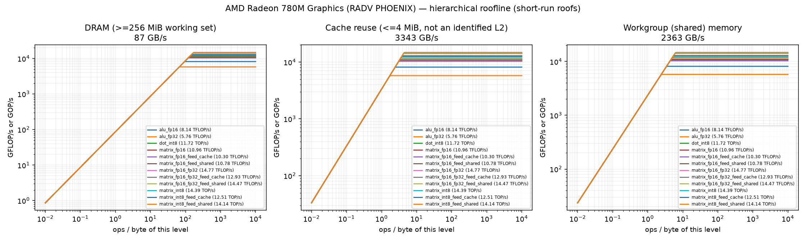
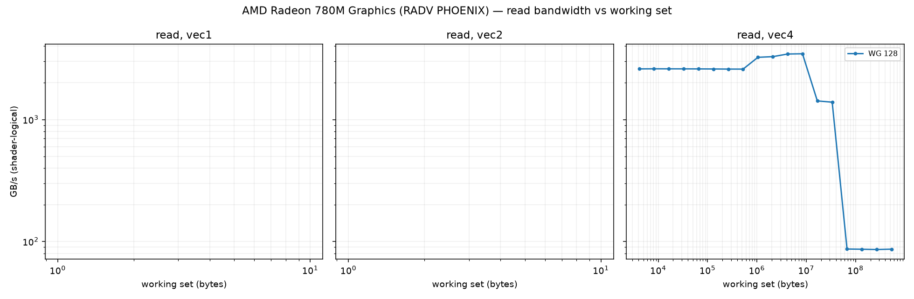
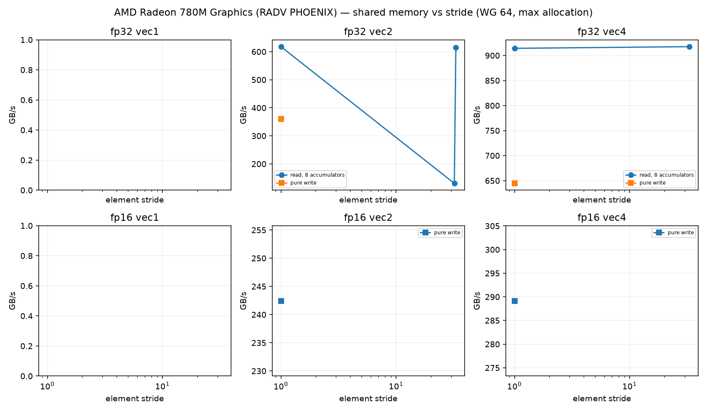
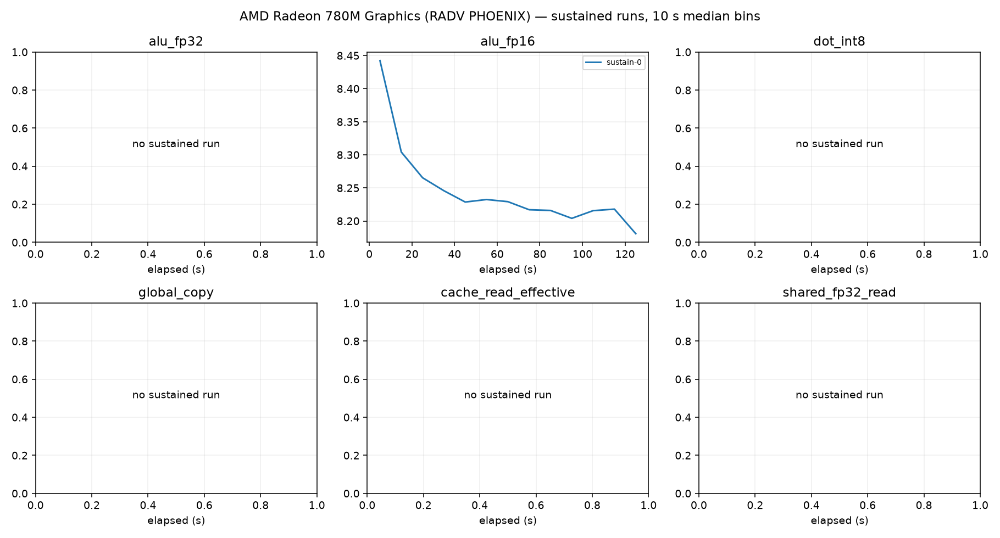

# AMD Radeon 780M Graphics (RADV PHOENIX) roofline report

Device: host AMD Ryzen 9 7940HS w/ Radeon 780M Graphics (SoC AMD Ryzen 9 7940HS w/ Radeon 780M Graphics), Rocky Linux 10.2 (Red Quartz), driver 104865799, subgroup 64.
Plan(s): fast. GPU clock **DVFS-governed** (not pinned); results depend on the governor and thermal state.
Code: None, runner e91952e1b2363724. Rows from other runner or shader builds excluded: 0.

Validation policy: **pre_and_post**; checks bracket continuous sampling and do not guarantee detection of transient errors between checks. Historical pre-only rows are diagnostic only.
Excluded rows: 62; reasons are in all-configurations.csv.
Sustained roofs require three distinct stable batches per current confirmed configuration and duration

Short-run columns are the best validated configuration: median and best (minimum time, the STREAM/BabelStream convention) of the samples, and the differential rate (paired L vs L/2 runs, removing fixed per-dispatch cost). Sustained is the median of the last 60 s of each sustained run (durations are recorded in sustained-runs.csv). Controls never define a roof. `spill` marks variants whose driver statistics report register spilling: spills only slow a kernel, so the value is still an achievable lower bound.

| roof | short median | short best | differential | sustained | unit |
|---|---:|---:|---:|---:|---|
| alu_fp16 | 8.136 | 8.471 | 8.184 (fixed 1%) | 8.216 (1×) | TFLOP/s |
| alu_fp32 | 5.756 | 5.866 | 5.786 (fixed 1%) | — | TFLOP/s |
| cache_read_effective | 3343.037 | 3404.422 | 3389.375 (fixed 1%) | — | GB/s |
| dot_int8 | 11.717 | 11.973 | 11.864 (fixed 1%) | — | TOP/s |
| global_copy | 71.478 | 71.891 | 70.085 (fixed -2%) | — | GB/s |
| global_read | 86.672 | 86.904 | 87.145 (fixed 1%) | 86.634 (1×) | GB/s |
| global_triad | 72.964 | 73.251 | 72.730 (fixed -0%) | — | GB/s |
| global_write | 77.418 | 78.903 | 76.918 (fixed -1%) | — | GB/s |
| matrix_fp16 | 10.958 | 10.977 | 11.015 (fixed 1%) | — | TFLOP/s |
| matrix_fp16_feed_cache | 10.295 | 10.309 | 10.349 (fixed 1%) | — | TFLOP/s |
| matrix_fp16_feed_dram | 81.764 | 82.156 | 81.708 (fixed -0%) | — | GB/s |
| matrix_fp16_feed_shared | 10.784 | 10.823 | 11.263 (fixed 4%) | — | TFLOP/s |
| matrix_fp16_fp32 | 14.772 | 14.825 | 14.794 (fixed 0%) | 14.789 (1×) | TFLOP/s |
| matrix_fp16_fp32_feed_cache | 12.934 | 12.972 | 13.035 (fixed 1%) | — | TFLOP/s |
| matrix_fp16_fp32_feed_dram | 81.335 | 81.645 | 85.140 (fixed 4%) | — | GB/s |
| matrix_fp16_fp32_feed_shared | 14.468 | 14.512 | 15.151 (fixed 5%) | — | TFLOP/s |
| matrix_int8 | 14.393 | 14.428 | 14.419 (fixed 0%) | — | TOP/s |
| matrix_int8_feed_cache | 12.513 | 12.631 | 12.552 (fixed 0%) | — | TOP/s |
| matrix_int8_feed_dram | 80.594 | 80.814 | 85.384 (fixed 6%) | — | GB/s |
| matrix_int8_feed_shared | 14.140 | 14.175 | 14.413 (fixed 2%) | — | TOP/s |
| shared_fp16_read | 2157.630 | 2161.940 | 2318.917 (fixed 7%) | — | GB/s |
| shared_fp16_write | 1723.923 | 1750.028 | 1806.006 (fixed 5%) | — | GB/s |
| shared_fp32_read | 2282.158 | 2289.879 | 2298.464 (fixed 1%) | — | GB/s |
| shared_fp32_write | 2363.451 | 2425.747 | 2367.683 (fixed 0%) | — | GB/s |
| texture_rgba16f_buffer_cache | 82.225 | 84.003 | 81.836 (fixed -0%) | — | GB/s |
| texture_rgba16f_buffer_dram | 83.698 | 83.945 | 83.705 (fixed 0%) | — | GB/s |
| texture_rgba16f_tex2d_cache | 82.672 | 84.557 | 82.536 (fixed -0%) | — | GB/s |
| texture_rgba16f_tex2d_dram | 45.880 | 51.328 | 45.961 (fixed 0%) | — | GB/s |
| texture_rgba16f_tex3d_cache | 82.275 | 84.242 | 82.043 (fixed -0%) | — | GB/s |
| texture_rgba16f_tex3d_dram | 40.763 | 41.343 | 40.894 (fixed 0%) | — | GB/s |
| texture_rgba32f_buffer_cache | 83.095 | 84.977 | 82.703 (fixed -0%) | — | GB/s |
| texture_rgba32f_buffer_dram | 83.461 | 84.235 | 83.628 (fixed 0%) | — | GB/s |
| texture_rgba32f_tex2d_cache | 83.449 | 85.682 | 84.009 (fixed 1%) | — | GB/s |
| texture_rgba32f_tex2d_dram | 43.479 | 43.953 | 43.358 (fixed -0%) | — | GB/s |
| texture_rgba32f_tex3d_cache | 82.297 | 83.270 | 82.437 (fixed 0%) | — | GB/s |
| texture_rgba32f_tex3d_dram | 39.899 | 40.236 | 39.974 (fixed 0%) | — | GB/s |

## Roof confirmation

Each roof's top candidates were re-measured in fresh processes, round-robin with alternating order. The roof is the median of the best candidate's repeats; the sweep maximum (a single run) is shown for comparison. Roofs without a quality-passing candidate (standard error of the median <= 3 %, not short, fixed cost <= 10 %) are marked unconfirmed.

| roof | confirmed median | repeat range | repeats | sweep max (unconfirmed) |
|---|---:|---:|---:|---:|
| alu_fp16 | 8.136 | 8.104–8.366 (3.2%) | 3 | 8.244 |
| alu_fp32 | 5.756 | 5.742–5.812 (1.2%) | 3 | 5.916 |
| cache_read_effective | 3343.037 | 3328.380–3358.755 (0.9%) | 3 | 3449.487 |
| dot_int8 | 11.717 | 11.683–11.852 (1.4%) | 3 | 11.872 |
| global_copy | 71.478 | 71.112–71.480 (0.5%) | 3 | 71.420 |
| global_read | 86.672 | 86.614–86.687 (0.1%) | 3 | 86.745 |
| global_triad | 72.964 | 72.881–72.982 (0.1%) | 3 | 72.956 |
| global_write | 77.418 | 77.408–77.558 (0.2%) | 3 | 77.283 |
| matrix_fp16 | 10.958 | 10.952–10.968 (0.1%) | 3 | 10.947 |
| matrix_fp16_feed_cache | 10.295 | 10.290–10.301 (0.1%) | 3 | 10.288 |
| matrix_fp16_feed_dram | 81.764 | 81.761–81.857 (0.1%) | 3 | 81.728 |
| matrix_fp16_feed_shared | 10.784 | 10.782–10.812 (0.3%) | 3 | 10.812 |
| matrix_fp16_fp32 | 14.772 | 14.771–14.800 (0.2%) | 3 | 14.801 |
| matrix_fp16_fp32_feed_cache | 12.934 | 12.931–12.942 (0.1%) | 3 | 12.963 |
| matrix_fp16_fp32_feed_dram | 81.335 | 81.280–81.347 (0.1%) | 3 | 81.266 |
| matrix_fp16_fp32_feed_shared | 14.468 | 14.466–14.484 (0.1%) | 3 | 14.489 |
| matrix_int8 | 14.393 | 14.368–14.393 (0.2%) | 3 | 14.402 |
| matrix_int8_feed_cache | 12.513 | 12.508–12.609 (0.8%) | 3 | 12.517 |
| matrix_int8_feed_dram | 80.594 | 80.589–80.613 (0.0%) | 3 | 80.603 |
| matrix_int8_feed_shared | 14.140 | 14.125–14.159 (0.2%) | 3 | 14.133 |
| shared_fp16_read | 2157.630 | 2155.921–2158.189 (0.1%) | 3 | 2158.347 |
| shared_fp16_write | 1723.923 | 1723.506–1738.693 (0.9%) | 3 | 1729.904 |
| shared_fp32_read | 2282.158 | 2271.502–2282.698 (0.5%) | 3 | 2272.116 |
| shared_fp32_write | 2363.451 | 2362.154–2380.195 (0.8%) | 3 | 2377.494 |
| texture_rgba16f_buffer_cache | 82.225 | 82.136–82.537 (0.5%) | 3 | 82.116 |
| texture_rgba16f_buffer_dram | 83.698 | 83.655–83.735 (0.1%) | 3 | 83.638 |
| texture_rgba16f_tex2d_cache | 82.672 | 82.589–84.002 (1.7%) | 3 | 82.695 |
| texture_rgba16f_tex2d_dram | 45.880 | 45.596–46.258 (1.4%) | 3 | 45.675 |
| texture_rgba16f_tex3d_cache | 82.275 | 82.137–82.348 (0.3%) | 3 | 82.300 |
| texture_rgba16f_tex3d_dram | 40.763 | 40.719–40.860 (0.3%) | 3 | 40.745 |
| texture_rgba32f_buffer_cache | 83.095 | 83.093–83.096 (0.0%) | 3 | 82.912 |
| texture_rgba32f_buffer_dram | 83.461 | 83.412–83.484 (0.1%) | 3 | 83.482 |
| texture_rgba32f_tex2d_cache | 83.449 | 83.118–83.583 (0.6%) | 3 | 83.065 |
| texture_rgba32f_tex2d_dram | 43.479 | 43.421–43.487 (0.2%) | 3 | 43.461 |
| texture_rgba32f_tex3d_cache | 82.297 | 82.275–82.490 (0.3%) | 3 | 82.412 |
| texture_rgba32f_tex3d_dram | 39.899 | 39.827–39.972 (0.4%) | 3 | 39.861 |

## Cooperative matrix fed from memory, by reuse

Best validated median per source and CHAINS (multiply-adds per loaded A/B tile pair). `load GB/s` counts the A/B tile bytes loaded. DRAM-fed rates grow with reuse until the matrix unit limits them, so the `matrix_*_feed_dram` roof above is a bandwidth; look a kernel's ops per loaded byte up here instead. `gates` lists quality gates the row failed (such rows never define a roof).

| dtype | source | CHAINS | ops / loaded byte | rate | load GB/s | gates |
|---|---|---:|---:|---:|---:|---|
| fp16 | shared | 1 | 8.0 | 2.392 TFLOP/s | 299.0 | — |
| fp16 | shared | 2 | 16.0 | 4.771 TFLOP/s | 298.2 | — |
| fp16 | shared | 4 | 32.0 | 9.181 TFLOP/s | 286.9 | — |
| fp16 | shared | 8 | 64.0 | 10.812 TFLOP/s | 168.9 | — |
| fp16 | cache | 1 | 8.0 | 4.073 TFLOP/s | 509.1 | — |
| fp16 | cache | 2 | 16.0 | 6.794 TFLOP/s | 424.6 | — |
| fp16 | cache | 8 | 64.0 | 10.301 TFLOP/s | 160.9 | — |
| fp16 | dram | 1 | 8.0 | 0.623 TFLOP/s | 77.8 | — |
| fp16 | dram | 2 | 16.0 | 1.219 TFLOP/s | 76.2 | — |
| fp16 | dram | 4 | 32.0 | 2.316 TFLOP/s | 72.4 | — |
| fp16 | dram | 8 | 64.0 | 4.436 TFLOP/s | 69.3 | — |
| fp16_fp32 | shared | 1 | 8.0 | 2.416 TFLOP/s | 302.0 | — |
| fp16_fp32 | shared | 2 | 16.0 | 4.821 TFLOP/s | 301.3 | — |
| fp16_fp32 | shared | 4 | 32.0 | 9.639 TFLOP/s | 301.2 | — |
| fp16_fp32 | shared | 8 | 64.0 | 14.489 TFLOP/s | 226.4 | — |
| fp16_fp32 | cache | 1 | 8.0 | 4.125 TFLOP/s | 515.6 | — |
| fp16_fp32 | cache | 2 | 16.0 | 8.124 TFLOP/s | 507.7 | — |
| fp16_fp32 | cache | 4 | 32.0 | 10.957 TFLOP/s | 342.4 | — |
| fp16_fp32 | cache | 8 | 64.0 | 12.963 TFLOP/s | 202.6 | — |
| fp16_fp32 | dram | 1 | 8.0 | 0.607 TFLOP/s | 75.9 | — |
| fp16_fp32 | dram | 2 | 16.0 | 1.176 TFLOP/s | 73.5 | — |
| fp16_fp32 | dram | 4 | 32.0 | 2.318 TFLOP/s | 72.4 | — |
| fp16_fp32 | dram | 8 | 64.0 | 4.679 TFLOP/s | 73.1 | — |
| int8 | shared | 1 | 16.0 | 4.041 TOP/s | 252.6 | — |
| int8 | shared | 2 | 32.0 | 8.036 TOP/s | 251.1 | — |
| int8 | shared | 4 | 64.0 | 12.887 TOP/s | 201.4 | — |
| int8 | shared | 8 | 128.0 | 14.159 TOP/s | 110.6 | — |
| int8 | cache | 1 | 16.0 | 5.030 TOP/s | 314.4 | — |
| int8 | cache | 2 | 32.0 | 7.644 TOP/s | 238.9 | — |
| int8 | cache | 4 | 64.0 | 10.437 TOP/s | 163.1 | — |
| int8 | cache | 8 | 128.0 | 12.609 TOP/s | 98.5 | — |
| int8 | dram | 1 | 16.0 | 1.225 TOP/s | 76.6 | — |
| int8 | dram | 2 | 32.0 | 2.280 TOP/s | 71.3 | — |
| int8 | dram | 4 | 64.0 | 4.424 TOP/s | 69.1 | — |
| int8 | dram | 8 | 128.0 | 9.081 TOP/s | 70.9 | — |

## Device-state sentinel

`alu_fp32_v4_c16 wg256 groups512` measured before and after every stage and every 20 configurations. Values below 85 % of the median reading (3.269 TFLOP/s) mark a stage that ran on a throttled or otherwise degraded device; re-measure those stages.

| UTC | label | TFLOP/s | state |
|---|---|---:|---|
| 2026-09-26T17:51:03 | validate_start | 3.290 | ok |
| 2026-09-26T17:51:06 | validate_end | 3.290 | ok |
| 2026-09-26T17:51:35 | cache_end | 3.277 | ok |
| 2026-09-26T17:51:42 | sweep-memory_20 | 3.280 | ok |
| 2026-09-26T17:51:55 | memory_end | 3.279 | ok |
| 2026-09-26T17:52:16 | sweep-compute_40 | 3.272 | ok |
| 2026-09-26T17:52:46 | sweep-compute_60 | 3.269 | ok |
| 2026-09-26T17:53:17 | sweep-compute_80 | 3.260 | ok |
| 2026-09-26T17:53:48 | sweep-compute_100 | 3.269 | ok |
| 2026-09-26T17:54:22 | sweep-compute_120 | 3.238 | ok |
| 2026-09-26T17:55:01 | sweep-compute_140 | 3.226 | ok |
| 2026-09-26T17:55:38 | sweep-compute_160 | 3.233 | ok |
| 2026-09-26T17:56:00 | compute_end | 3.254 | ok |
| 2026-09-26T17:56:11 | sweep-matrix-feed_180 | 3.264 | ok |
| 2026-09-26T17:56:46 | sweep-matrix-feed_200 | 3.201 | ok |
| 2026-09-26T17:57:04 | matrix_feed_end | 3.243 | ok |
| 2026-09-26T17:57:23 | sweep-texture_220 | 3.270 | ok |
| 2026-09-26T17:57:28 | texture_end | 3.266 | ok |
| 2026-09-26T17:57:59 | sweep-shared_240 | 3.272 | ok |
| 2026-09-26T17:58:29 | sweep-shared_260 | 3.273 | ok |
| 2026-09-26T17:58:59 | sweep-shared_280 | 3.273 | ok |
| 2026-09-26T17:59:02 | shared_end | 3.272 | ok |
| 2026-09-26T17:59:25 | latency_end | 3.272 | ok |
| 2026-09-26T17:59:39 | confirm_300 | 3.268 | ok |
| 2026-09-26T18:00:12 | confirm_320 | 3.240 | ok |
| 2026-09-26T18:00:51 | confirm_340 | 3.265 | ok |
| 2026-09-26T18:01:28 | confirm_360 | 3.270 | ok |
| 2026-09-26T18:02:06 | confirm_380 | 3.270 | ok |
| 2026-09-26T18:02:40 | confirm_400 | 3.235 | ok |
| 2026-09-26T18:03:09 | confirm_420 | 3.249 | ok |
| 2026-09-26T18:03:42 | confirm_440 | 3.234 | ok |
| 2026-09-26T18:04:22 | confirm_460 | 3.259 | ok |
| 2026-09-26T18:04:37 | confirm_end | 3.271 | ok |
| 2026-09-26T18:04:38 | sustain_0 | 3.269 | ok |

## Ridge points (short-run roofs)

Arithmetic intensity (ops per byte of that level) at which each compute roof meets each memory roof.

| compute roof | global | cache | shared_fp32 | shared_fp16 |
|---|---:|---:|---:|---:|
| alu_fp16 | 93.87 | 2.43 | 3.44 | 3.77 |
| alu_fp32 | 66.41 | 1.72 | 2.44 | 2.67 |
| dot_int8 | 135.19 | 3.50 | 4.96 | 5.43 |
| matrix_fp16 | 126.43 | 3.28 | 4.64 | 5.08 |
| matrix_fp16_feed_cache | 118.79 | 3.08 | 4.36 | 4.77 |
| matrix_fp16_feed_shared | 124.42 | 3.23 | 4.56 | 5.00 |
| matrix_fp16_fp32 | 170.44 | 4.42 | 6.25 | 6.85 |
| matrix_fp16_fp32_feed_cache | 149.23 | 3.87 | 5.47 | 5.99 |
| matrix_fp16_fp32_feed_shared | 166.92 | 4.33 | 6.12 | 6.71 |
| matrix_int8 | 166.06 | 4.31 | 6.09 | 6.67 |
| matrix_int8_feed_cache | 144.37 | 3.74 | 5.29 | 5.80 |
| matrix_int8_feed_shared | 163.15 | 4.23 | 5.98 | 6.55 |

## Figures

See also [TUNING.md](TUNING.md), [SUPPLEMENT.md](SUPPLEMENT.md) (latency, TLB, line size, ERT, memory type) and [ISA-CHECK.md](ISA-CHECK.md).

## Limits

- Bandwidths are shader-logical bytes; physical DRAM/L2 traffic is not measurable without `VK_KHR_performance_query` (exposed: False).
- No vendor theoretical peaks are used; values are achievable rates on this device and driver.
- Cache knees move with workgroup size and are not cache capacities; see the pointer-chase results.
- Sustained values need 3 batches (plan `gold`) before they replace short-run roofs.
